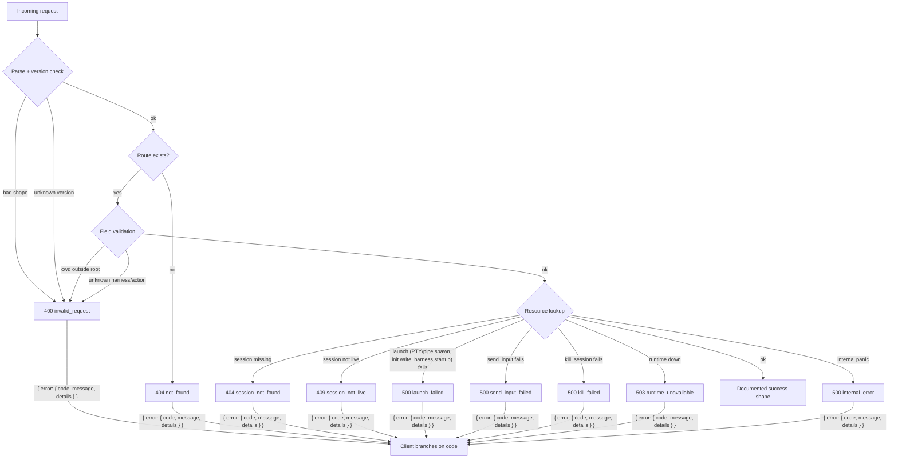
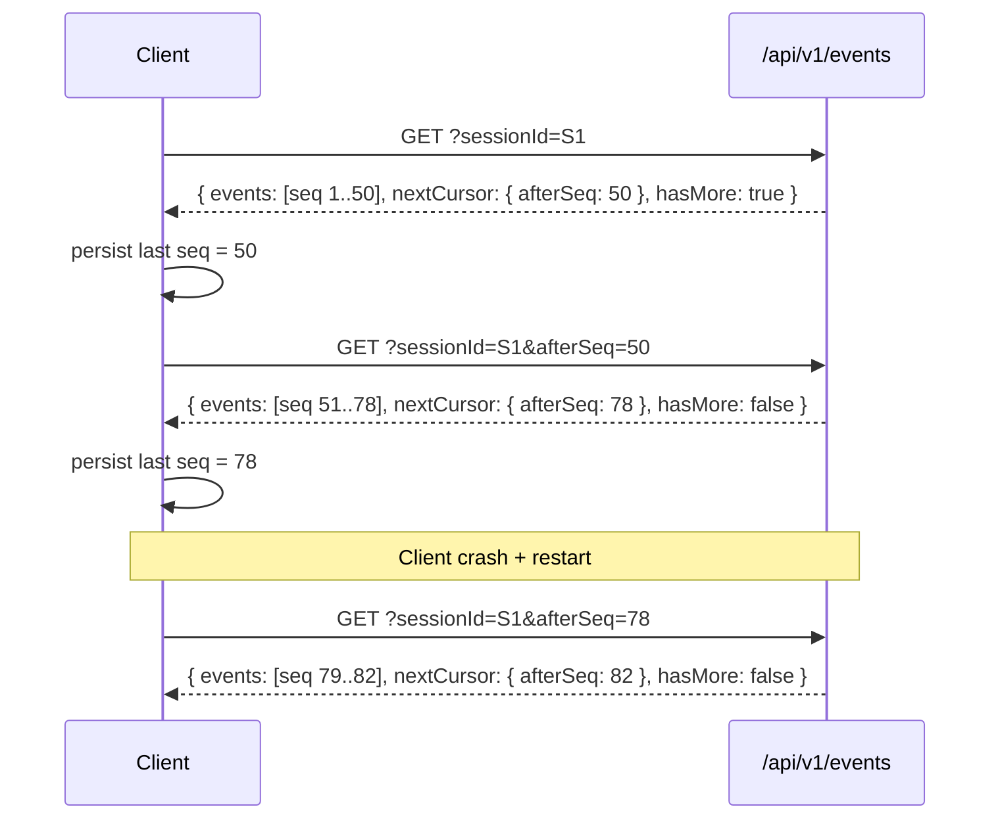

# Coven local API contract

The Coven daemon socket API is a public compatibility boundary for comux and external clients such as external OpenClaw bridge plugin.

## Current stable version

- `GET /api/v1/health` exposes `apiVersion: "coven.daemon.v1"`, `covenVersion`, and a machine-readable `capabilities` object.
- Clients should read `/api/v1/health` before assuming any response shape from other endpoints.
- Legacy unversioned routes such as `GET /health` remain early-MVP aliases; new clients should use `/api/v1`.
- Control-plane clients should discover capabilities before sending action ids.
- All API failures are returned as structured `{ "error": { "code", "message", "details" } }` envelopes.
- Events include a monotonic `seq` cursor for incremental reads.
- Event payloads are redacted by default before API display.

## `GET /api/v1/health`

`GET /api/v1/health` returns daemon reachability, the named contract version, coven version, and machine-readable capabilities:

```json
{
  "ok": true,
  "apiVersion": "coven.daemon.v1",
  "covenVersion": "0.0.0",
  "capabilities": {
    "sessions": true,
    "events": true,
    "travel": true,
    "scheduler": true,
    "hub": true,
    "executorDispatch": true,
    "eventCursor": "sequence",
    "structuredErrors": true
  },
  "daemon": {
    "pid": 12345,
    "startedAt": "2026-05-09T06:43:00Z",
    "socket": "/Users/alice/.coven/coven.sock"
  },
  "hub": {
    "role": "hub",
    "hubId": "hub_01J...",
    "nodesTotal": 2,
    "nodesAvailable": 1
  }
}
```

If the daemon metadata is unavailable, `daemon` may be `null`. The `hub` block reports the daemon's control-plane role and node availability summary; full node detail lives at `GET /api/v1/hub/status`.

### Capability fields

| Field             | Type    | Description                                                       |
|-------------------|---------|-------------------------------------------------------------------|
| `sessions`        | boolean | Sessions API (`/sessions`, `/sessions/:id`) is available.        |
| `events`          | boolean | Events API (`/events`) is available.                             |
| `travel`          | boolean | Travel profile, delta, and state APIs are available.             |
| `scheduler`       | boolean | Scheduler decision and recovery APIs are available.              |
| `hub`             | boolean | Hub control-plane APIs (node registry, routing, queues) are available. |
| `executorDispatch`| boolean | Hub-outbound executor poll/dispatch APIs are available.          |
| `eventCursor`     | string  | Cursor type supported; `"sequence"` means `afterSeq` is stable.  |
| `structuredErrors`| boolean | All errors use the `{ error: { code, message, details } }` shape.|

## Structured error envelope



All API errors use the following stable envelope. Clients must branch on `error.code`, not `error.message`:

```json
{
  "error": {
    "code": "session_not_found",
    "message": "Session was not found.",
    "details": {
      "sessionId": "abc-123"
    }
  }
}
```

`details` is optional and included when extra context is useful.

### Stable error codes

| Code                   | HTTP status | Description                                      |
|------------------------|-------------|--------------------------------------------------|
| `not_found`            | 404         | Generic route not found.                         |
| `invalid_request`      | 400 or 404  | Malformed request, unknown harness id, missing required field, or unsupported API version. |
| `session_not_found`    | 404         | Session id does not exist.                       |
| `session_not_live`     | 409         | Session exists but is not running.               |
| `project_root_violation`| 400        | Reserved. Cwd-outside-root currently emits `invalid_request` with the violation message in the body; promoting to its own code would let clients branch without parsing prose. |
| `pty_spawn_failed`     | 500         | Reserved. PTY spawn failures currently emit `launch_failed`; promoting to its own code would let clients distinguish "the PTY couldn't open" (likely a host issue) from "the harness CLI errored at startup" (likely an auth/config issue). |
| `launch_failed`        | 500         | Daemon accepted the launch payload but the runtime (PTY/pipe spawn, initial-message write, harness CLI startup) failed. `details.sessionId` is the row that was inserted and marked `failed`. |
| `send_input_failed`    | 500         | Daemon accepted the input payload but the runtime write failed (closed pipe, killed process, IO error). `details.sessionId` is the affected session. |
| `kill_failed`          | 500         | Daemon accepted the kill request but the runtime signal/kill call failed (permission, missing process, IO error). `details.sessionId` is the affected session. |
| `runtime_unavailable`  | 503         | The session runtime is unavailable.              |
| `internal_error`       | 500         | Unexpected internal error.                       |
| `raw_artifacts_disabled` | 403       | Raw artifact retrieval was requested without explicit raw artifact persistence enabled. |
| `raw_artifact_requires_raw_flag` | 400 | Raw artifact retrieval omitted the required `raw=1` query flag. |
| `artifact_not_found`   | 404         | Sensitive artifact id does not exist for the session. |
| `travel_profile_not_found` | 404     | Travel profile id does not exist.                |
| `travel_profile_expired` | 409       | Travel profile is expired and cannot accept deltas. |
| `source_hub_mismatch`  | 409         | Delta source hub does not match the travel profile source hub. |
| `no_scheduler_target`  | 409         | No available scheduler node matches the requested capabilities and policy. |
| `scheduler_decision_not_found` | 404 | Scheduler decision id does not exist.            |
| `scheduler_loop_not_found` | 404     | Scheduler loop state does not exist.             |
| `node_not_found`       | 404         | Node id does not exist in the hub registry.      |
| `node_unavailable`     | 409         | Requested assignment target node is not available. |
| `node_missing_capabilities` | 409    | Requested assignment target node lacks required capabilities. |
| `job_not_found`        | 404         | Job id does not exist in the hub queue.          |
| `job_already_queued`   | 409         | A job with the same id already exists in the global queue. |
| `job_not_assignable`   | 409         | Job has already reached a terminal state.        |
| `no_available_node`    | 409         | No available registered node satisfies the job's required capabilities. |
| `session_id_conflict`  | 409         | `POST /sessions/external`: a daemon-managed (non-external) session with the supplied id already exists. |
| `not_external_session` | 422         | `POST /sessions/:id/complete`: the session exists but is not an external session. Use `POST /sessions/:id/kill` for daemon-managed sessions. |
| `external_session_not_killable` | 422 | `POST /sessions/:id/kill`: the session is external and not managed by the daemon; use `POST /sessions/:id/complete` instead. |

## Capability catalog shape (`v1`)

`GET /api/v1/capabilities` returns the daemon/control-plane capability catalog. This is the intended intake-client handshake for deciding which actions to show or route through Coven.

```json
{
  "capabilities": [
    {
      "id": "coven.control.actions",
      "label": "Coven control-plane action router",
      "adapter": "coven-daemon",
      "status": "available",
      "policy": "allow",
      "actions": ["coven.capabilities.refresh"]
    },
    {
      "id": "coven.travel",
      "label": "Travel profiles and offline delta reconciliation",
      "adapter": "coven-daemon",
      "status": "available",
      "policy": "allow",
      "actions": []
    },
    {
      "id": "coven.scheduler",
      "label": "Multi-host scheduler decisions and recovery",
      "adapter": "coven-daemon",
      "status": "available",
      "policy": "allow",
      "actions": []
    },
    {
      "id": "desktop.automation",
      "label": "Desktop automation adapters",
      "adapter": "desktop-use",
      "status": "planned",
      "policy": "requiresApproval",
      "actions": []
    }
  ]
}
```

Known enum values in `v1`:

- `status`: `available`, `planned`
- `policy`: `allow`, `requiresApproval`

Clients should ignore unknown future capability ids and action ids unless they explicitly support them.

## Control action shape (`v1`)

`POST /api/v1/actions` accepts a policy-shaped action envelope. The daemon validates the action id before any adapter work is allowed.

```json
{
  "action": "coven.capabilities.refresh",
  "origin": "external-client",
  "intentId": "intent-1",
  "args": {}
}
```

Immediately completed safe actions return `200`:

```json
{
  "ok": true,
  "accepted": true,
  "action": "coven.capabilities.refresh",
  "status": "completed",
  "event": {
    "kind": "capabilities.refreshed",
    "action": "coven.capabilities.refresh",
    "origin": "external-client",
    "intentId": "intent-1",
    "payload": { "capabilities": 5 }
  }
}
```

Unknown action ids return `400` and fail closed:

```json
{
  "ok": false,
  "accepted": false,
  "action": "desktop.deleteEverything",
  "status": "rejected",
  "reason": "unknown action `desktop.deleteEverything`"
}
```

## Session record shape (`v1`)

In `v1`, session responses stay as raw JSON objects using the Rust daemon's snake_case field names.

Endpoints that return this shape:

- `GET /api/v1/sessions` → `SessionRecord[]`
- `POST /api/v1/sessions` → `SessionRecord`
- `GET /api/v1/sessions/:id` → `SessionRecord`
- `POST /api/v1/sessions/external` → `SessionRecord`
- `POST /api/v1/sessions/:id/complete` → `SessionRecord`

```json
{
  "id": "session-1",
  "project_root": "/repo",
  "harness": "codex",
  "title": "Fix the tests",
  "status": "running",
  "exit_code": null,
  "archived_at": null,
  "created_at": "2026-05-09T06:43:00Z",
  "updated_at": "2026-05-09T06:43:05Z",
  "conversation_id": null,
  "familiar_id": null,
  "labels": [],
  "visibility": "private",
  "external": false,
  "transcript_path": null
}
```

The `external` field is `true` for sessions registered via `POST /api/v1/sessions/external`; it is `false` for all daemon-launched sessions. The `transcript_path` field carries the absolute path to the external session's transcript file when provided at registration; it is `null` for daemon-launched sessions and for external sessions where no path was supplied.

## `POST /api/v1/sessions/external`

Registers a session that is already running outside the daemon (for example, the engine's interactive TUI). The daemon creates a ledger row with `external: true` and does not own the PTY or lifecycle.

### Request body

```json
{
  "id": "sess-engine-abc",
  "projectRoot": "/repo",
  "harness": "coven-code",
  "title": "coven-code session",
  "transcriptPath": "/repo/.claude/sessions/sess-engine-abc.jsonl"
}
```

| Field            | Type   | Required | Description                                                                 |
|------------------|--------|----------|-----------------------------------------------------------------------------|
| `id`             | string | Yes      | Session id. Must be non-empty after trimming whitespace.                    |
| `projectRoot`    | string | Yes      | Absolute path to the project root. Must be non-empty after trimming.       |
| `harness`        | string | Yes      | Harness identifier (e.g. `"coven-code"`). Must be non-empty after trimming.|
| `title`          | string | No       | Display title. Defaults to `"External session"` when absent or empty.      |
| `transcriptPath` | string | No       | Absolute path to the external session's transcript file. Stored as-is; the daemon does not read or validate the path. |

### Responses

| Status | Condition                                                                                          |
|--------|----------------------------------------------------------------------------------------------------|
| `201`  | Session did not exist; row created. Body: the new `SessionRecord`.                                 |
| `200`  | An external session with this id was already registered (idempotent re-register). Body: the existing `SessionRecord`. |
| `409`  | `session_id_conflict` — a daemon-managed (non-external) session with this id already exists. The daemon refuses to alias it. |
| `400`  | `invalid_request` — malformed JSON or a required field is missing or blank.                        |

On success the response body is the full `SessionRecord` as described in [Session record shape (`v1`)](#session-record-shape-v1), with `external: true` and `status: "running"`.

## `POST /api/v1/sessions/:id/complete`

Marks an externally-registered session finished. The daemon updates the session status based on `exitCode` and returns the updated `SessionRecord`.

### Request body

```json
{
  "exitCode": 0
}
```

| Field      | Type    | Required | Description                                                                                   |
|------------|---------|----------|-----------------------------------------------------------------------------------------------|
| `exitCode` | integer | No       | Process exit code. Absent, `null`, or `0` → status becomes `"completed"`. Any nonzero value → status becomes `"failed"`. |

### Responses

| Status | Condition                                                                                  |
|--------|--------------------------------------------------------------------------------------------|
| `200`  | Session updated. Body: the updated `SessionRecord` with the new `status` and `exit_code`.  |
| `404`  | `session_not_found` — no session with this id exists.                                      |
| `422`  | `not_external_session` — the session exists but was not registered as external. For daemon-managed sessions use `POST /api/v1/sessions/:id/kill`. |

### Kill on an external session

`POST /api/v1/sessions/:id/kill` returns `422 external_session_not_killable` when the target session has `external: true`. The kill endpoint is only valid for daemon-managed sessions.

## Event record shape and cursor pagination (`v1`)

`GET /api/v1/events` returns a paginated envelope with monotonic `seq` cursors. `GET /api/v1/sessions/:id/events` is the session-scoped alias with the same response shape and cursor query parameters except that `sessionId` comes from the path.

### Query parameters

| Parameter     | Required | Description                                             |
|---------------|----------|---------------------------------------------------------|
| `sessionId`   | Yes      | Session to fetch events for.                           |
| `afterSeq`    | No       | Return only events with `seq > afterSeq` (preferred).  |
| `afterEventId`| No       | Compatibility cursor — resolves to a sequence position.|
| `limit`       | No       | Maximum number of events to return (daemon-enforced, max 1000). |

### Response envelope

```json
{
  "events": [
    {
      "seq": 42,
      "id": "event-uuid",
      "session_id": "session-uuid",
      "kind": "output",
      "payload_json": "{\"data\":\"hello\"}",
      "created_at": "2026-05-09T06:43:10Z"
    }
  ],
  "nextCursor": {
    "afterSeq": 42
  },
  "hasMore": false
}
```

`nextCursor` is `null` when there are no events. `hasMore` is `true` when a `limit` was applied and more events may exist.

`payload_json` is the redacted preview payload used by clients. Raw sensitive artifacts are never included in this envelope.

## Log preview shape (`v1`)

`GET /api/v1/sessions/:id/log` currently returns the full redacted log preview for the session as an unbounded array:

```json
[
  {
    "ts": "2026-05-09T06:43:10Z",
    "level": "info",
    "message": "> hello"
  }
]
```

## Travel mode profile and delta shapes (`v1`)

Travel mode lets a same-user local client export a bounded, read-only working profile for laptop/offline work and later reconcile appended results back into the hub store. It is additive to sessions/events: uploaded offline events are persisted as ordinary redacted event-log entries on a reconciliation session.

### `POST /api/v1/travel/profiles`

Request:

```json
{
  "familiarId": "sage",
  "workspaceId": "workspace-1",
  "expiresInSeconds": 604800,
  "staleAfterSeconds": 172800
}
```

`familiarId` is required. `workspaceId` defaults to `"default"`. Expiry values must be positive when supplied; defaults are 7 days for `expiresInSeconds` and 2 days for `staleAfterSeconds`, capped at the expiry.

Response `201`:

```json
{
  "profileId": "travel_...",
  "version": "0.1",
  "generatedAt": "2026-07-04T12:00:00Z",
  "expiresAt": "2026-07-11T12:00:00Z",
  "staleAfter": "2026-07-06T12:00:00Z",
  "sourceHub": {
    "hubId": "hub_...",
    "displayName": "Coven hub"
  },
  "scope": {
    "familiarId": "sage",
    "workspaceId": "workspace-1"
  },
  "sourceRevision": {
    "memoryRevision": "mem_...",
    "loopRevision": "loop_..."
  },
  "permissions": {
    "mode": "travel-read-only",
    "allowedLocalAgents": ["lightweight"],
    "allowMemoryOverwrite": false,
    "allowHeavyweightLocalWork": false
  },
  "encoding": "gzip+base64",
  "contentHash": "sha256:...",
  "profileBlob": "..."
}
```

The daemon also writes a gzip profile artifact under `<covenHome>/travel/profiles/` and marks it read-only. The profile payload may include familiar memory context for the requested familiar; clients must treat it as a snapshot, not a write target.

### `POST /api/v1/travel/deltas`

Request:

```json
{
  "profileId": "travel_...",
  "sourceHubId": "hub_...",
  "sourceRevision": {
    "memoryRevision": "mem_...",
    "loopRevision": "loop_..."
  },
  "clientId": "laptop-1",
  "events": [
    { "id": "local-event-1", "kind": "assistant", "text": "offline result" }
  ],
  "artifacts": [
    { "id": "artifact-1", "kind": "summary" }
  ],
  "proposedMemoryAdditions": [
    { "path": "MEMORY.md", "text": "append this" }
  ]
}
```

`profileId`, `sourceHubId`, and `clientId` are required. Query `state` may be `handoff_pending`, `syncing_delta`, or `hub_resumed`; omitted state defaults to `hub_resumed`. Query `defer=1` is a compatibility alias for `state=handoff_pending`.

Response `202`:

```json
{
  "deltaId": "delta_...",
  "state": "hub_resumed",
  "acceptedEvents": 1,
  "acceptedArtifacts": 1,
  "memoryReviewState": "queued",
  "canonicalMemoryOverwriteApplied": false,
  "reconciliationSessionId": "travel-delta_...",
  "hubRevision": {
    "memoryRevision": "mem_...",
    "loopRevision": "loop_..."
  }
}
```

The daemon appends offline events as `travel.offline_event` and offline artifacts as `travel.offline_artifact` entries on the reconciliation session. Proposed memory additions are queued for review; canonical memory overwrite is never applied by this endpoint.

### `GET /api/v1/travel/state`

Query parameters:

| Parameter   | Required | Description                                      |
|-------------|----------|--------------------------------------------------|
| `clientId`  | Yes      | Client whose latest travel delta state is read. |
| `profileId` | No      | Profile to evaluate before any delta exists.    |

Response `200`:

```json
{
  "state": "travel_local",
  "profileId": "travel_...",
  "pendingDeltaBytes": 0,
  "lastSyncError": null,
  "hubReachable": false,
  "profileFreshness": "fresh",
  "travelExecutionAllowed": true,
  "validStates": [
    "hub_active",
    "travel_local",
    "travel_stale",
    "handoff_pending",
    "syncing_delta",
    "hub_resumed"
  ]
}
```

`profileFreshness` is `fresh`, `stale`, `expired`, `none`, or `unknown`. Expired profiles return `travelExecutionAllowed: false`; local clients should fail closed when that flag is false.

## Scheduler decision and recovery shapes (`v1`)

The scheduler routes multi-host work across local laptop, stationary, hub, and compute executor roles. Decisions are stored so clients can inspect prior routing and recover loop state after daemon restart.

### `POST /api/v1/scheduler/decisions`

Request:

```json
{
  "jobId": "job-gpu-loop",
  "requiredCapabilities": ["gpu", "long-running-loop"],
  "taskWeight": "heavyweight",
  "travelState": "hub_active",
  "allowHeavyweightLocalWork": false,
  "nodes": [
    {
      "nodeId": "node-compute-idle",
      "role": "compute_executor",
      "available": true,
      "capabilities": ["gpu", "long-running-loop"],
      "queuePressure": 1
    }
  ]
}
```

Response `201`:

```json
{
  "decisionId": "sched_...",
  "jobId": "job-gpu-loop",
  "target": {
    "role": "compute_executor",
    "nodeId": "node-compute-idle"
  },
  "reason": "compute_executor has required capability set and low queue pressure",
  "inputs": {
    "requiredCapabilities": ["gpu", "long-running-loop"],
    "queuePressure": "low",
    "travelState": "hub_active",
    "taskWeight": "heavyweight",
    "nodesSource": "request_snapshot"
  },
  "createdAt": "2026-07-04T12:00:00Z"
}
```

The daemon filters unavailable nodes, required capability misses, low-battery `laptop_local` nodes during travel, and heavyweight laptop-local work while `travelState` is `travel_local` or `travel_stale` unless explicitly allowed.

`nodes` is optional. When it is omitted or empty, candidates are loaded from the persistent hub node registry instead (`inputs.nodesSource` is `"hub_registry"`); supplying a `nodes` snapshot keeps the request fully deterministic for failure simulations. An empty snapshot with an empty registry returns `409 no_scheduler_target`.

### `GET /api/v1/scheduler/decisions/:id`

Returns the same shape as `POST /api/v1/scheduler/decisions` for a persisted decision, or `404 scheduler_decision_not_found`.

### `POST /api/v1/scheduler/redispatch`

Request:

```json
{
  "loopId": "loop-gpu",
  "jobId": "job-gpu-loop",
  "currentNodeId": "compute-primary",
  "requiredCapabilities": ["gpu", "long-running-loop"],
  "loopResumable": true,
  "nodes": [
    {
      "nodeId": "compute-primary",
      "role": "compute_executor",
      "available": false,
      "capabilities": ["gpu", "long-running-loop"],
      "queuePressure": 3,
      "queuedJobIds": ["job-gpu-loop"]
    },
    {
      "nodeId": "compute-fallback",
      "role": "compute_executor",
      "available": true,
      "capabilities": ["gpu", "long-running-loop"],
      "queuePressure": 1
    }
  ]
}
```

Response `202`:

```json
{
  "decisionId": "sched_...",
  "state": "redispatched",
  "loopId": "loop-gpu",
  "jobId": "job-gpu-loop",
  "target": {
    "role": "compute_executor",
    "nodeId": "compute-fallback"
  },
  "reason": "compute-primary went offline; redispatched resumable loop to compute-fallback",
  "preservedSubqueue": {
    "nodeId": "compute-primary",
    "jobIds": ["job-gpu-loop"]
  },
  "nodeAvailability": [
    {
      "nodeId": "compute-primary",
      "role": "compute_executor",
      "available": false,
      "queuePressure": "medium"
    }
  ],
  "hubJobSynced": true,
  "createdAt": "2026-07-04T12:00:00Z"
}
```

If the loop is not resumable or no alternate node matches, `state` is `paused` and `target` is `{ "role": "paused", "nodeId": null }`. In both cases, the failed node subqueue is preserved.

`nodes` is optional. When omitted or empty, both the failed node and the redispatch candidates are resolved from the persistent hub node registry, with subqueue contents taken from the persistent per-executor queues (`inputs.nodesSource` on the persisted decision is `"hub_registry"`). If `currentNodeId` is not in the registry either, the call fails with `400 invalid_request`.

`hubJobSynced` reports whether the job is tracked in the hub's persistent global queue. When `true`, the redispatch also updated hub state so the outcome is visible at `GET /api/v1/hub/jobs/:jobId` and `GET /api/v1/hub/status`:

- `redispatched` — the job becomes `assigned` to the new node, the routing table points at it, and both nodes' subqueues are rebuilt.
- `paused` — the job becomes `held` on its current node without leaving that node's subqueue.

Snapshot-only jobs (not enqueued via `POST /api/v1/hub/jobs`) leave hub state untouched (`hubJobSynced: false`), which keeps deterministic failure-simulation fixtures independent of the registry.

### `GET /api/v1/scheduler/loops/:loopId`

Returns the persisted redispatch/pause state with the same fields as `POST /api/v1/scheduler/redispatch`, plus `updatedAt`, or `404 scheduler_loop_not_found`.

## Hub control-plane shapes (`v1`)

The hub control plane is the durable multi-host state described in `specs/coven-multi-host-daemon`: a persistent node registry, a routing table, a global job queue, and per-executor subqueues. All hub state persists in the daemon SQLite store and reloads after a daemon restart. Hub job assignment routes against the persistent registry; the `POST /api/v1/scheduler/*` routes also fall back to the registry whenever a request omits its `nodes` snapshot.

### `POST /api/v1/hub/nodes`

Registers a node or re-registers an existing one (updating role, transport, capabilities, and availability). Returns `201` for a new node and `200` for a re-registration.

Request:

```json
{
  "nodeId": "compute-primary",
  "role": "compute_executor",
  "transport": "ssh",
  "transportConfig": {
    "kind": "ssh",
    "host": "compute-primary.internal",
    "user": "coven",
    "port": 22,
    "identityFile": "/home/coven/.ssh/id_ed25519"
  },
  "capabilities": ["gpu", "long-running-loop"],
  "available": true
}
```

Response:

```json
{
  "nodeId": "compute-primary",
  "role": "compute_executor",
  "transport": "ssh",
  "transportConfig": { "kind": "ssh", "host": "compute-primary.internal", "user": "coven", "port": 22, "identityFile": "/home/coven/.ssh/id_ed25519" },
  "capabilities": ["gpu", "long-running-loop"],
  "available": true,
  "queuePressure": 0,
  "lastHealthAt": "2026-07-06T12:00:00Z",
  "lastError": null,
  "registeredAt": "2026-07-06T12:00:00Z",
  "updatedAt": "2026-07-06T12:00:00Z"
}
```

`transport` defaults to `"ssh"`. `queuePressure` is hub-computed from the node's persistent subqueue and cannot be set by the caller. `transportConfig` is the structured hub-outbound dispatch link (`kind: "ssh"` or `kind: "local"` for private-network/same-host process dispatch); it is validated at registration, required before the hub can poll or dispatch to the node, and preserved when a re-registration omits it.

### `GET /api/v1/hub/nodes` and `GET /api/v1/hub/nodes/:nodeId`

List all registered nodes (`{ "nodes": [ ... ] }`) or fetch one node record. Unknown ids return `404 node_not_found`.

### `POST /api/v1/hub/nodes/:nodeId/health`

Records an executor health report and updates `lastHealthAt`:

```json
{
  "available": false,
  "capabilities": ["gpu", "long-running-loop"]
}
```

Availability transitions move the node's jobs between `assigned` and `held` without removing them from the node's persistent subqueue:

- `available: false` — every `assigned` job on the node becomes `held`; the subqueue and loop ids are preserved.
- `available: true` — every `held` job on the node returns to `assigned`.

Response:

```json
{
  "node": { "nodeId": "compute-primary", "available": false, "queuePressure": 1 },
  "heldSubqueue": { "nodeId": "compute-primary", "jobIds": ["job_01J..."] },
  "transitionedJobs": { "from": "assigned", "to": "held", "jobIds": ["job_01J..."] }
}
```

### `POST /api/v1/hub/nodes/:nodeId/poll`

Hub-initiated availability poll for the stateless executor protocol (`coven.executor.v1`). The hub connects **outbound** over the node's registered `transportConfig` (SSH batch mode with pinned host keys, or a local/private-network process launch), runs `coven executor probe`, and records the advertised capabilities plus last-known availability. Executors never push registration or heartbeats to the hub.

The response always returns `200` with the poll outcome; failures are recorded on the node (`available: false`, `lastError`), never fatal:

```json
{
  "nodeId": "compute-primary",
  "ok": true,
  "probe": {
    "protocolVersion": "coven.executor.v1",
    "role": "compute_executor",
    "capabilities": ["shell", "gpu"],
    "available": true,
    "queuePressure": 0,
    "covenVersion": "0.0.0",
    "probedAt": "2026-07-06T12:00:00Z"
  },
  "heldSubqueue": { "nodeId": "compute-primary", "jobIds": [] },
  "node": { "nodeId": "compute-primary", "available": true }
}
```

Availability transitions from a poll move the node's jobs between `assigned` and `held` exactly like a health report. A probe that advertises a role different from the registered one fails closed (`ok: false`, node unavailable). Nodes registered without a `transportConfig` return `409 node_transport_not_configured`.

### `POST /api/v1/hub/nodes/:nodeId/dispatch`

Hub-outbound job dispatch. The hub sends a full-context job spec (argv, cwd, env, stdin payload, timeout, opaque `context` blob) to `coven executor run-job` on the node, so the stateless executor needs no local durable authority.

Request:

```json
{
  "jobId": "job_01J...",
  "command": ["sh", "-c", "…"],
  "cwd": "/work/checkout",
  "env": { "KEY": "value" },
  "stdin": "optional payload",
  "timeoutSeconds": 300,
  "requiredCapabilities": ["gpu"],
  "context": { "workspaceId": "workspace_01J..." }
}
```

`jobId` is optional (the hub generates `job_<uuid>` when omitted). Required capabilities are checked against the node's last-known capability metadata (`409 executor_capability_mismatch`). The executor replies with a normalized result envelope, persisted with the dispatch record:

```json
{
  "jobId": "job_01J...",
  "nodeId": "compute-primary",
  "createdAt": "2026-07-06T12:00:00Z",
  "envelope": {
    "protocolVersion": "coven.executor.v1",
    "jobId": "job_01J...",
    "status": "completed",
    "exitCode": 0,
    "stdout": "…",
    "stderr": "…",
    "startedAt": "2026-07-06T12:00:00Z",
    "finishedAt": "2026-07-06T12:00:05Z",
    "durationMs": 5000,
    "error": null
  }
}
```

Envelope `status` is one of `completed`, `failed`, `timeout`, `rejected`, or `transport_error` (synthesized by the hub-side dispatcher when the node is unreachable or replies with a malformed envelope, returned as `502 executor_unreachable` with the envelope in `details`). A dispatch doubles as an availability observation, and when `jobId` names a job on the hub queue, that job's state advances from the envelope (`completed`, or `failed` for `failed`/`timeout`/`rejected`); a transport error leaves the queued job held so no work is lost.

### `GET /api/v1/hub/dispatches/:jobId`

Returns the persisted dispatch record — full job spec, normalized result envelope (or `null` while in flight), status, node id, and timestamps — or `404 executor_job_not_found`.

### `POST /api/v1/hub/jobs`

Enqueues a job on the persistent global queue with state `queued`. `jobId` is optional (the hub generates `job_<uuid>` when omitted). Duplicate ids return `409 job_already_queued`.

```json
{
  "jobId": "job_01J...",
  "requiredCapabilities": ["gpu"],
  "priority": 5,
  "loopId": "loop_01J...",
  "payload": { "kind": "loop-run" }
}
```

Job states: `queued`, `assigned`, `held`, and the terminal states `completed`, `failed`, `cancelled`.

### `GET /api/v1/hub/jobs?state=...` and `GET /api/v1/hub/jobs/:jobId`

List queued jobs (optionally filtered by `state`, ordered by priority then age) or fetch one job. The single-job response includes the job's routing-table entry under `route` (or `null` when unrouted).

### `POST /api/v1/hub/jobs/:jobId/assign`

Assigns the job to an executor from the persistent node registry. With an empty body, the hub picks the best available node by capability match, then lowest queue pressure, then role rank (`compute_executor` before `stationary_executor` before `hub` before `laptop_local`). Passing `{ "nodeId": "..." }` forces a specific registered node (`409 node_unavailable` / `409 node_missing_capabilities` when it cannot take the job).

On success the hub persists, in one pass:

- the job's state (`assigned`) and `assignedNodeId`;
- a routing-table entry mapping the job to the node;
- a scheduler decision record (readable at `GET /api/v1/scheduler/decisions/:id`); and
- the target node's rebuilt subqueue and queue pressure.

If no registered node qualifies, the call returns `409 no_available_node` and the job stays `queued`.

### `POST /api/v1/hub/jobs/:jobId/complete`

Marks a job terminal (`{ "state": "completed" | "failed" | "cancelled" }`, defaulting to `completed`), removes it from its executor subqueue, and refreshes the node's queue pressure. Terminal jobs cannot be reassigned (`409 job_not_assignable`).

### `GET /api/v1/hub/routing`

Returns the persistent routing table:

```json
{
  "routes": [
    {
      "jobId": "job_01J...",
      "nodeId": "compute-primary",
      "decisionId": "sched_01J...",
      "reason": "compute-primary selected from hub registry by capability match and queue pressure",
      "createdAt": "2026-07-06T12:00:00Z",
      "updatedAt": "2026-07-06T12:00:00Z"
    }
  ]
}
```

### `GET /api/v1/hub/status`

Returns the hub role, identity, node availability, and queue depths:

```json
{
  "role": "hub",
  "hubId": "hub_01J...",
  "nodes": [ { "nodeId": "compute-primary", "available": true, "queuePressure": 1 } ],
  "nodesTotal": 1,
  "nodesAvailable": 1,
  "globalQueue": { "queued": 0, "assigned": 1, "held": 0, "total": 1 },
  "executorQueues": [ { "nodeId": "compute-primary", "jobIds": ["job_01J..."], "updatedAt": "2026-07-06T12:00:00Z" } ]
}
```

`hubId` is the same stable identity embedded as `sourceHub.hubId` in generated travel profiles.

Restart and supervision guidance for hub daemons lives in [`HUB-OPERATIONS.md`](HUB-OPERATIONS.md).

## Raw artifact access (`v1`)

`GET /api/v1/sessions/:id/artifacts/:artifactId?raw=1` is intentionally narrow. It is unavailable unless raw artifact persistence is explicitly enabled in local privacy settings. Disabled installs return:

```json
{
  "error": {
    "code": "raw_artifacts_disabled",
    "message": "Raw artifact persistence is not enabled.",
    "details": {
      "sessionId": "session-1",
      "artifactId": "event-1"
    }
  }
}
```

### Incremental read pattern

1. Poll `GET /events?sessionId=<id>` to get all events (with optional `limit`).
2. Use `nextCursor.afterSeq` in subsequent requests: `GET /events?sessionId=<id>&afterSeq=<seq>`.
3. Repeat until `hasMore` is `false`.

This gives clients stable incremental reads. Exactly-once delivery also requires client-side checkpointing and idempotency.



Persisting `afterSeq` survives daemon restarts: events are append-only and seq numbers are monotonic, so a resumed poll always picks up where it stopped.

## Live control response shapes (`v1`)

Both live-control endpoints return the same accepted response shape on success:

- `POST /api/v1/sessions/:id/input`
- `POST /api/v1/sessions/:id/kill`

```json
{
  "ok": true,
  "accepted": true
}
```

Shared non-success responses use the structured error envelope:

- `404` when the session does not exist:

```json
{
  "error": {
    "code": "session_not_found",
    "message": "Session was not found.",
    "details": { "sessionId": "session-1" }
  }
}
```

- `409` when the session exists but is not live:

```json
{
  "error": {
    "code": "session_not_live",
    "message": "Session is not live.",
    "details": { "sessionId": "session-1" }
  }
}
```

## comux and OpenClaw bridge compatibility

- comux reads the `capabilities` object from `/health` to decide which features to use.
- The external OpenClaw bridge plugin OpenClaw bridge (`packages/openclaw-coven`) is updated in this repo alongside the daemon and uses `apiVersion === "coven.daemon.v1"` as its contract guard.
- Client updates to use `afterSeq` cursors and paginated event envelopes may happen independently of the daemon update; the daemon-enforced shape is the source of truth.
- The `supportedApiVersions` field has been removed from the health response in `coven.daemon.v1`; clients should check `apiVersion` directly.

## Compatibility and migration policy

- `coven.daemon.v1` clients may rely on the documented field names and top-level response shapes above.
- Additive fields are backward compatible. Clients should ignore unknown fields when safe.
- Any incompatible change must ship under a new `apiVersion` value exposed by `GET /api/v1/health` or its successor route.
- Before a client switches to a new major contract, the Coven repo should publish updated contract docs and a migration note that maps the old shape to the new one.

## Recommended client handshake

1. Call `GET /api/v1/health`.
2. Verify `apiVersion === "coven.daemon.v1"` and `capabilities.structuredErrors === true`.
3. Check `capabilities.eventCursor === "sequence"` before using `afterSeq` pagination.
4. Only then depend on the documented `v1` sessions/events shapes.

## Scope boundary

The `coven.daemon.v1` contract covers daemon health, capability discovery, action routing, sessions, events, live input, live kill, travel-mode profile/delta reconciliation, and scheduler decision/recovery routes. Do not treat route names outside this document as reserved API until they are implemented and documented here.
