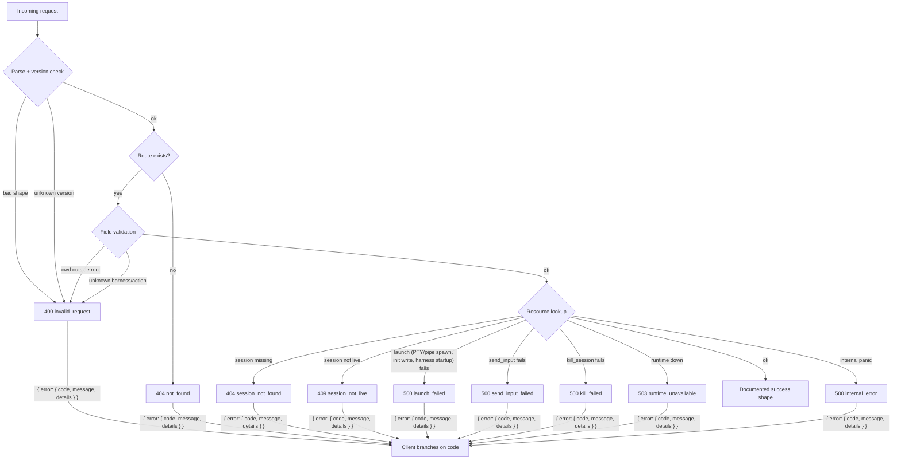
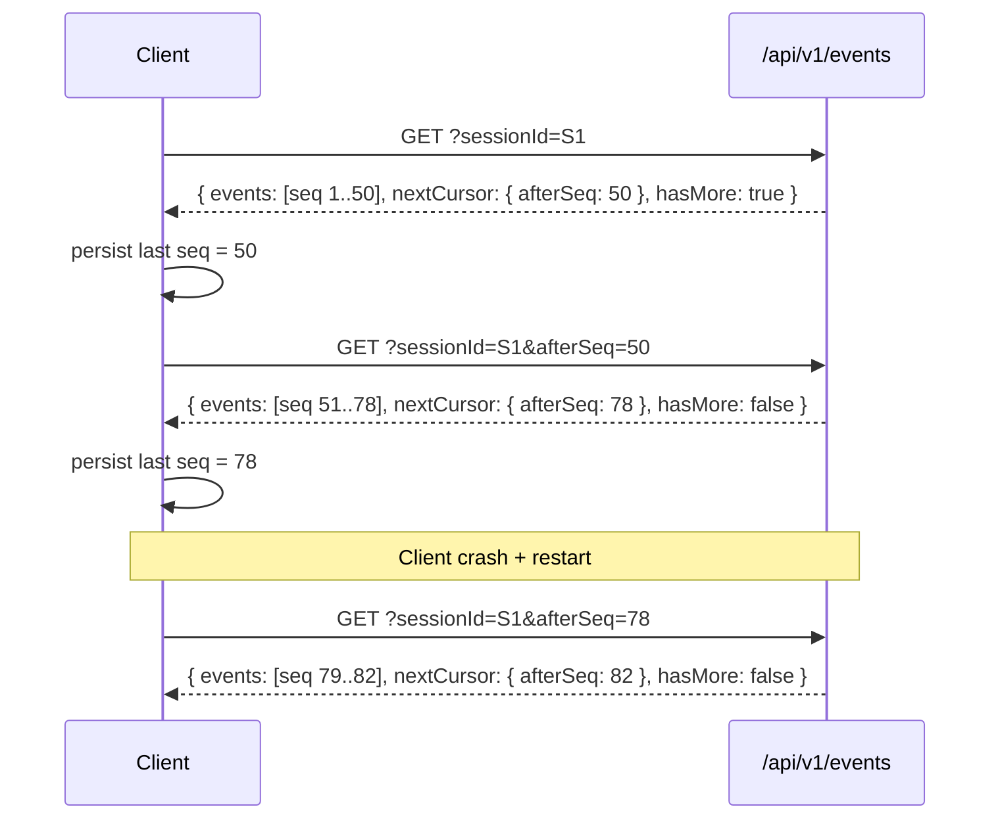

# Coven local API contract

The Coven daemon socket API is a public compatibility boundary for comux and external clients such as `@opencoven/coven`.

## Current stable version

- `GET /api/v1/health` exposes `apiVersion: "coven.daemon.v1"`, `covenVersion`, and a machine-readable `capabilities` object.
- Clients should read `/api/v1/health` before assuming any response shape from other endpoints.
- Legacy unversioned routes such as `GET /health` remain early-MVP aliases; new clients should use `/api/v1`.
- Control-plane clients should discover capabilities before sending action ids.
- All API failures are returned as structured `{ "error": { "code", "message", "details" } }` envelopes.
- Events include a monotonic `seq` cursor for incremental reads.

## `GET /api/v1/health`

`GET /api/v1/health` returns daemon reachability, the named contract version, coven version, and machine-readable capabilities:

```json
{
  "ok": true,
  "apiVersion": "coven.daemon.v1",
  "covenVersion": "0.0.0",
  "capabilities": {
    "sessions": true,
    "events": true,
    "eventCursor": "sequence",
    "structuredErrors": true
  },
  "daemon": {
    "pid": 12345,
    "startedAt": "2026-05-09T06:43:00Z",
    "socket": "/Users/alice/.coven/coven.sock"
  }
}
```

If the daemon metadata is unavailable, `daemon` may be `null`.

### Capability fields

| Field             | Type    | Description                                                       |
|-------------------|---------|-------------------------------------------------------------------|
| `sessions`        | boolean | Sessions API (`/sessions`, `/sessions/:id`) is available.        |
| `events`          | boolean | Events API (`/events`) is available.                             |
| `eventCursor`     | string  | Cursor type supported; `"sequence"` means `afterSeq` is stable.  |
| `structuredErrors`| boolean | All errors use the `{ error: { code, message, details } }` shape.|

## Structured error envelope



All API errors use the following stable envelope. Clients must branch on `error.code`, not `error.message`:

```json
{
  "error": {
    "code": "session_not_found",
    "message": "Session was not found.",
    "details": {
      "sessionId": "abc-123"
    }
  }
}
```

`details` is optional and included when extra context is useful.

### Stable error codes

| Code                   | HTTP status | Description                                      |
|------------------------|-------------|--------------------------------------------------|
| `not_found`            | 404         | Generic route not found.                         |
| `invalid_request`      | 400 or 404  | Malformed request, unknown harness id, missing required field, or unsupported API version. |
| `session_not_found`    | 404         | Session id does not exist.                       |
| `session_not_live`     | 409         | Session exists but is not running.               |
| `project_root_violation`| 400        | Reserved. Cwd-outside-root currently emits `invalid_request` with the violation message in the body; promoting to its own code would let clients branch without parsing prose. |
| `pty_spawn_failed`     | 500         | Reserved. PTY spawn failures currently emit `launch_failed`; promoting to its own code would let clients distinguish "the PTY couldn't open" (likely a host issue) from "the harness CLI errored at startup" (likely an auth/config issue). |
| `launch_failed`        | 500         | Daemon accepted the launch payload but the runtime (PTY/pipe spawn, initial-message write, harness CLI startup) failed. `details.sessionId` is the row that was inserted and marked `failed`. |
| `send_input_failed`    | 500         | Daemon accepted the input payload but the runtime write failed (closed pipe, killed process, IO error). `details.sessionId` is the affected session. |
| `kill_failed`          | 500         | Daemon accepted the kill request but the runtime signal/kill call failed (permission, missing process, IO error). `details.sessionId` is the affected session. |
| `runtime_unavailable`  | 503         | The session runtime is unavailable.              |
| `internal_error`       | 500         | Unexpected internal error.                       |

## Capability catalog shape (`v1`)

`GET /api/v1/capabilities` returns the daemon/control-plane capability catalog. This is the intended OpenMeow handshake for deciding which actions to show or route through Coven.

```json
{
  "capabilities": [
    {
      "id": "coven.control.actions",
      "label": "Coven control-plane action router",
      "adapter": "coven-daemon",
      "status": "available",
      "policy": "allow",
      "actions": ["coven.capabilities.refresh"]
    },
    {
      "id": "desktop.automation",
      "label": "Desktop automation adapters",
      "adapter": "desktop-use",
      "status": "planned",
      "policy": "requiresApproval",
      "actions": []
    }
  ]
}
```

Known enum values in `v1`:

- `status`: `available`, `planned`
- `policy`: `allow`, `requiresApproval`

Clients should ignore unknown future capability ids and action ids unless they explicitly support them.

## Control action shape (`v1`)

`POST /api/v1/actions` accepts a policy-shaped action envelope. The daemon validates the action id before any adapter work is allowed.

```json
{
  "action": "coven.capabilities.refresh",
  "origin": "open-meow",
  "intentId": "intent-1",
  "args": {}
}
```

Immediately completed safe actions return `200`:

```json
{
  "ok": true,
  "accepted": true,
  "action": "coven.capabilities.refresh",
  "status": "completed",
  "event": {
    "kind": "capabilities.refreshed",
    "action": "coven.capabilities.refresh",
    "origin": "open-meow",
    "intentId": "intent-1",
    "payload": { "capabilities": 3 }
  }
}
```

Unknown action ids return `400` and fail closed:

```json
{
  "ok": false,
  "accepted": false,
  "action": "desktop.deleteEverything",
  "status": "rejected",
  "reason": "unknown action `desktop.deleteEverything`"
}
```

## Session record shape (`v1`)

In `v1`, session responses stay as raw JSON objects using the Rust daemon's snake_case field names.

Endpoints that return this shape:

- `GET /api/v1/sessions` → `SessionRecord[]`
- `POST /api/v1/sessions` → `SessionRecord`
- `GET /api/v1/sessions/:id` → `SessionRecord`

```json
{
  "id": "session-1",
  "project_root": "/repo",
  "harness": "codex",
  "title": "Fix the tests",
  "status": "running",
  "exit_code": null,
  "archived_at": null,
  "created_at": "2026-05-09T06:43:00Z",
  "updated_at": "2026-05-09T06:43:05Z"
}
```

## Event record shape and cursor pagination (`v1`)

`GET /api/v1/events` returns a paginated envelope with monotonic `seq` cursors.

### Query parameters

| Parameter     | Required | Description                                             |
|---------------|----------|---------------------------------------------------------|
| `sessionId`   | Yes      | Session to fetch events for.                           |
| `afterSeq`    | No       | Return only events with `seq > afterSeq` (preferred).  |
| `afterEventId`| No       | Compatibility cursor — resolves to a sequence position.|
| `limit`       | No       | Maximum number of events to return (daemon-enforced, max 1000). |

### Response envelope

```json
{
  "events": [
    {
      "seq": 42,
      "id": "event-uuid",
      "session_id": "session-uuid",
      "kind": "output",
      "payload_json": "{\"data\":\"hello\"}",
      "created_at": "2026-05-09T06:43:10Z"
    }
  ],
  "nextCursor": {
    "afterSeq": 42
  },
  "hasMore": false
}
```

`nextCursor` is `null` when there are no events. `hasMore` is `true` when a `limit` was applied and more events may exist.

### Incremental read pattern

1. Poll `GET /events?sessionId=<id>` to get all events (with optional `limit`).
2. Use `nextCursor.afterSeq` in subsequent requests: `GET /events?sessionId=<id>&afterSeq=<seq>`.
3. Repeat until `hasMore` is `false`.

This gives clients stable incremental reads. Exactly-once delivery also requires client-side checkpointing and idempotency.



Persisting `afterSeq` survives daemon restarts: events are append-only and seq numbers are monotonic, so a resumed poll always picks up where it stopped.

## Live control response shapes (`v1`)

Both live-control endpoints return the same accepted response shape on success:

- `POST /api/v1/sessions/:id/input`
- `POST /api/v1/sessions/:id/kill`

```json
{
  "ok": true,
  "accepted": true
}
```

Shared non-success responses use the structured error envelope:

- `404` when the session does not exist:

```json
{
  "error": {
    "code": "session_not_found",
    "message": "Session was not found.",
    "details": { "sessionId": "session-1" }
  }
}
```

- `409` when the session exists but is not live:

```json
{
  "error": {
    "code": "session_not_live",
    "message": "Session is not live.",
    "details": { "sessionId": "session-1" }
  }
}
```

## comux and OpenClaw bridge compatibility

- comux reads the `capabilities` object from `/health` to decide which features to use.
- The `@opencoven/coven` OpenClaw bridge (`packages/openclaw-coven`) is updated in this repo alongside the daemon and uses `apiVersion === "coven.daemon.v1"` as its contract guard.
- Client updates to use `afterSeq` cursors and paginated event envelopes may happen independently of the daemon update; the daemon-enforced shape is the source of truth.
- The `supportedApiVersions` field has been removed from the health response in `coven.daemon.v1`; clients should check `apiVersion` directly.

## Compatibility and migration policy

- `coven.daemon.v1` clients may rely on the documented field names and top-level response shapes above.
- Additive fields are backward compatible. Clients should ignore unknown fields when safe.
- Any incompatible change must ship under a new `apiVersion` value exposed by `GET /api/v1/health` or its successor route.
- Before a client switches to a new major contract, the Coven repo should publish updated contract docs and a migration note that maps the old shape to the new one.

## Recommended client handshake

1. Call `GET /api/v1/health`.
2. Verify `apiVersion === "coven.daemon.v1"` and `capabilities.structuredErrors === true`.
3. Check `capabilities.eventCursor === "sequence"` before using `afterSeq` pagination.
4. Only then depend on the documented `v1` sessions/events shapes.

## Scope boundary

The `coven.daemon.v1` contract covers daemon health, capability discovery, action routing, sessions, events, live input, and live kill. Do not treat future orchestration, handoff, or task-routing route names as reserved API until they are implemented and documented in this file.
