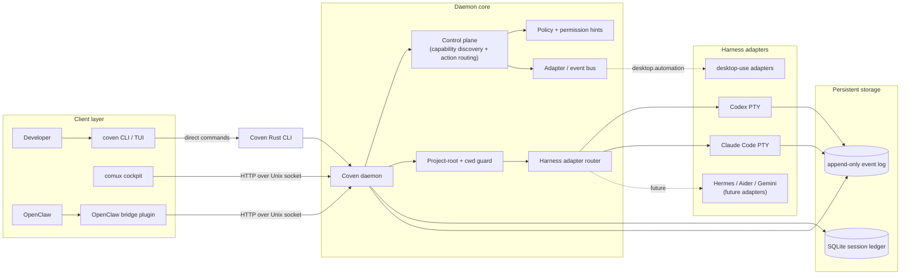
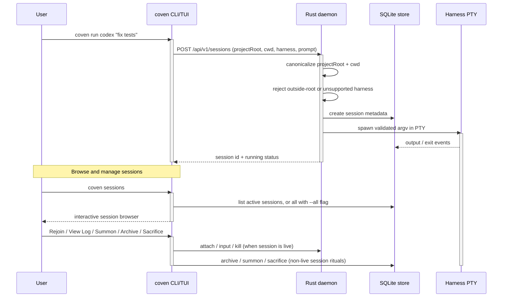
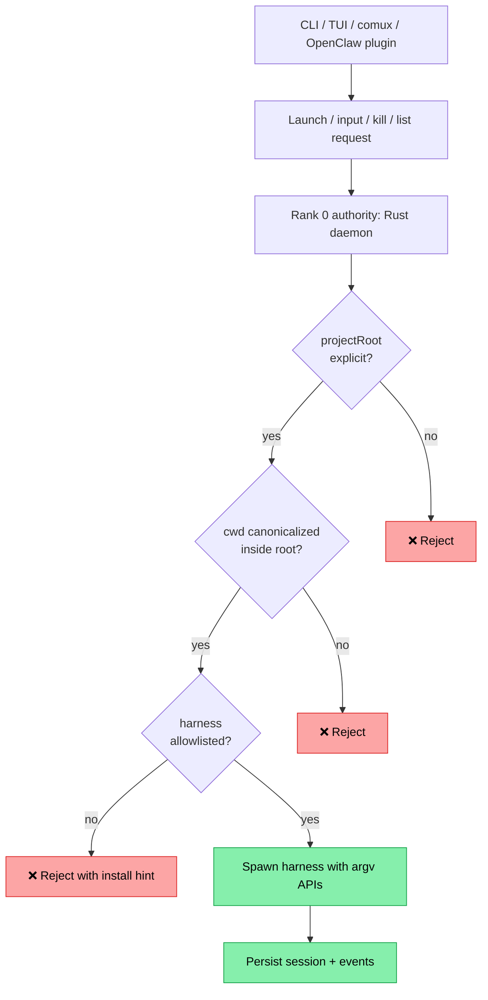

# Coven Architecture

Coven is a local-first harness substrate. The Rust CLI/daemon is the authority layer; clients such as the CLI TUI, comux, and the optional OpenClaw plugin are presentation/integration layers.

The versioned local socket API contract lives in [`docs/API-CONTRACT.md`](API-CONTRACT.md). Clients should use `GET /api/v1/health` and its `apiVersion` / `supportedApiVersions` fields as the handshake before depending on session or event response shapes.

## Runtime topology



## Session lifecycle



## Authority boundary



## Intake / automation boundary

The chat/intake client should remain a chat UI, local echo/optimistic rendering surface, intent-capture layer, and tiny fast-path host for ultra-simple local actions. It should not become the automation engine.

Coven is the canonical shared local runtime for reusable automation because it centralizes:

- daemon/process ownership
- policy and permission decisions
- config/profile storage
- capability discovery
- action routing and event emission
- adapter ownership for Accessibility, AppleScript, keyboard/mouse, window, filesystem, clipboard, and app-specific bridges

The intended flow is:

```text
user -> chat/intake client -> Coven -> adapters -> desktop/apps
desktop/apps -> Coven -> chat/intake client UI updates
```

`GET /api/v1/capabilities` lets the chat/intake client and other clients discover what Coven can route. `POST /api/v1/actions` gives clients a stable intent envelope without coupling them directly to brittle OS automation APIs.

## Current user-facing surface

- `coven` and `coven tui` open the beginner-friendly slash-command palette.
- `coven doctor` checks store/project/harness readiness and prints next steps.
- `coven daemon start/status/restart/stop` manages the local daemon.
- `coven run codex|claude <prompt>` launches a project-scoped PTY session.
- `coven sessions` opens the human session browser in a terminal; `--plain` keeps scriptable output.
- Session browser actions surface readable choices: **Rejoin**, **View Log**, **Summon**, **Archive**, and **Sacrifice**.
- `coven attach|summon|archive|sacrifice <session-id>` remain explicit lower-level verbs for scripts and copy/paste workflows.

## Managed engine

Coven drives `coven-code` as a separately-installed engine process — it is
never linked or imported as a library. The process boundary is also the license
boundary (coven: MIT; coven-code: GPL-3.0). The exact CLI flags, environment
variables, stream-json events, and exit codes that constitute the integration
surface are specified in [`docs/ENGINE-CONTRACT.md`](ENGINE-CONTRACT.md);
any breaking change to that surface requires a coordinated version bump in both
repositories.

## Distribution snapshot

The npm wrapper packages are live for early adopters:

- `@opencoven/cli`
- `@opencoven/cli-macos`
- `@opencoven/cli-linux-x64`
- `@opencoven/cli-windows` once the next Windows-enabled release is published

The source package versions stay template-like in the repo; release workflow dispatch supplies the published version and builds platform packages. As of the current documentation pass, npm latest is `0.0.10` for the wrapper plus macOS/Linux packages; Windows x64 release wiring is staged for the next package release.
