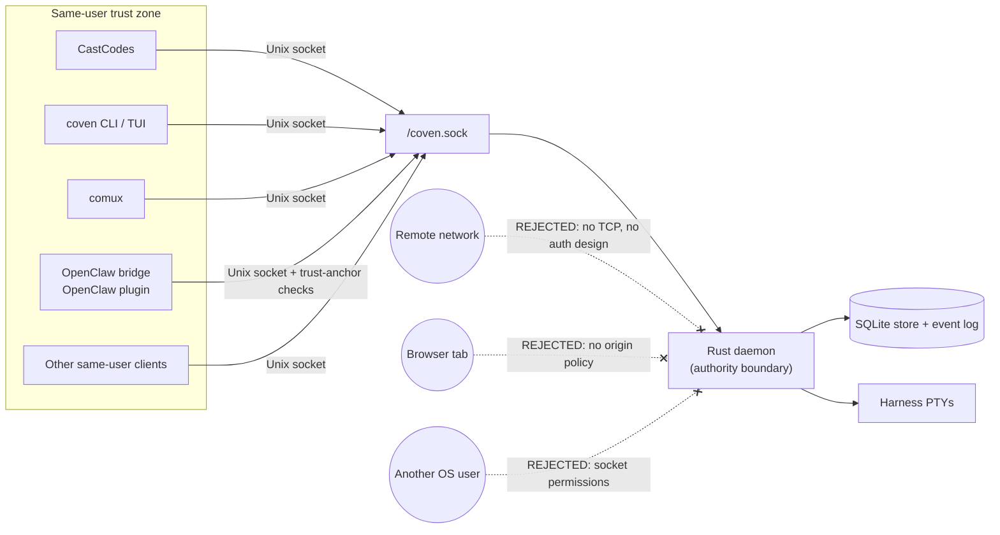

# Authentication and local access

_Last updated: 2026-05-26_

Coven does not currently have daemon-level user authentication in the OAuth, JWT, bearer-token, API-key, browser-cookie, or hosted-account sense.

The current solution is a **same-user local access model**:

- The daemon exposes HTTP only over the local Unix socket at `<covenHome>/coven.sock`.
- The default socket path is `~/.coven/coven.sock`.
- Clients may validate requests for UX, but the Rust daemon is the enforcement boundary.
- Harness provider credentials stay in the harness provider's normal local auth flow.
- Coven should not read, proxy, persist, or mint Codex, Claude Code, OpenAI, Anthropic, GitHub, or OpenClaw credentials.

This is intentionally a local-first MVP posture. It is suitable for same-user local clients such as CastCodes, the Coven CLI/TUI, comux, and the external OpenClaw plugin. It is not a remote API auth scheme.

The boundary is filesystem permissions plus same-user process locality. Anything outside the dashed zone is rejected by design; introducing a remote, browser, or cross-user surface requires a separate auth design (not a tunnel of the existing socket).

## What protects the API today

### Unix socket locality

The API is not exposed as TCP by default. Clients connect to the local Unix socket owned by the user's Coven state directory.

New clients should treat the socket path as the trust anchor and should connect only to the versioned API under `/api/v1/...`.

### Rust authority checks

The daemon must revalidate sensitive request fields before acting, even when a client already validated them:

- API version;
- project root;
- working directory;
- harness id;
- session id;
- live-session state;
- input requests;
- kill requests; and
- control-plane action ids.

Unknown API versions, unknown action ids, unsupported harnesses, invalid session ids, and outside-root working directories must fail closed.

### Harness-owned provider auth

Coven launches supported local harness CLIs. It does not implement provider login.

Examples:

- Codex authentication remains `codex login` or the Codex CLI's own local setup.
- Claude Code authentication remains `claude doctor` or the Claude Code CLI's own local setup.

`coven doctor` may report setup hints for these tools, but Coven does not own their credentials.

### External OpenClaw plugin guardrails

OpenClaw integration is externalized through external OpenClaw bridge plugin. OpenClaw core is not a Coven trust root.

The plugin is disabled by default and must be explicitly selected as the ACP backend. It validates the local socket trust anchor before connecting:

- `covenHome` must be an absolute, non-symlink directory.
- `socketPath` is restricted to `<covenHome>/coven.sock`.
- The socket path must not be a symlink.
- The resolved socket must be a Unix socket.
- The socket root, socket directory, and socket must be owned by the current user.
- The socket root and directory must not be group or world accessible.
- The socket path is fingerprinted around connection to catch replacement races.

These client-side checks improve defense in depth. They do not replace Rust daemon enforcement.

## What this is not

The current auth solution is not:

- OAuth;
- OpenID Connect;
- JWT sessions;
- bearer-token auth;
- API-key auth;
- browser cookie auth;
- RBAC;
- multi-user authorization;
- a CSRF/origin policy;
- a cloud account boundary; or
- permission to expose the socket API on localhost TCP, a remote network, or a browser page.

If a future dashboard, mobile app, remote bridge, or browser-exposed service needs to talk to Coven, it needs an explicit additional auth and pairing design. Do not tunnel or proxy the raw daemon socket into a network service and call that authenticated.

## Current hardening gap

The TypeScript OpenClaw plugin client already performs strict socket trust-anchor validation.

The Rust daemon currently owns request enforcement and socket API behavior, but Rust-side private `COVEN_HOME` ownership and permission checks before creating, binding, or removing daemon state are still a hardening priority. Until that is implemented, client-side socket validation should be treated as defense in depth for cooperating clients, not as a complete daemon-side auth boundary.

Before broad distribution, Rust should fail closed when:

- `COVEN_HOME` is not owned by the current user;
- `COVEN_HOME` is group or world accessible;
- `COVEN_HOME` resolves through a symlink;
- the socket path resolves outside `COVEN_HOME`;
- an existing socket path is a symlink or non-socket file; or
- socket creation or cleanup would cross the trusted state directory boundary.

## Requirements for new clients

New Coven clients must:

- use `/api/v1/...` routes;
- call `GET /api/v1/health` before assuming compatibility;
- treat the Rust daemon as the authority boundary;
- keep provider credentials in the provider or harness auth flow;
- avoid storing repository secrets, environment dumps, private URLs, or token-bearing logs;
- reject configurable socket paths that do not resolve to `<covenHome>/coven.sock`;
- fail closed on unknown harness ids or unsupported API versions; and
- avoid adding any network, browser, or remote transport without a separate auth design.
