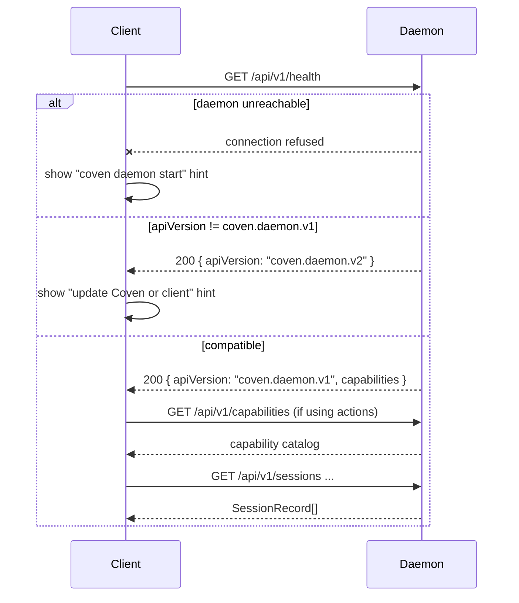

# CastCodes integration and advanced clients

Coven is a runtime substrate. CastCodes is the primary public workspace that presents, routes, and observes Coven-managed work without taking over the authority boundary.

Other clients are advanced, legacy, or compatibility surfaces. They should follow the same socket rules, but beginner/product docs should not lead with them.

## Integration rule

Talk to Coven through the local socket API. Do not duplicate Coven's path, harness, live-session, or deletion policy in a way that can drift from the daemon.

Recommended handshake:

1. Call `GET /api/v1/health`.
2. Confirm `apiVersion === "coven.daemon.v1"` and the needed `capabilities` fields are available.
3. Call `GET /api/v1/capabilities` if using control-plane actions.
4. Use versioned `/api/v1/...` routes only.



Clients should treat the handshake as **mandatory before any other request**. Skipping it means depending on undefined response shapes from a future daemon version.

## CastCodes responsibilities

CastCodes should own:

- workspace navigation;
- terminal tabs and visible agent lanes;
- editor/file context;
- harness selection UI;
- diff/review surfaces;
- verification result display;
- session selection and status rendering;
- PR, merge, archive, and cleanup approval UX; and
- handoff and retrospective views.

CastCodes must still treat the daemon as the authority for project roots, cwd, harness ids, live-session checks, destructive deletion rules, socket trust, and external action approvals.

## Advanced client responsibilities

Clients may own:

- navigation;
- panes;
- chat or intake UI;
- task forms;
- diff/review surfaces;
- notification rendering;
- session selection;
- optimistic local UI state; and
- user approval UX.

Clients must not be the only enforcement point for:

- project-root boundaries;
- cwd restrictions;
- harness allowlists;
- live-session checks;
- destructive deletion rules;
- socket trust;
- external action approvals.

## comux migration reference

comux is a legacy/reference cockpit layer. It proved useful primitives that are being folded into CastCodes-native workflows.

Useful comux primitives:

- list Coven sessions;
- launch sessions from visible project/worktree context;
- open sessions in panes;
- attach/rejoin live work;
- read `coven sessions --json` for simple local discovery when daemon-level control is unnecessary;
- show logs and artifacts;
- help review diffs;
- help merge, PR, archive, or clean up explicitly.

comux should remain useful when Coven is not installed. If Coven is missing, present clear installation and fallback states instead of assuming the daemon exists.

## OpenClaw plugin

OpenClaw integration belongs in the external OpenClaw bridge plugin, not OpenClaw core.

The plugin should:

- register an optional Coven backend;
- validate config for UX;
- connect to the local socket;
- launch sessions through `POST /api/v1/sessions`;
- map Coven events into OpenClaw runtime events;
- preserve fallback behavior only when explicitly configured; and
- treat the Rust daemon as the launch authority.

The plugin should not:

- bypass the daemon for launches;
- depend on OpenClaw core internals;
- store provider credentials;
- assume unversioned routes are stable; or
- widen project-root permissions.

## Intake surfaces

Chat/intake clients are advanced intake and presentation layers. They should not become the first-contact public story for Coven.

Useful responsibilities:

- capture user intent;
- show local status;
- present approvals;
- display notifications;
- hand work into Coven;
- show session updates from Coven.

Avoid making intake clients the automation engine. Reusable automation should live behind Coven capabilities and actions so the policy boundary stays centralized.

## Desktop clients and control rooms

A native control room can make Coven easier to operate by showing:

- active sessions;
- archived sessions;
- daemon health;
- project roots;
- harness availability;
- client integrations;
- capability catalog;
- action approval queue;
- logs and traces;
- docs and troubleshooting links.

Use `coven sessions --json` for active sessions and `coven sessions --json --all` when the client needs archived records too. The CLI returns a top-level object with a `sessions` array, and each record uses the same `SessionRecord` field names exposed by the daemon API, including `project_root`, `status`, `created_at`, `updated_at`, and nullable `archived_at`.

The control room should still use the same socket API and capability handshake as CastCodes and other clients.

## Desktop automation adapters

Desktop automation is useful when an app has no clean API. It is also powerful enough to need clear policy.

Recommended pattern:

```text
user request
  -> client captures intent
  -> Coven exposes capability and policy hints
  -> client asks for approval when required
  -> Coven routes a known action id
  -> adapter performs the local UI action
  -> event/result returns to the client
```

Do not let UI clients bind directly to OS automation libraries and then call that "Coven integration." The reusable boundary should be Coven's control plane.

## Compatibility expectations

For every integration:

- use `/api/v1`;
- call health first;
- ignore unknown additive fields when safe;
- fail closed on unknown required behavior;
- test against representative daemon responses;
- update `docs/API-CONTRACT.md` when response shapes change.

## Error handling

A good client should translate daemon errors into action-oriented UI:

- daemon unavailable: show start/restart instructions;
- unsupported API version: ask user to update Coven or the client;
- missing harness: show `coven doctor` guidance;
- outside-root cwd: explain the project boundary;
- session not live: offer log viewing instead of live input;
- destructive action blocked: explain the session is running or lacks confirmation.
