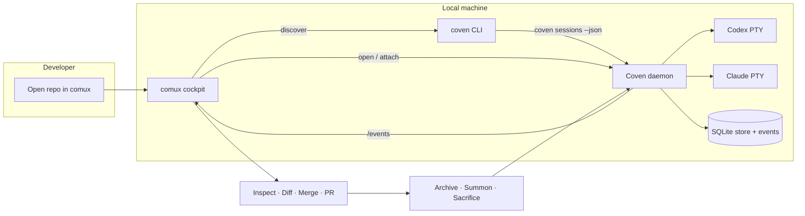

# comux + Coven demo loop

This is the Coven-side contract for making Coven-managed Codex and Claude Code sessions visible in comux.



The demo loop is end-to-end: comux never bypasses the daemon, and the daemon never trusts comux for project-root, harness, or destructive-deletion enforcement.

## Loop

1. Open the target repository in comux.
2. Start Coven if needed:

   ```sh
   coven daemon start
   ```

3. Launch a Coven-backed session from the same repository:

   ```sh
   coven run codex "fix the failing tests"
   coven run claude "review the diff"
   ```

4. Let comux discover sessions through either supported client path:
   - `coven sessions --json` for simple local CLI discovery.
   - `GET /api/v1/sessions` after `GET /api/v1/health` for daemon clients.
5. Open the session as a visible comux pane, or attach manually:

   ```sh
   coven attach <session-id>
   ```

6. Inspect files, diffs, and session output from comux.
7. Merge, create a PR, archive, summon, sacrifice, or clean up explicitly after verification.

## CLI discovery

`coven sessions --json` prints a stable object with a `sessions` array. Records use the same snake_case field names as the daemon API:

```json
{
  "sessions": [
    {
      "id": "session-1",
      "project_root": "/repo",
      "harness": "codex",
      "title": "Fix the tests",
      "status": "running",
      "exit_code": null,
      "archived_at": null,
      "created_at": "2026-05-14T07:00:00Z",
      "updated_at": "2026-05-14T07:00:01Z"
    }
  ]
}
```

Use `--all --json` when archived sessions should remain visible.

## Daemon discovery

Daemon clients should use the versioned socket API:

1. `GET /api/v1/health`
2. Verify `apiVersion === "coven.daemon.v1"` and `capabilities.sessions === true`.
3. `GET /api/v1/sessions`
4. Filter sessions by verified project root before showing them in a project-scoped UI.

The daemon socket defaults to `~/.coven/coven.sock`. The daemon remains the authority for project roots, cwd, harness ids, live-session checks, input, kill requests, archive state, and destructive deletion rules.

## Unavailable states

Clients should keep their core UI usable when Coven is missing or stopped:

- CLI missing: show install guidance for `@opencoven/cli`.
- Daemon stopped or socket missing: suggest `coven daemon start`.
- Harness missing: suggest `coven doctor`.
- Unsupported API version: ask the user to update Coven or the client.

## Roadmap

The broader OpenCoven roadmap remains the public tracking point for the end-to-end demo: [ROADMAP.md](/ROADMAP).
