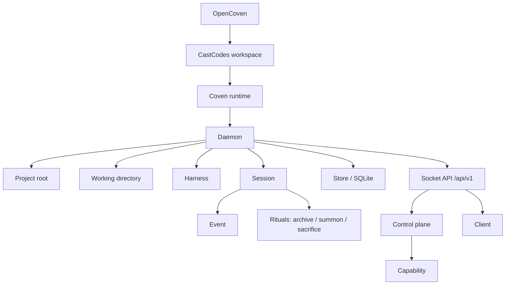

# Coven Concepts

This page defines the nouns used across CastCodes, the Coven CLI, daemon, API, docs, and advanced client integrations.



Every term below is one node in the graph above.

## OpenCoven

OpenCoven is the umbrella and organization behind CastCodes, Coven, and related labs.

Use **OpenCoven** when talking about the broader project family.

## CastCodes

CastCodes is the local-first AI coding workspace and primary public proof surface for Coven.

Use **CastCodes** for the product users open: terminal/editor substrate, visible lanes, workspace context, review flows, and approval UX.

## Coven

Coven is the local runtime substrate. It owns project-scoped harness sessions, PTYs, logs, local daemon state, and the socket API.

Use **Coven** for the CLI, daemon, Rust crate, npm wrapper, and local session runtime.

## `coven`

`coven` is the user-facing command.

Do not tell users to run `opencoven` or `@opencoven`. The package names live under `@opencoven/*`, but the command is always `coven`.

## Harness

A harness is an external coding-agent CLI that Coven can launch and supervise.

Current v0 harnesses:

- Codex, with harness id `codex`.
- Claude Code, with harness id `claude`.

Coven does not store provider credentials. Each harness keeps using its own local authentication flow.

## Project root

The project root is the explicit boundary for a session. Coven validates and canonicalizes the project root before launching work.

The root matters because it defines where the harness is allowed to start. A client cannot widen this boundary by sending a different `cwd` or a looser config value.

## Working directory

The working directory is the launch directory for a harness session. It must be inside the project root after canonicalization.

Examples:

```sh
coven run codex "fix tests"
coven run codex "inspect the CLI package" --cwd packages/cli
```

The second command is valid only when `packages/cli` resolves inside the selected project root.

## Session

A session is a Coven-owned record of one harness run.

It includes:

- a stable session id;
- project root;
- harness id;
- readable title;
- status;
- optional exit code;
- archive state; and
- created/updated timestamps.

Session records are stored in SQLite.

## Event

An event is an append-only record associated with a session.

Events include output, exit, and metadata records. They let clients replay or inspect what happened after the process exits or the daemon restarts.

## Daemon

The daemon is the local Rust process that owns live session state and exposes the HTTP-over-Unix-socket API.

The daemon is the authority boundary. It validates:

- launch requests;
- project roots;
- working directories;
- harness ids;
- live input;
- kill requests; and
- session ids.

## Store

The store is Coven's local SQLite database. It contains session metadata and append-only event history.

Runtime state belongs outside source control. Do not commit `.coven/`, databases, sockets, logs, or environment files.

## Client

A client is anything that talks to Coven rather than launching harnesses directly.

Known client shapes:

- CastCodes workspace.
- `coven` CLI/TUI.
- comux legacy/reference cockpit.
- external OpenClaw plugin package external OpenClaw bridge plugin.
- future desktop intake surfaces.

Clients are convenience layers, not trust roots.

## Control plane

The control plane is the capability and action-routing layer in front of future adapters.

It lets clients discover what Coven can do through `GET /api/v1/capabilities` and send known actions through `POST /api/v1/actions`. Unknown action ids fail closed.

## Capability

A capability describes a daemon-owned or adapter-owned feature that a client may present.

Capability records include:

- id;
- label;
- owning adapter;
- status;
- policy hint; and
- action ids.

## Rituals

Rituals are Coven's human-friendly session-management verbs:

- **Archive** hides a completed session from the active list while preserving events.
- **Summon** restores an archived session.
- **Sacrifice** permanently deletes a non-running session and its events.

Ritual names are product language. The safety behavior underneath them should stay precise and conservative.

## Socket API

The socket API is the public compatibility boundary for local clients.

Current stable prefix:

```text
/api/v1
```

Clients should handshake with:

```text
GET /api/v1/health
```

before depending on other response shapes.
