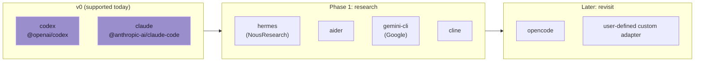

# Future harness notes

Coven v0 intentionally supports only the Codex and Claude Code adapters. This note records what the current adapter seam must preserve before adding additional harnesses such as Hermes.

OpenClaw is not a Coven harness target in v0. OpenClaw integration is externalized through the `@opencoven/coven` plugin, which acts as a socket client for the Rust daemon.

## Current adapter contract

A Coven harness adapter resolves to:

- a stable Coven harness id, such as `codex` or `claude`;
- a user-facing label for `coven doctor`;
- an executable name to detect on `PATH`;
- optional fixed arguments that must come before the prompt; and
- the prompt as the final command argument.

This keeps the runtime generic enough for CLIs that are not shaped exactly like Codex or Claude Code, without adding unsupported harnesses prematurely.

## Hermes observations

Hermes should stay a phase-2 validation target until Coven has more direct Codex/Claude/comux usage.

Observed public CLI surface:

- Interactive session: `hermes`
- TUI mode: `hermes --tui`
- One-shot prompt: `hermes chat -q "..."`
- Programmatic output mode: `hermes chat --quiet -q "..."`
- Model/provider overrides: `hermes chat --model ...`, `hermes chat --provider ...`
- Resume options: `--resume <session>` and `--continue [name]`
- Worktree mode: `--worktree`
- Approval bypass: `--yolo`

Sources:

- https://hermes-agent.nousresearch.com/docs/user-guide/cli
- https://hermes-agent.nousresearch.com/docs/reference/cli-commands

## Implications for Coven

A Hermes adapter probably should not be a direct copy of the Codex/Claude shape. It likely needs one of these modes:

1. **One-shot logged session** using `hermes chat --quiet -q <prompt>`.
   - Good for captured output and exit events.
   - Less useful for long-lived attach/input because the process may exit after the answer.
2. **Interactive PTY session** using `hermes` or `hermes --tui`.
   - Better for human-visible attach/intervention.
   - Requires testing whether initial prompt injection through argv is possible or whether Coven must write the prompt to stdin after spawn.
3. **Resume-aware session** using `--resume` / `--continue`.
   - Potentially useful once Coven has a first-class upstream session id field.
   - Should not be added until Coven's own session identity model is stable.

## Decision

Do not add Hermes to `coven doctor` or `coven run` yet.

For now, keep the adapter seam able to express prefix-arg CLIs (`chat -q <prompt>`) and revisit the actual Hermes adapter after:

- direct Coven Codex/Claude sessions have been used more;
- comux attach/open has had real usage;
- we know whether Hermes should be one-shot, interactive, or resume-aware inside Coven; and
- we can test against a real Hermes install.

## Candidate harness landscape

A candidate moves from **Phase 1: research** to public v0 support only after clearing every stage in the [Harness adapters maturity checklist](/HARNESS-ADAPTERS#suggested-adapter-maturity-stages). The grid above is directional, not a promise.
