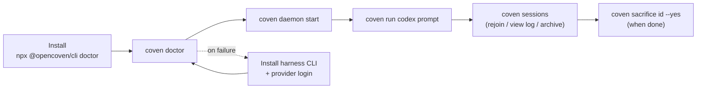

# Getting started with Coven

This guide takes a new user from a fresh checkout or npm install to a visible project-scoped agent session.

## What Coven is

Coven is a local-first runtime for coding-agent harnesses. It runs supported CLIs such as Codex and Claude Code inside explicit project boundaries, records session metadata and events, and exposes the work through a CLI, TUI, and local socket API.

The short promise:

> One project. Any harness. Visible work.

## Install paths

Use the npm wrapper when you want the fastest public install:

```sh
npx @opencoven/cli doctor
pnpm dlx @opencoven/cli doctor
```

Build from source when you are contributing to Coven:

```sh
git clone https://github.com/OpenCoven/coven.git
cd coven
cargo build --workspace
cargo run -p coven-cli -- doctor
```

## Prerequisites

Coven needs:

- Rust stable, if building from source.
- Git.
- A Unix-like local runtime for the current daemon socket and PTY path.
- At least one supported harness CLI on `PATH`.

Supported v0 harnesses:

- `codex`
- `claude`

Install and authenticate a harness before expecting `coven run` to work:

```sh
npm install -g @openai/codex
codex login

npm install -g @anthropic-ai/claude-code
claude doctor
```

## First run

From a project directory:

```sh
coven
```

The default command opens the prompt-first TUI. You can either:

- type a task directly and press Enter (e.g. `fix the failing tests` or a slash command like `/run codex fix the failing tests`);
- select a menu item with arrow keys or its single-key shortcut and press Enter;
- press `h` or type `/help` to see natural-language and slash-command examples;
- press `Ctrl+C` or `Esc` to quit.

If you prefer to run the explicit setup checks:

```sh
coven doctor
```

`coven doctor` checks:

- store readiness;
- project detection;
- built-in harness availability; and
- next steps for missing setup.

## Run a session

Start the daemon, then launch a harness session from a repository or project directory:

```sh
coven daemon start
coven run codex "fix the failing tests"
```

or:

```sh
coven run claude "polish the CLI help text"
```

For a more readable session list, pass a title:

```sh
coven run codex "update the docs" --title "Docs refresh"
```

Use a specific working directory only when it is inside the detected project root:

```sh
coven run codex "inspect this package" --cwd packages/cli
```

Coven rejects outside-root working directories. Clients may validate for nicer UX, but the Rust daemon is the authority.

## Browse sessions

In an interactive terminal:

```sh
coven sessions
```

This opens the session browser. You can select a session and choose contextual actions:

- **Rejoin** for live sessions.
- **View Log** for completed sessions.
- **Summon** for archived sessions.
- **Archive** for completed visible sessions.
- **Sacrifice** for permanent deletion of non-running sessions and events.

For scripts or copy/paste workflows:

```sh
coven sessions --plain
coven sessions --all --plain
coven sessions --json
coven sessions --json --all
```

## Attach, archive, summon, and sacrifice

Lower-level session verbs remain available:

```sh
coven attach <session-id>
coven archive <session-id>
coven summon <session-id>
coven sacrifice <session-id> --yes
```

Archive is reversible. Summon restores an archived session to the active list. Sacrifice is destructive and refuses live sessions.

## Stop the daemon

```sh
coven daemon stop
```

Use `restart` when the socket or daemon state looks stale:

```sh
coven daemon restart
```

## Diagnostics and relief

`coven pc` is a macOS-first system diagnostics and relief tool surfaced through the Coven CLI. All read operations are side-effect free.

Inspect:

```sh
coven pc                  # full report: CPU, memory, disk, top processes
coven pc status           # one-line health summary with 🟢/🟡/🔴 indicators
coven pc status --json    # machine-readable health summary
coven pc top --n 10       # top-N processes by CPU usage
coven pc disk             # disk usage breakdown
```

Relief operations mutate system state and require an explicit `--confirm` gate:

```sh
coven pc kill <pid> --confirm     # SIGTERM with PID identity re-check
coven pc cache clear --confirm    # clear ~/Library/Caches + /Library/Caches
```

Safety constraints in v1:

- All write operations require `--confirm`. There is no bypass path.
- Termination is SIGTERM only. No SIGKILL.
- Process identity is re-checked immediately before SIGTERM to prevent PID reuse.
- Cache clear uses a hardcoded path list. No glob expansion.
- Process arguments are redacted by default; pass `--verbose` to inspect them.
- No `sudo`, no LaunchAgent mutation, no system service control.

## End-to-end flow



The "install → doctor → daemon → run → sessions" loop is the entire happy path for a first session. Everything else in this guide is fallback or troubleshooting.


## Contributor verification loop

Before opening a PR:

```sh
cargo fmt --check
cargo clippy --workspace --all-targets -- -D warnings
cargo test --workspace --locked
python scripts/check-secrets.py
```

For daemon/session changes, also run the smoke test:

```sh
cargo test -p coven-cli --test smoke -- --nocapture
```

The smoke test uses a temporary `COVEN_HOME` and a fake harness executable. It does not require private harness credentials.
