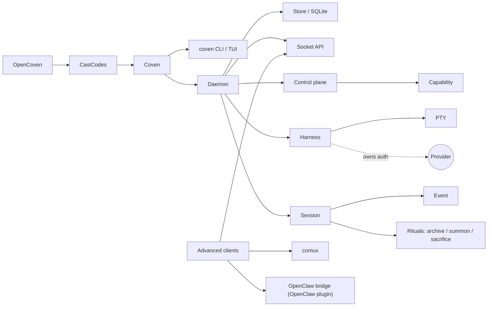

# Glossary

> **See also:** the condensed [reference glossary](/reference/glossary), which additionally defines future orchestration terms (affinity, handoff, harness capability, router). This repo-root page is the fuller canonical term list.

How the terms fit together at a glance:

Definitions follow alphabetically.

## ACP

Agent Client Protocol. In this repo, ACP appears as an integration surface for external agent runtimes and OpenClaw compatibility. Coven itself is not an ACP implementation; the external OpenClaw plugin maps between OpenClaw runtime events and Coven sessions.

## API version

The named compatibility contract exposed by the daemon socket API. Current stable value: `coven.daemon.v1`.

## Archive

Hide a non-running session from the active list while preserving its record and events.

## Capability

A discoverable daemon or adapter feature returned by `GET /api/v1/capabilities`.

## Cast

Coven's plan-then-run flow for free-text tasks. `coven "<task>"` parses the
task into an intent, shows a plan card (spell, harness, risk), gates anything
destructive behind confirmation, then runs it in a recorded session.

## CastCodes

The local-first AI coding workspace powered by Coven. CastCodes is the primary public proof surface: the product users open to run visible lanes, inspect work, review diffs, verify changes, and decide what lands.

## Client

Any process or UI that talks to the Coven daemon. CastCodes is the primary public client; the CLI/TUI, comux, and the OpenClaw plugin are operator, legacy, or advanced client shapes.

## comux

The legacy/reference cockpit layer for visible agent work, panes, worktrees, review, and merge flow. comux proved primitives that are being folded into CastCodes; it is not the Coven runtime or the future-facing flagship surface.

## Control plane

The daemon layer that exposes capabilities and routes known action ids to owned adapters.

## Coven

The OpenCoven local runtime substrate and command-line product.

## `coven`

The user-facing command.

## `coven pc`

macOS-first system diagnostics and relief subcommand. Reports CPU, memory, disk, and top processes. Write operations (process kill, cache clear) are gated behind `--confirm`.

## `COVEN_HOME`

The local directory where Coven stores daemon/socket/database state when configured. Runtime state should not be committed to source control.

## Daemon

The local Rust process that owns live session state and the socket API.

## Event

An append-only record for session output, exit, or metadata.

## Familiar

A named agent identity with a role and memory, declared in
`~/.coven/familiars.toml`. `coven run <harness> --familiar <id>` injects the
familiar's identity preamble into the session; `coven doctor` lists configured
familiars and their memory freshness.

## Harness

A supported coding-agent CLI that Coven can launch and supervise.

## OpenCoven

The broader organization and lab around CastCodes, Coven, and related integrations.

## OpenClaw plugin

The external package external OpenClaw bridge plugin, which lets OpenClaw use Coven through the socket API. It is not part of OpenClaw core.

## Project root

The explicit repository or project boundary for a session.

## PTY

Pseudoterminal. Coven uses PTYs so harnesses behave like terminal-native tools while their output can still be recorded and replayed.

## Prompt-first TUI

The default `coven` and `coven tui` interface. Accepts free-form task text or slash commands like `/run codex <task>` as input, alongside arrow-key menu navigation.

## Relief

Write-side operations in `coven pc` that mutate system state (process termination, cache deletion). Always require an explicit `--confirm` flag.

## Ritual

Any of the explicit session lifecycle verbs: Archive, Summon, Sacrifice, and
Rejoin (reattach). See each entry for what it does and whether it is
reversible.

## Sacrifice

Permanently delete a non-running session and its events.

## Session

A Coven-owned record of one harness run.

## Socket API

The local HTTP-over-Unix-socket API exposed by the daemon.

## Spell

The free-text task a user gives Cast (e.g. `coven "fix the failing tests"`).
The Cast plan card shows the spell alongside the chosen harness and risk level.

## Summon

Restore an archived session to the active list and then replay/follow it.

## Future coordination

Multi-harness handoff and task routing are not current public CLI/API features. They should be documented only as roadmap work until implemented.
