# Harness adapter guide

Coven should treat every harness as an adapter. The daemon ships a small bundled compatibility adapter set for Codex and Claude Code, but no harness should become privileged runtime logic. OpenClaw, Hermes, Aider, Gemini, and future agents should enter through the same adapter contract and maturity checklist.

The goal is a harness-neutral runtime:

- Coven owns project-root validation, PTY supervision, session ids, event replay, and local socket policy.
- The adapter owns how to detect and invoke one external CLI.
- Provider auth, model/provider config, tools, skills, and memory stay inside that external harness.
- Clients can discover supported adapters with `coven adapter list` instead of hard-coding "Codex vs Claude" assumptions.

## Current adapter shape

A Coven harness adapter defines:

- stable Coven harness id;
- user-facing label;
- executable name to detect on `PATH`;
- prompt argument shape for interactive mode;
- prompt argument shape for non-interactive mode; and
- install/authentication hint for `coven doctor`.

The current implementation expects the prompt to be the final command argument after any fixed prefix args. Keep that invariant unless the adapter explicitly documents a safer stdin or protocol mode.

## External adapter rule

New harnesses should not be added as one-off special cases across the daemon, TUI, docs, OpenClaw plugin, and package READMEs. Add a reusable adapter description first, then wire the daemon and clients against that description.

For now, Codex and Claude Code remain the bundled compatibility defaults. Additional harnesses can be tested through explicit adapter manifests.

Load one manifest file:

```json
{
  "adapters": [
    {
      "id": "example",
      "label": "Example Harness",
      "executable": "example",
      "interactive_prompt_prefix_args": [],
      "non_interactive_prompt_prefix_args": ["run", "--quiet"],
      "install_hint": "Install Example Harness and make sure `example` is on PATH.",
      "system_prompt_flag": null
    }
  ]
}
```

```sh
export COVEN_HARNESS_ADAPTER_MANIFEST=/path/to/adapters.json
coven adapter list
coven adapter doctor example
```

Load every `*.json` manifest in one or more directories:

```sh
export COVEN_HARNESS_ADAPTER_DIRS="$HOME/.coven/adapters:$HOME/.config/coven/adapters"
coven adapter list --json
```

Without env vars, Coven also checks `COVEN_HOME/adapters/*.json` when `COVEN_HOME` is set, then `~/.coven/adapters/*.json`, and finally `$XDG_CONFIG_HOME/coven/adapters/*.json`.

The prompt is appended as the final command argument after the configured prefix args. Adapter ids must be lowercase and must not collide with built-in ids. Executables are names only, not shell strings or paths.

This manifest path is for explicit integration work. It is not a public support claim for every adapter listed in a maintainer's local manifest.

A code-backed adapter should still be shaped as data plus narrow translation functions. The adapter registry/manifest can describe:

- `id`, `label`, and `executable`;
- detection and setup hints;
- interactive, one-shot, and optional stream/resume argv;
- whether the adapter supports preassigned upstream session ids;
- whether the adapter has a dedicated system-prompt/identity flag;
- output expectations and known unsupported modes; and
- client compatibility notes for OpenClaw, CastCodes, and other consumers.

Do not promote a harness to public support by only adding it to `built_in_harness_specs()`. That makes the UI and docs look supported before the adapter contract is proven.

## Bundled compatibility adapters

The bundled compatibility adapters are Codex and Claude Code. They are first-class supported user paths, not a model for hardcoding every future harness.

### Codex

- Harness id: `codex`
- Executable: `codex`
- Interactive prefix args: none
- Non-interactive prefix args: `exec --skip-git-repo-check --color never`

Setup hint:

```sh
npm install -g @openai/codex
codex login
```

### Claude Code

- Harness id: `claude`
- Executable: `claude`
- Interactive prefix args: none
- Non-interactive prefix args: `--print`

Setup hint:

```sh
npm install -g @anthropic-ai/claude-code
claude doctor
```

## First external integration: OpenClaw

OpenClaw is the first external integration boundary for Coven, but it is not a daemon-launched harness id. The package `@opencoven/coven` is an external OpenClaw ACP runtime bridge:

- OpenClaw registers ACP backend id `coven`.
- The bridge talks to the local Coven daemon over the configured Unix socket.
- OpenClaw chooses an ACP agent id, maps it to a Coven harness id, and launches a project-scoped Coven session.
- Coven validates the project root, harness id, session id, input, and kill requests.
- OpenClaw keeps responsibility for its own UI, chat/session routing, plugin lifecycle, and ACP bindings.

This is the integration shape future clients should follow: consume Coven's socket API and adapter discovery, do not import daemon internals or require Coven to know OpenClaw internals.

## Adapter requirements

Before adding a new harness, confirm:

- the CLI can be detected safely on `PATH`;
- the prompt can be passed without shell interpolation;
- the process can run from a validated project cwd;
- output can be captured through PTY/session events;
- authentication stays in the harness provider's normal local flow;
- failure modes are understandable in `coven doctor`;
- tests cover command construction and missing executable behavior.

## Adapter commands

Use these commands to debug a machine that only has Codex, Claude Code, or a local manifest adapter installed:

```sh
coven adapter list
coven adapter list --json
coven adapter doctor
coven adapter doctor codex
coven adapter doctor claude
```

`coven doctor` includes the same configured adapter set in its broader local runtime report.

## Adding a new adapter

1. Start with a research note in `docs/FUTURE-HARNESSES.md` or a dedicated `docs/harnesses/<id>.md` page.
2. Document the exact CLI contract: install, auth/setup, interactive launch, one-shot prompt launch, quiet/programmatic output mode, resume/session behavior, and unsupported modes.
3. Add command-construction tests before changing user-facing docs to say the harness is supported.
4. Add `coven adapter doctor` / `coven doctor` detection and setup hints.
5. Add launch behavior behind the generic adapter path, not scattered string checks.
6. Add client compatibility notes for the OpenClaw bridge and any CastCodes surfaces that expose the harness.
7. Run a smoke test against a real install or clearly document that support is still research-only.

## What not to add yet

Avoid generic arbitrary command adapters until Coven has explicit policy and approval behavior for them.

Arbitrary commands are more dangerous than named harness adapters because they can blur the difference between "run a coding agent in this project" and "execute whatever string a client sent." Keep v0 narrow.

## Future harness evaluation checklist

For a candidate harness, document:

- install command;
- executable name;
- local auth flow;
- one-shot prompt command;
- interactive command;
- resume/session command, if any;
- non-interactive output mode;
- whether stdin prompt injection is needed;
- whether the CLI can disable color/control sequences;
- whether the CLI can avoid shell quoting hazards;
- known exit codes;
- minimum safe smoke test.

## Session identity mapping

Some harnesses have their own upstream session ids. Coven's session id remains the local runtime id.

If upstream ids become useful, store them as metadata rather than replacing Coven's own id. Clients should be able to rely on a stable Coven id for attach, events, archive, summon, and sacrifice.

## Suggested adapter maturity stages

1. **Research note** - document CLI shape and risks.
2. **Command construction tests** - prove argv construction is safe.
3. **Doctor detection** - add install/auth hints.
4. **Launch smoke** - prove a session can run in a temporary project.
5. **Attach/replay smoke** - prove events can be replayed.
6. **Client compatibility** - update CastCodes-facing docs and advanced-client integration tests.

Do not skip from research directly to public support.

```mermaid
flowchart LR
  S1["1. Research note\n(public CLI shape + risks)"] --> S2
  S2["2. argv construction tests\n(no shell, prompt last)"] --> S3
  S3["3. coven doctor detection\n(install + auth hints)"] --> S4
  S4["4. Launch smoke\n(temp project, fake creds)"] --> S5
  S5["5. Attach / replay smoke\n(events round-trip)"] --> S6
  S6["6. Client compatibility\n(CastCodes + advanced clients)"] --> Done(["Public support"])

  style S1 fill:#3D3547,stroke:#9A8ECD,color:#fff
  style S2 fill:#3D3547,stroke:#9A8ECD,color:#fff
  style S3 fill:#3D3547,stroke:#9A8ECD,color:#fff
  style S4 fill:#3D3547,stroke:#9A8ECD,color:#fff
  style S5 fill:#3D3547,stroke:#9A8ECD,color:#fff
  style S6 fill:#3D3547,stroke:#9A8ECD,color:#fff
  style Done fill:#9A8ECD,stroke:#D4B5FF,color:#1A1825
```



A harness skipping any stage is **not** ready for public support, even if it appears to work on a maintainer's machine.
