# Harness adapter guide

Coven v0 supports Codex and Claude Code. This guide describes the current adapter shape and the bar for adding more harnesses.

## Current adapter shape

A built-in harness adapter defines:

- stable Coven harness id;
- user-facing label;
- executable name to detect on `PATH`;
- prompt argument shape for interactive mode;
- prompt argument shape for non-interactive mode; and
- install/authentication hint for `coven doctor`.

The current implementation expects the prompt to be the final command argument after any fixed prefix args.

## Built-in harnesses

### Codex

- Harness id: `codex`
- Executable: `codex`
- Interactive prefix args: none
- Non-interactive prefix args: `exec --skip-git-repo-check --color never`

Setup hint:

```sh
npm install -g @openai/codex
codex login
```

### Claude Code

- Harness id: `claude`
- Executable: `claude`
- Interactive prefix args: none
- Non-interactive prefix args: `--print`

Setup hint:

```sh
npm install -g @anthropic-ai/claude-code
claude doctor
```

## Adapter requirements

Before adding a new harness, confirm:

- the CLI can be detected safely on `PATH`;
- the prompt can be passed without shell interpolation;
- the process can run from a validated project cwd;
- output can be captured through PTY/session events;
- authentication stays in the harness provider's normal local flow;
- failure modes are understandable in `coven doctor`;
- tests cover command construction and missing executable behavior.

## What not to add yet

Avoid generic arbitrary command adapters until Coven has explicit policy and approval behavior for them.

Arbitrary commands are more dangerous than named harness adapters because they can blur the difference between "run a coding agent in this project" and "execute whatever string a client sent." Keep v0 narrow.

## Future harness evaluation checklist

For a candidate harness, document:

- install command;
- executable name;
- local auth flow;
- one-shot prompt command;
- interactive command;
- resume/session command, if any;
- non-interactive output mode;
- whether stdin prompt injection is needed;
- whether the CLI can disable color/control sequences;
- whether the CLI can avoid shell quoting hazards;
- known exit codes;
- minimum safe smoke test.

## Session identity mapping

Some harnesses have their own upstream session ids. Coven's session id remains the local runtime id.

If upstream ids become useful, store them as metadata rather than replacing Coven's own id. Clients should be able to rely on a stable Coven id for attach, events, archive, summon, and sacrifice.

## Suggested adapter maturity stages

1. **Research note** - document CLI shape and risks.
2. **Command construction tests** - prove argv construction is safe.
3. **Doctor detection** - add install/auth hints.
4. **Launch smoke** - prove a session can run in a temporary project.
5. **Attach/replay smoke** - prove events can be replayed.
6. **Client compatibility** - update docs and integration tests.

Do not skip from research directly to public support.

```mermaid
flowchart LR
  S1["1. Research note\n(public CLI shape + risks)"] --> S2
  S2["2. argv construction tests\n(no shell, prompt last)"] --> S3
  S3["3. coven doctor detection\n(install + auth hints)"] --> S4
  S4["4. Launch smoke\n(temp project, fake creds)"] --> S5
  S5["5. Attach / replay smoke\n(events round-trip)"] --> S6
  S6["6. Client compatibility\n(comux + plugin tests)"] --> Done(["Public support"])

  style S1 fill:#3D3547,stroke:#9A8ECD,color:#fff
  style S2 fill:#3D3547,stroke:#9A8ECD,color:#fff
  style S3 fill:#3D3547,stroke:#9A8ECD,color:#fff
  style S4 fill:#3D3547,stroke:#9A8ECD,color:#fff
  style S5 fill:#3D3547,stroke:#9A8ECD,color:#fff
  style S6 fill:#3D3547,stroke:#9A8ECD,color:#fff
  style Done fill:#9A8ECD,stroke:#D4B5FF,color:#1A1825
```



A harness skipping any stage is **not** ready for public support, even if it appears to work on a maintainer's machine.
