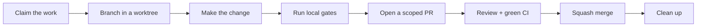

# Coven merge guide

Every change to Coven lands through a pull request with green CI. Nothing is
pushed directly to `main`. This guide is the single path from "I want to change
something" to "the change is merged and cleaned up" — for humans, agents, and
familiars alike.

## The merge path at a glance



In prose, the same contract:

1. **Claim** the issue so parallel sessions do not duplicate it.
2. **Branch** from current `origin/main` in an isolated worktree.
3. **Change** one concern; no drive-by refactors.
4. **Gate** locally: format, lint, test, secret scan.
5. **PR** with a conventional-commit subject and a DCO sign-off.
6. **Merge** only with green CI, preserving contributor attribution.
7. **Clean up**: delete the branch, prune the worktree, release the claim.

## Step 1 — Claim the work

Multiple sessions (Codex, Claude Code, familiars) often run against the same
repository at once. Worktrees stop git operations from racing, but they do not
stop two sessions from independently building the same issue. Claims do.

Before touching code, check what is already taken:

```sh
coven claim status          # active claims, shared across every worktree
gh pr list --state open     # is there already a PR for this issue?
```

Branch names alone will not reveal duplication — one issue can spawn
`fix/output-polish`, `fix/311-output-polish`, and `fix/output-polish-311` from
three different sessions. Check the claim registry and the open PR list, not
just branches.

If the work is free, claim it with a **shared, issue-keyed token** — not your
working branch name, which no other session can predict:

```sh
coven claim acquire issue-311
```

Claims are TTL-bounded (default one hour) and live under git's common
directory in `agent-claims/`, so every worktree and session sees them. For
long tasks, extend the claim:

```sh
coven claim heartbeat issue-311
```

Set `COVEN_AGENT_ID` to a stable agent name so claim ownership is meaningful
across sessions. See [Parallel specialist lanes](familiars/parallel-lanes.md)
for the full protocol, including hooks and environment variables.

## Step 2 — Branch in a worktree

Branch from current `origin/main`, one fresh branch per task. If more than one
session can touch the repository, work in a worktree so operations do not race:

```sh
coven wt fix/311-output-polish
```

This creates or enters `<repo>.wt/<branch-slug>/`. The plain-git equivalent:

```sh
git fetch origin main
git worktree add -b fix/311-output-polish /path/to/coven.wt/fix-311-output-polish origin/main
```

Optionally install the local guard hooks; they block accidental
primary-branch commits, cross-agent claim conflicts, and protected pushes
without explicit merge intent:

```sh
coven hooks install
```

## Step 3 — Keep the diff scoped

- **One concern per PR.** No drive-by refactors inside a feature PR.
- **Respect the authority boundary.** Core and authority logic stays in the
  Rust crates; the npm/TypeScript packages remain thin integration surface.
- **Update docs in the same change** when you modify CLI commands, daemon
  lifecycle, session or event shapes, socket API fields, harness support, or
  security rules. See [Documentation maintenance](DOCS-MAINTENANCE.md).
- For larger changes, **start from an issue** and include the readiness packet
  the PR template asks for.

## Step 4 — Run the local gates

CI rejects on any of these, so run them before opening the PR:

```sh
cargo fmt --check
cargo clippy --workspace --all-targets -- -D warnings
cargo test --workspace --locked
python scripts/check-secrets.py
```

If you touched the npm/TypeScript packages, also:

```sh
npm run build
npm test
```

For docs-only changes, the short form is enough:

```sh
python scripts/check-secrets.py
git diff --check
```

Two gates have no escape hatch:

- `-D warnings` has **no exceptions**. Fix lints; do not add `#[allow(...)]`
  without a justifying comment.
- **Never weaken the secret scan.** If `check-secrets.py` flags content, fix
  the content — do not allowlist past it.

## Step 5 — Open the PR

- Use a conventional-commit subject: `feat:`, `fix:`, `docs:`, `chore:`,
  `refactor:`.
- Sign off every commit for the DCO: `git commit -s`.
- Include smoke-test notes for runtime or API changes.
- Keep the PR description concrete: what changed, why, and how it was
  verified.

```sh
git push -u origin fix/311-output-polish
gh pr create --fill
```

If a guard hook blocks a push to a protected branch, that is the protocol
working. Protected pushes require `.git/MERGE_INTENT` to contain the exact
merge phrase (`Enchant merge to main.` by default; `COVEN_MERGE_PHRASE`
overrides it). Reaching for that phrase should be rare and deliberate — the
normal path is always a PR.

## Step 6 — Merge

- Merge only with **green CI**. Do not disable gates or branch protection to
  land a change; if it cannot go through a green PR, surface the blocker.
- Squash merge is the default. The squash commit subject should remain a
  conventional-commit line.
- **Preserve attribution when squashing.** If the PR builds on someone else's
  work — a fork PR, an issue author's proposal, a co-author — keep their
  trailer in the squash commit message:

  ```text
  Co-authored-by: Full Name <ID+username@users.noreply.github.com>
  ```

  Use the numeric-id no-reply form; get the id with
  `gh api users/<login> --jq .id`. Never use a machine or `.local` email in a
  trailer — it links to no account and gives zero credit.

### Resolving conflicts

Rebase onto current `origin/main` rather than merging `main` into the feature
branch:

```sh
git fetch origin main
git rebase origin/main
```

Re-run the full local gates after any conflict resolution — a clean rebase is
not a substitute for a clean test run. Then force-push the feature branch
(`git push --force-with-lease`); never force-push a protected branch.

## Step 7 — Clean up

After the merge:

```sh
gh pr view --json state          # confirm merged
git push origin --delete fix/311-output-polish
coven wt --prune-merged
coven claim release issue-311
```

Stale worktrees and expired claims accumulate silently; `coven wt --doctor`
and `coven claim status` show what is left behind.

## Troubleshooting

| Symptom | Likely cause | Fix |
| --- | --- | --- |
| Two open PRs for one issue | Sessions skipped the claim step | Close one PR, keep the better diff, credit both authors with trailers |
| `claim acquire` refused | Another agent holds a live claim | Pick different work, or coordinate; check `coven claim status` |
| Push to `main` rejected | Guard hooks or branch protection | Correct behavior — open a PR from a feature branch |
| CI red on `clippy` only | New lint from `-D warnings` | Fix the lint; do not `#[allow(...)]` without a justifying comment |
| Secret scan flags a doc example | Realistic-looking token or private path | Replace with public-safe placeholders from [Documentation maintenance](DOCS-MAINTENANCE.md) |
| Worktree list keeps growing | Merged branches never pruned | `coven wt --prune-merged`, then `coven wt --prune-stale 14` |

## Related

- [Parallel specialist lanes](familiars/parallel-lanes.md) — worktrees, claims, and guard hooks in depth
- [CLI reference](reference/cli.md) — `coven wt`, `coven claim`, `coven hooks install`
- [Documentation maintenance](DOCS-MAINTENANCE.md) — public-docs rules and docs-only gates
- [CONTRIBUTING](../CONTRIBUTING.md) — the full contribution bar, DCO, and release checklist
