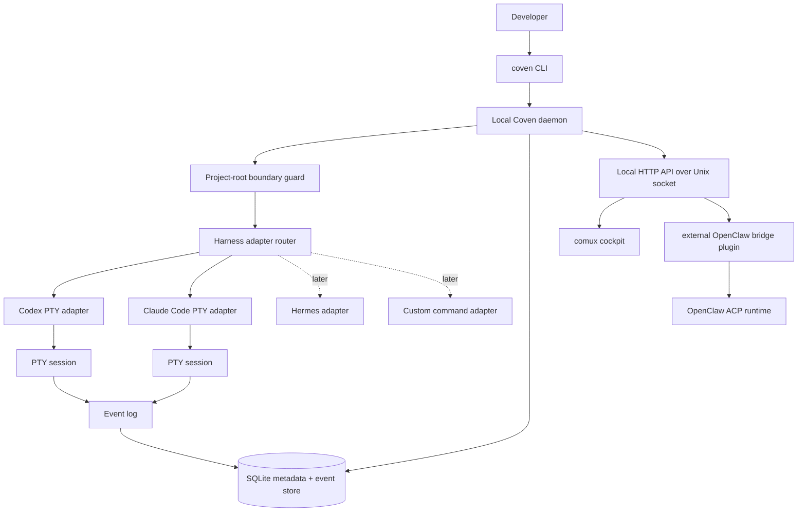
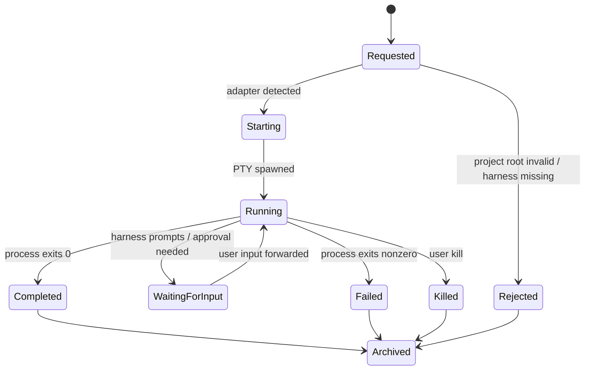
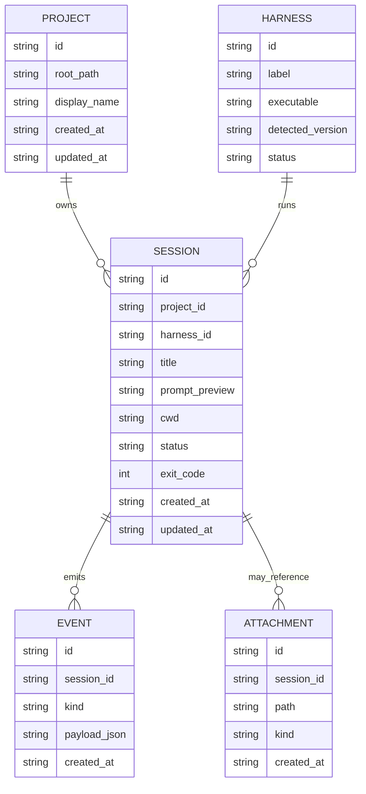
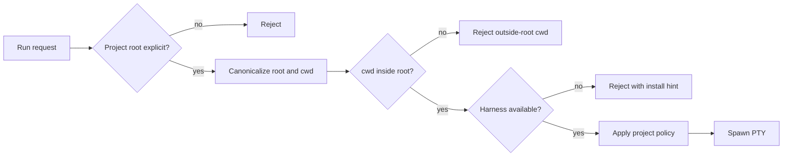
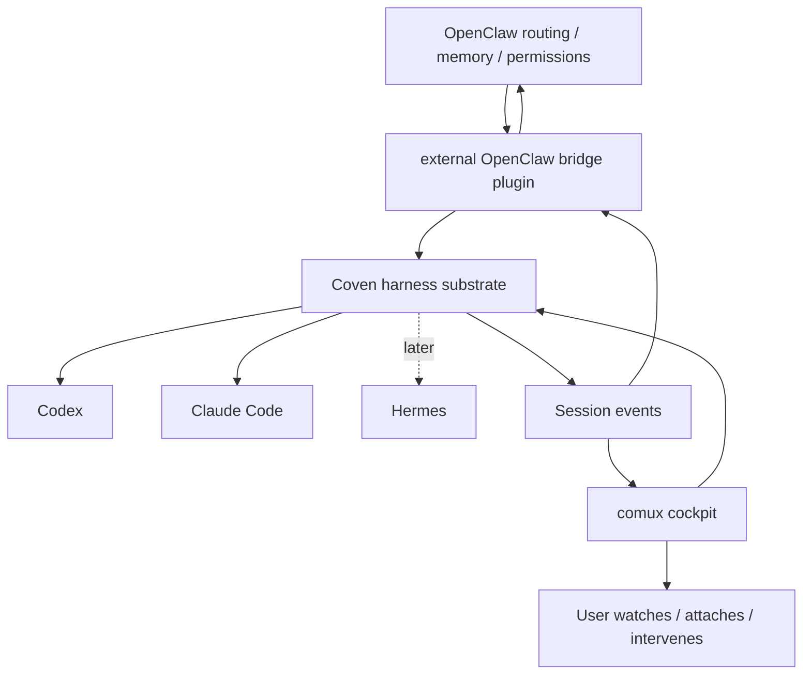
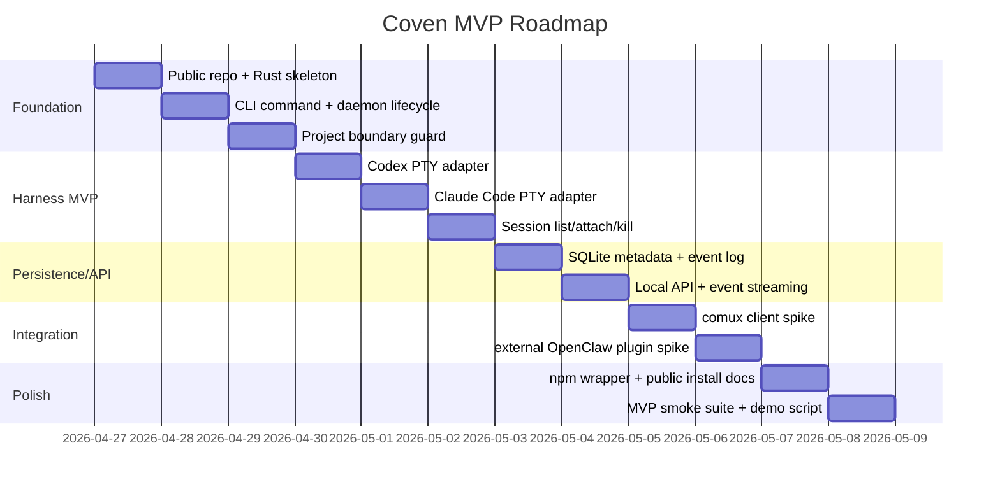

# Coven MVP Product + Implementation Plan

> **Historical framing note:** This plan captured the first Coven MVP path when comux was the proving cockpit. Current public product direction is CastCodes as the primary proof surface and Coven as the runtime that powers it. See [CastCodes and Coven integration](/CASTCODES-INTEGRATION) and [Roadmap](/ROADMAP) for current positioning.

> **For agentic workers:** REQUIRED SUB-SKILL: Use superpowers:subagent-driven-development (recommended) or superpowers:executing-plans to implement this plan task-by-task. Steps use checkbox (`- [ ]`) syntax for tracking.

**Goal:** Build Coven as a public, standalone, Rust-first harness substrate that runs Codex and Claude Code as project-scoped, attachable PTY sessions, then exposes enough API surface for comux and external clients such as the external OpenClaw bridge plugin OpenClaw plugin to manage those sessions through Coven.

**Architecture:** Coven starts as a local Rust CLI/daemon with strict project-root boundaries, a small built-in adapter layer for Codex and Claude Code, local SQLite/event-log persistence, and a local API for clients. TypeScript enters as a convenience layer for npm distribution, SDKs, and external adapters; comux becomes the first visual cockpit client, while OpenClaw integration stays outside OpenClaw core as a ClawHub plugin.

**Tech Stack:** Rust, `portable-pty`, SQLite via `rusqlite`, local HTTP-over-Unix-socket daemon API, npm wrapper package `@opencoven/cli` exposing binary command `coven`, and TypeScript packages for external adapters such as external OpenClaw bridge plugin.

---

## 1. Product north star

Coven is not another agent harness. Coven is the harness substrate.

It lets a user bring whatever coding harness they already trust — Codex, Claude Code, Hermes, Aider, Gemini, OpenCode, or custom tools — and run it inside a project-scoped, observable, attachable, persistent workspace.

**North-star promise:**

> One project. Any harness. Visible work.

**OpenCoven phrasing:**

> Bring any familiar into the circle.

**Trust phrase:**

> Full autonomy, inside a room you chose.

## 2. Why Coven exists

Users do not all agree on one agent harness. Some prefer Codex for codebase work. Some prefer Claude Code for frontend/product polish. Some will bring Gemini, Aider, Hermes, custom shell agents, or whatever comes next.

OpenCoven should not force users into one basket. Coven gives the OpenCoven ecosystem a neutral runtime layer:

- Harness-neutral execution.
- Project-scoped autonomy boundaries.
- Persistent session/event history.
- Attachability and visibility.
- A path for comux and external adapters such as external OpenClaw bridge plugin to coordinate work without hard-coding one agent provider.

## 3. Naming and package rules

- **Product:** Coven
- **Public repo target:** `OpenCoven/coven`
- **CLI command:** `coven`
- **npm org/namespace:** `@OpenCoven` / lowercase npm package names such as `@opencoven/cli`
- **Do not use as terminal command:** `@opencoven`, `opencoven`, or a scoped package name
- **Discord/community link:** `discord.gg/opencoven`
- **X / Twitter handle:** `@OpenCvn`

Expected UX:

```sh
npm exec @opencoven/cli -- run codex "fix tests"
pnpm dlx @opencoven/cli run claude "polish the landing page"

# Once installed or resolved by package shim:
coven run codex "fix tests"
coven run claude "polish the landing page"
coven sessions
coven sessions --plain
coven attach <session-id>
```

## 4. Explicit MVP scope

### In scope for MVP

- Public repo and public package/release flow.
- Rust CLI command named `coven`.
- Local daemon process.
- Interactive PTY sessions.
- Built-in Codex adapter.
- Built-in Claude Code adapter.
- Strict explicit project-root boundary.
- Session list, human browser, attach/rejoin/view-log flows, archive/summon/sacrifice rituals, and daemon kill API for live sessions.
- Local event log and session metadata.
- Minimal local API for comux and external plugin integration.
- Npm-first distribution wrapper with native binary.
- Clear public docs for early adopters.
- `coven patch openclaw` as a CLI-first rescue loop for local OpenClaw source checkouts.

### Out of scope for MVP

- Public launch.
- Marketplace/plugin ecosystem.
- Full TypeScript plugin runtime.
- Cloud sync as a hard requirement.
- Bundled OpenClaw core integration.
- Full OpenClaw replacement.
- Full comux UI rewrite.
- Mobile/native clients.
- Browser automation harness support beyond documenting the adapter path.
- Multi-user collaboration.
- Billing.

### Scope rule

If a feature does not help an early adopter run Codex or Claude Code in a visible, project-scoped, attachable session, it is not MVP.

## 5. MVP success criteria

Coven MVP is successful when all of this is true:

1. From a Git project root, a developer can run:

```sh
coven run codex "fix the failing tests"
coven run claude "polish this UI"
```

2. Both commands create supervised interactive PTY sessions.
3. `coven sessions` shows active and completed sessions, opening the interactive browser in terminals and plain output when piped.
4. `coven attach <session-id>` reconnects to live PTY output/input, while the browser exposes **Rejoin** / **View Log** without making users copy ids.
5. The daemon `POST /api/v1/sessions/:id/kill` API stops a live session cleanly; the CLI keeps destructive history cleanup behind `coven sacrifice <session-id> --yes`.
6. Session metadata and event logs survive daemon restart.
7. Coven refuses to run a session outside the explicitly selected project root.
8. comux can query sessions through the local API and show them as external/Coven-managed panes.
9. The external OpenClaw plugin can invoke Coven for at least one local project task without requiring Coven code in the OpenClaw repo.
10. The npm wrapper exposes the command as `coven`.
11. A user can run `coven patch openclaw --dry-run --repo <openclaw-source>` and see a safe repair plan without launching a harness.
12. A user can run `coven patch openclaw "<issue>" --repo <openclaw-source> --harness codex` to launch a supervised patch session that leaves changes uncommitted.

## 6. Product metrics

### Activation metrics

- Time from install to first successful `coven run`: target under 5 minutes.
- Percent of first runs that fail due to missing Codex/Claude binary.
- Percent of failed runs with actionable remediation shown.

### Reliability metrics

- Session start success rate.
- Session attach success rate.
- Clean kill success rate.
- Daemon restart recovery success rate.
- Event log write failure count.

### Safety metrics

- Number of rejected out-of-root cwd attempts.
- Number of command attempts blocked by project policy.
- Number of sessions launched without an explicit project root: target 0.

### Product usefulness metrics

- Number of sessions launched per project per day.
- Session duration distribution.
- Number of sessions viewed through comux.
- Number of sessions launched through the external OpenClaw plugin once enabled.
- Manual user rating per session: useful / not useful / blocked.

## 7. System architecture



## 8. Runtime session model



## 9. Data model v0



## 10. Local API v1

The local API should be boring and stable. It is now the contract between Rust and external clients, including comux and the external OpenClaw bridge plugin OpenClaw plugin. Prefer the smallest local HTTP-over-Unix-socket surface that can be versioned, tested, and kept backward compatible.

Implemented route surface:

- `GET /api/v1/api-version`
- `GET /api/v1/health`
- `GET /api/v1/sessions`
- `POST /api/v1/sessions`
- `GET /api/v1/sessions/:id`
- `GET /api/v1/events?sessionId=...`
- `POST /api/v1/sessions/:id/input`
- `POST /api/v1/sessions/:id/kill`

Legacy unversioned routes remain as early-MVP aliases while clients move to `/api/v1`.

Logical contract:

```ts
type HarnessId = 'codex' | 'claude' | string;
type SessionStatus = 'starting' | 'running' | 'waiting' | 'completed' | 'failed' | 'killed';

type ProjectSummary = {
  id: string;
  root: string;
  title: string;
};

type HarnessSummary = {
  id: HarnessId;
  label: string;
  available: boolean;
  version?: string;
  installHint?: string;
};

type SessionSummary = {
  id: string;
  projectId: string;
  harness: HarnessId;
  title: string;
  cwd: string;
  status: SessionStatus;
  createdAt: string;
  updatedAt: string;
};

type RunRequest = {
  projectRoot: string;
  harness: HarnessId;
  prompt: string;
  title?: string;
  cwd?: string;
};
```

Future logical operations, if a higher-level SDK is added:

- `projects.open`
- `harnesses.list`
- `sessions.run`
- `sessions.list`
- `sessions.get`
- `sessions.attach`
- `sessions.input`
- `sessions.kill`
- `events.tail`

## 11. Adapter contract v0

Do not overbuild plugin infrastructure in MVP. Start with built-in adapters behind a small trait/interface.

```rust
pub struct RunSpec {
    pub project_root: PathBuf,
    pub cwd: PathBuf,
    pub prompt: String,
    pub title: Option<String>,
}

pub struct HarnessCommand {
    pub executable: String,
    pub args: Vec<String>,
    pub env: Vec<(String, String)>,
    pub cwd: PathBuf,
}

pub trait HarnessAdapter {
    fn id(&self) -> &'static str;
    fn label(&self) -> &'static str;
    fn detect(&self) -> HarnessDetection;
    fn build_command(&self, spec: &RunSpec) -> Result<HarnessCommand, AdapterError>;
}
```

### Codex adapter v0

- Detects `codex` on PATH.
- Launches Codex in interactive PTY mode.
- Passes prompt as safely quoted argument or prompt file, depending on actual CLI behavior.
- Uses project `cwd` only after boundary validation.

### Claude Code adapter v0

- Detects Claude Code CLI on PATH.
- Launches Claude in interactive PTY mode.
- Passes prompt safely.
- Uses project `cwd` only after boundary validation.

### Hermes and future adapters

Hermes should be a phase-2 adapter target unless its CLI contract is already stable during MVP implementation. Coven should not assume Hermes behaves like Codex or Claude; it should rely on the adapter contract.

Future adapter support should cover:

- `hermes`
- `aider`
- `gemini`
- `opencode`
- `custom` command adapter

## 12. Security and trust boundaries



Rules:

- Coven never launches work without an explicit project root.
- Coven canonicalizes root/cwd before comparing paths.
- Symlinks must not bypass root checks.
- Prompt text must not be interpolated into shell commands.
- Harness launch should use argv APIs, not `sh -c`, unless unavoidable and reviewed.
- Event logs must not intentionally store tokens, private URLs, or environment dumps.
- Socket clients are not trusted just because they are first-party or installed from ClawHub.
- OpenClaw core is not part of the Coven trust root; the external plugin is only a socket client.
- External actions such as push/publish/merge are harness behavior, not Coven behavior; later policies can observe/block/require approvals.

## 13. Distribution strategy

### MVP distribution

- Public GitHub repo.
- Public npm package `@opencoven/cli` with platform packages for macOS Apple Silicon and Linux x64.
- Package exposes binary command `coven`.
- Rust binary is built in CI and bundled/downloaded by npm wrapper.

### Later distribution

- Homebrew tap once binary is stable.
- Direct GitHub release artifacts.
- Optional package manager support for cargo, mise, or asdf if demand appears.

## 14. Relationship to comux and OpenClaw



### comux role

comux should not become the harness substrate. comux should become the cockpit UI that visualizes Coven sessions and can open/attach/intervene.

### OpenClaw role

OpenClaw should use Coven only through the external OpenClaw bridge plugin. The OpenClaw repo no longer includes OpenCoven or Coven code, and Coven should not assume OpenClaw internals. OpenClaw remains valuable for permissions, memory, routing, scheduling, user interaction, and Gateway persistence; the plugin translates OpenClaw ACP runtime calls into Coven socket API calls.

The plugin is not part of Coven's trust root. Rust must revalidate all project roots, cwd values, harness ids, input, and kill requests.

### Intake-client role

The chat/intake client remains intake/status/handoff. It should not embed full terminals. It should toss tasks toward OpenClaw/Coven/comux and show compact session status.

## 15. Phased roadmap



### Phase 0: Product framing and repo setup

Goal: keep the public home for Coven clear and lock the initial design.

Exit criteria:

- Public repo exists.
- README states Coven's product thesis.
- Plan/spec files are committed.
- Project board or tracking checklist exists.

### Phase 1: Rust CLI/daemon foundation

Goal: make `coven` real.

Exit criteria:

- `coven --help` works.
- `coven daemon start/status/stop` works.
- `coven doctor` detects OS, shell, Codex, Claude Code, tmux/PTY prerequisites if needed.
- Daemon can persist a project record.

### Phase 2: Project boundary and session model

Goal: make Coven safe by default.

Exit criteria:

- `coven project open <path>` canonicalizes and stores explicit project root.
- `coven run ...` refuses outside-root cwd.
- Symlink escape tests pass.
- Session IDs are stable and human-readable enough for CLI use.

### Phase 3: Codex + Claude interactive PTY

Goal: prove harness plurality.

Exit criteria:

- `coven run codex "..."` starts an attachable PTY session.
- `coven run claude "..."` starts an attachable PTY session.
- `coven attach <id>` works.
- `coven sessions` shows status.
- Live session kill works through the daemon API, and CLI history cleanup uses guarded `coven sacrifice <id> --yes`.
- Missing harness produces an actionable install hint.

### Phase 4: Persistence and local API

Goal: make sessions observable by other tools.

Exit criteria:

- Session metadata survives daemon restart.
- Event logs can be tailed.
- Local API supports projects/harnesses/sessions/events.
- API has an auth/local-origin story appropriate for a public local-first MVP.

### Phase 5: comux bridge

Goal: make comux the first cockpit client.

Exit criteria:

- comux can list Coven sessions for a project.
- comux can open/attach to a Coven-managed session.
- comux marks sessions as Coven-managed vs native comux panes.
- No full comux rewrite required.

### Phase 6: External OpenClaw plugin

Goal: provide an opt-in OpenClaw ACP backend through a ClawHub package, without adding Coven code to OpenClaw core.

Exit criteria:

- The external OpenClaw bridge plugin can launch a coding task through Coven.
- The plugin receives session ID and status/events.
- The plugin can stop/list sessions through the Coven socket API where the host runtime needs it.
- Existing direct ACP path remains as fallback only when explicitly configured.
- No bundled OpenClaw core integration is required for MVP.

### Phase 7: Hermes/future harness adapters

Goal: prove the adapter road can extend beyond the first two.

Exit criteria:

- Hermes CLI contract is documented.
- Hermes adapter spike exists or a generic command adapter can run it.
- Adapter contract updated only if real Hermes behavior requires it.
- No marketplace/plugin overbuild yet.

## 16. Implementation plan

### Task 1: Create Coven repo skeleton

**Files:**
- Create: `README.md`
- Create: `LICENSE`
- Create: `docs/PRODUCT-SPEC.md`
- Create: `docs/MVP-PLAN.md`
- Create: `Cargo.toml`
- Create: `crates/coven-cli/Cargo.toml`
- Create: `crates/coven-cli/src/main.rs`
- Create: `.gitignore`

- [x] **Step 1: Initialize repo**

Run:

```bash
mkdir -p ~/Documents/GitHub/OpenCoven/coven
cd ~/Documents/GitHub/OpenCoven/coven
git init -b main
```

Expected: empty local repo on `main`.

- [x] **Step 2: Create Rust workspace**

Create `Cargo.toml`:

```toml
[workspace]
members = ["crates/coven-cli"]
resolver = "2"

[workspace.package]
edition = "2021"
license = "MIT"
authors = ["OpenCoven contributors"]
repository = "https://github.com/OpenCoven/coven"
```

Create `crates/coven-cli/Cargo.toml`:

```toml
[package]
name = "coven-cli"
version = "0.0.0"
edition.workspace = true
license.workspace = true
authors.workspace = true
repository.workspace = true

[[bin]]
name = "coven"
path = "src/main.rs"

[dependencies]
anyhow = "1"
clap = { version = "4", features = ["derive"] }
```

Create `crates/coven-cli/src/main.rs`:

```rust
use clap::{Parser, Subcommand};

#[derive(Parser, Debug)]
#[command(name = "coven")]
#[command(about = "Project-scoped harness substrate for agent sessions")]
struct Cli {
    #[command(subcommand)]
    command: Command,
}

#[derive(Subcommand, Debug)]
enum Command {
    Doctor,
}

fn main() -> anyhow::Result<()> {
    let cli = Cli::parse();
    match cli.command {
        Command::Doctor => {
            println!("coven doctor: ok");
        }
    }
    Ok(())
}
```

- [x] **Step 3: Verify CLI skeleton**

Run:

```bash
cargo run -p coven-cli -- doctor
```

Expected output contains:

```text
coven doctor: ok
```

- [x] **Step 4: Commit**

```bash
git add .
git commit -m "chore: scaffold coven rust workspace"
```

### Task 2: Add project boundary guard

**Files:**
- Create: `crates/coven-cli/src/project.rs`
- Modify: `crates/coven-cli/src/main.rs`
- Test: `crates/coven-cli/src/project.rs`

- [x] **Step 1: Add path canonicalization helper and tests**

Create `crates/coven-cli/src/project.rs`:

```rust
use std::path::{Path, PathBuf};

pub fn canonical_project_root(path: &Path) -> anyhow::Result<PathBuf> {
    Ok(path.canonicalize()?)
}

pub fn resolve_inside_root(root: &Path, cwd: Option<&Path>) -> anyhow::Result<PathBuf> {
    let root = root.canonicalize()?;
    let candidate = match cwd {
        Some(cwd) if cwd.is_absolute() => cwd.to_path_buf(),
        Some(cwd) => root.join(cwd),
        None => root.clone(),
    };
    let candidate = candidate.canonicalize()?;
    if candidate == root || candidate.starts_with(&root) {
        Ok(candidate)
    } else {
        anyhow::bail!("cwd is outside the Coven project root");
    }
}

#[cfg(test)]
mod tests {
    use super::*;
    use std::fs;

    #[test]
    fn accepts_root_itself() {
        let temp = tempfile::tempdir().unwrap();
        let root = canonical_project_root(temp.path()).unwrap();
        assert_eq!(resolve_inside_root(&root, None).unwrap(), root);
    }

    #[test]
    fn rejects_outside_root() {
        let root = tempfile::tempdir().unwrap();
        let outside = tempfile::tempdir().unwrap();
        let err = resolve_inside_root(root.path(), Some(outside.path())).unwrap_err();
        assert!(err.to_string().contains("outside"));
    }

    #[test]
    fn accepts_child_path() {
        let root = tempfile::tempdir().unwrap();
        fs::create_dir(root.path().join("src")).unwrap();
        let resolved = resolve_inside_root(root.path(), Some(Path::new("src"))).unwrap();
        assert!(resolved.ends_with("src"));
    }
}
```

Update `crates/coven-cli/Cargo.toml`:

```toml
[dev-dependencies]
tempfile = "3"
```

- [x] **Step 2: Run tests**

```bash
cargo test -p coven-cli project
```

Expected: all project boundary tests pass.

- [x] **Step 3: Commit**

```bash
git add crates/coven-cli
 git commit -m "feat: add project boundary guard"
```

### Task 3: Add harness detection for Codex and Claude Code

**Files:**
- Create: `crates/coven-cli/src/harness.rs`
- Modify: `crates/coven-cli/src/main.rs`

- [x] **Step 1: Create harness model**

Create `crates/coven-cli/src/harness.rs`:

```rust
use std::process::Command;

#[derive(Debug, Clone, PartialEq, Eq)]
pub struct HarnessSummary {
    pub id: &'static str,
    pub label: &'static str,
    pub executable: &'static str,
    pub available: bool,
    pub install_hint: &'static str,
}

fn executable_exists(executable: &str) -> bool {
    Command::new("sh")
        .arg("-c")
        .arg(format!("command -v {} >/dev/null 2>&1", executable))
        .status()
        .map(|status| status.success())
        .unwrap_or(false)
}

pub fn built_in_harnesses() -> Vec<HarnessSummary> {
    vec![
        HarnessSummary {
            id: "codex",
            label: "Codex",
            executable: "codex",
            available: executable_exists("codex"),
            install_hint: "Install or authenticate the Codex CLI, then retry `coven doctor`.",
        },
        HarnessSummary {
            id: "claude",
            label: "Claude Code",
            executable: "claude",
            available: executable_exists("claude"),
            install_hint: "Install or authenticate Claude Code, then retry `coven doctor`.",
        },
    ]
}
```

- [x] **Step 2: Wire `coven doctor`**

Modify `crates/coven-cli/src/main.rs` to include:

```rust
mod harness;
mod project;

use clap::{Parser, Subcommand};

#[derive(Parser, Debug)]
#[command(name = "coven")]
#[command(about = "Project-scoped harness substrate for agent sessions")]
struct Cli {
    #[command(subcommand)]
    command: Command,
}

#[derive(Subcommand, Debug)]
enum Command {
    Doctor,
}

fn main() -> anyhow::Result<()> {
    let cli = Cli::parse();
    match cli.command {
        Command::Doctor => {
            println!("coven doctor");
            for harness in harness::built_in_harnesses() {
                let status = if harness.available { "available" } else { "missing" };
                println!("- {} ({}) — {}", harness.label, harness.id, status);
                if !harness.available {
                    println!("  hint: {}", harness.install_hint);
                }
            }
        }
    }
    Ok(())
}
```

- [x] **Step 3: Verify doctor output**

```bash
cargo run -p coven-cli -- doctor
```

Expected output lists Codex and Claude Code with `available` or `missing`.

- [x] **Step 4: Commit**

```bash
git add crates/coven-cli
 git commit -m "feat: detect built-in harnesses"
```

### Task 4: Add session store

**Files:**
- Create: `crates/coven-cli/src/store.rs`
- Modify: `crates/coven-cli/Cargo.toml`

- [x] **Step 1: Add SQLite dependencies**

Update `crates/coven-cli/Cargo.toml`:

```toml
[dependencies]
anyhow = "1"
clap = { version = "4", features = ["derive"] }
rusqlite = { version = "0.31", features = ["bundled"] }
uuid = { version = "1", features = ["v4"] }
chrono = { version = "0.4", features = ["serde"] }
serde = { version = "1", features = ["derive"] }
serde_json = "1"
```

- [x] **Step 2: Implement schema and session insert/list**

Create `crates/coven-cli/src/store.rs`:

```rust
use rusqlite::{params, Connection};
use std::path::Path;

#[derive(Debug, Clone)]
pub struct SessionRecord {
    pub id: String,
    pub project_root: String,
    pub harness: String,
    pub title: String,
    pub status: String,
    pub created_at: String,
    pub updated_at: String,
}

pub fn open_store(path: &Path) -> anyhow::Result<Connection> {
    let conn = Connection::open(path)?;
    conn.execute_batch(
        r#"
        create table if not exists sessions (
            id text primary key,
            project_root text not null,
            harness text not null,
            title text not null,
            status text not null,
            created_at text not null,
            updated_at text not null
        );
        create table if not exists events (
            id integer primary key autoincrement,
            session_id text not null,
            kind text not null,
            payload_json text not null,
            created_at text not null
        );
        "#,
    )?;
    Ok(conn)
}

pub fn insert_session(conn: &Connection, record: &SessionRecord) -> anyhow::Result<()> {
    conn.execute(
        "insert into sessions (id, project_root, harness, title, status, created_at, updated_at) values (?1, ?2, ?3, ?4, ?5, ?6, ?7)",
        params![record.id, record.project_root, record.harness, record.title, record.status, record.created_at, record.updated_at],
    )?;
    Ok(())
}

pub fn list_sessions(conn: &Connection) -> anyhow::Result<Vec<SessionRecord>> {
    let mut stmt = conn.prepare(
        "select id, project_root, harness, title, status, created_at, updated_at from sessions order by created_at desc",
    )?;
    let rows = stmt.query_map([], |row| {
        Ok(SessionRecord {
            id: row.get(0)?,
            project_root: row.get(1)?,
            harness: row.get(2)?,
            title: row.get(3)?,
            status: row.get(4)?,
            created_at: row.get(5)?,
            updated_at: row.get(6)?,
        })
    })?;
    Ok(rows.collect::<Result<Vec<_>, _>>()?)
}
```

- [x] **Step 3: Add store tests**

Append to `store.rs`:

```rust
#[cfg(test)]
mod tests {
    use super::*;

    #[test]
    fn inserts_and_lists_sessions() {
        let temp = tempfile::NamedTempFile::new().unwrap();
        let conn = open_store(temp.path()).unwrap();
        let record = SessionRecord {
            id: "s1".into(),
            project_root: "/repo".into(),
            harness: "codex".into(),
            title: "Fix tests".into(),
            status: "running".into(),
            created_at: "2026-04-27T00:00:00Z".into(),
            updated_at: "2026-04-27T00:00:00Z".into(),
        };
        insert_session(&conn, &record).unwrap();
        let sessions = list_sessions(&conn).unwrap();
        assert_eq!(sessions.len(), 1);
        assert_eq!(sessions[0].id, "s1");
        assert_eq!(sessions[0].harness, "codex");
    }
}
```

- [x] **Step 4: Run tests**

```bash
cargo test -p coven-cli store
```

Expected: store tests pass.

- [x] **Step 5: Commit**

```bash
git add crates/coven-cli
 git commit -m "feat: add local session store"
```

### Task 5: Implement `coven run` session creation shell

**Files:**
- Modify: `crates/coven-cli/src/main.rs`
- Modify: `crates/coven-cli/src/harness.rs`
- Modify: `crates/coven-cli/src/store.rs`

- [x] **Step 1: Add CLI shape**

Modify command enum in `main.rs`:

```rust
#[derive(Subcommand, Debug)]
enum Command {
    Doctor,
    Run {
        harness: String,
        prompt: Vec<String>,
        #[arg(long)]
        cwd: Option<std::path::PathBuf>,
        #[arg(long)]
        title: Option<String>,
    },
    Sessions,
}
```

- [x] **Step 2: Add store path helper**

Add to `main.rs`:

```rust
fn coven_home() -> anyhow::Result<std::path::PathBuf> {
    let home = std::env::var("HOME")?;
    let path = std::path::PathBuf::from(home).join(".coven");
    std::fs::create_dir_all(&path)?;
    Ok(path)
}
```

- [x] **Step 3: Implement run metadata creation before PTY**

In `main.rs`, implement `Command::Run` as a metadata-only first pass:

```rust
Command::Run { harness, prompt, cwd, title } => {
    let project_root = project::canonical_project_root(&std::env::current_dir()?)?;
    let cwd = project::resolve_inside_root(&project_root, cwd.as_deref())?;
    let prompt = prompt.join(" ");
    if prompt.trim().is_empty() {
        anyhow::bail!("prompt is required");
    }
    let known = harness::built_in_harnesses();
    let selected = known.iter().find(|item| item.id == harness);
    let selected = selected.ok_or_else(|| anyhow::anyhow!("unknown harness: {}", harness))?;
    if !selected.available {
        anyhow::bail!("{} is missing. {}", selected.label, selected.install_hint);
    }
    let now = chrono::Utc::now().to_rfc3339();
    let id = uuid::Uuid::new_v4().to_string();
    let title = title.unwrap_or_else(|| prompt.chars().take(48).collect());
    let store_path = coven_home()?.join("coven.sqlite3");
    let conn = store::open_store(&store_path)?;
    store::insert_session(&conn, &store::SessionRecord {
        id: id.clone(),
        project_root: project_root.display().to_string(),
        harness: harness.clone(),
        title,
        status: "created".into(),
        created_at: now.clone(),
        updated_at: now,
    })?;
    println!("created session {} for {} in {}", id, harness, cwd.display());
}
```

- [x] **Step 4: Implement sessions listing**

In `Command::Sessions`:

```rust
Command::Sessions => {
    let store_path = coven_home()?.join("coven.sqlite3");
    let conn = store::open_store(&store_path)?;
    for session in store::list_sessions(&conn)? {
        println!("{}  {}  {}  {}", session.id, session.status, session.harness, session.title);
    }
}
```

- [x] **Step 5: Verify metadata run**

Run from a git repo where Codex or Claude is installed:

```bash
cargo run -p coven-cli -- run codex "hello from coven"
cargo run -p coven-cli -- sessions
```

Expected: a session is created and listed.

- [x] **Step 6: Commit**

```bash
git add crates/coven-cli
 git commit -m "feat: create coven run sessions"
```

### Task 6: Add interactive PTY runner

**Files:**
- Create: `crates/coven-cli/src/pty_runner.rs`
- Modify: `crates/coven-cli/Cargo.toml`
- Modify: `crates/coven-cli/src/harness.rs`
- Modify: `crates/coven-cli/src/main.rs`

- [x] **Step 1: Add PTY dependency**

Update dependencies:

```toml
portable-pty = "0.8"
```

- [x] **Step 2: Build harness command without shell interpolation**

Add to `harness.rs`:

```rust
use std::path::PathBuf;

#[derive(Debug, Clone)]
pub struct HarnessCommand {
    pub executable: String,
    pub args: Vec<String>,
    pub cwd: PathBuf,
}

pub fn build_harness_command(id: &str, cwd: PathBuf, prompt: String) -> anyhow::Result<HarnessCommand> {
    match id {
        "codex" => Ok(HarnessCommand {
            executable: "codex".into(),
            args: vec![prompt],
            cwd,
        }),
        "claude" => Ok(HarnessCommand {
            executable: "claude".into(),
            args: vec![prompt],
            cwd,
        }),
        other => anyhow::bail!("unknown harness: {}", other),
    }
}
```

Implementation note: during real implementation, confirm Codex and Claude exact prompt argument behavior locally before finalizing. If either requires a subcommand or prompt file, adjust `args` while preserving argv-based launch.

- [x] **Step 3: Implement PTY spawn**

Create `pty_runner.rs`:

```rust
use portable_pty::{CommandBuilder, PtySize};
use std::io::{Read, Write};

use crate::harness::HarnessCommand;

pub fn run_interactive(command: HarnessCommand) -> anyhow::Result<i32> {
    let pty_system = portable_pty::native_pty_system();
    let pair = pty_system.openpty(PtySize {
        rows: 30,
        cols: 120,
        pixel_width: 0,
        pixel_height: 0,
    })?;

    let mut builder = CommandBuilder::new(command.executable);
    builder.args(command.args);
    builder.cwd(command.cwd);

    let mut child = pair.slave.spawn_command(builder)?;
    drop(pair.slave);

    let mut reader = pair.master.try_clone_reader()?;
    let mut writer = pair.master.take_writer()?;

    let stdin_thread = std::thread::spawn(move || -> anyhow::Result<()> {
        let mut stdin = std::io::stdin();
        let mut buf = [0u8; 8192];
        loop {
            let n = stdin.read(&mut buf)?;
            if n == 0 {
                break;
            }
            writer.write_all(&buf[..n])?;
            writer.flush()?;
        }
        Ok(())
    });

    let stdout_thread = std::thread::spawn(move || -> anyhow::Result<()> {
        let mut stdout = std::io::stdout();
        let mut buf = [0u8; 8192];
        loop {
            let n = reader.read(&mut buf)?;
            if n == 0 {
                break;
            }
            stdout.write_all(&buf[..n])?;
            stdout.flush()?;
        }
        Ok(())
    });

    let status = child.wait()?;
    let _ = stdin_thread.join();
    let _ = stdout_thread.join();
    Ok(status.exit_code() as i32)
}
```

- [x] **Step 4: Wire run command to PTY runner**

In `main.rs`, add:

```rust
mod pty_runner;
```

After creating metadata in `Command::Run`, call:

```rust
let command = harness::build_harness_command(&harness, cwd, prompt)?;
let exit_code = pty_runner::run_interactive(command)?;
println!("session {} exited with {}", id, exit_code);
```

- [x] **Step 5: Manual smoke test**

Run:

```bash
cargo run -p coven-cli -- run codex "print the current directory and stop"
cargo run -p coven-cli -- run claude "print the current directory and stop"
```

Expected: each harness opens interactively in the current project root and exits cleanly.

- [x] **Step 6: Commit**

```bash
git add crates/coven-cli
 git commit -m "feat: run harnesses in interactive pty sessions"
```

### Task 7: Add daemon/API after direct CLI PTY works

**Files:**
- Create: `crates/coven-cli/src/api.rs`
- Create: `crates/coven-cli/src/daemon.rs`
- Modify: `crates/coven-cli/src/main.rs`

- [x] **Step 1: Add daemon commands**

Add CLI commands:

```rust
Daemon { #[command(subcommand)] command: DaemonCommand },
Attach { session_id: String },
Kill { session_id: String },
```

Add subcommands:

```rust
#[derive(Subcommand, Debug)]
enum DaemonCommand {
    Start,
    Status,
    Stop,
}
```

- [x] **Step 2: Implement minimal daemon status file**

Before building a long-lived server, write a PID/status file under `~/.coven/daemon.json`.

```json
{
  "pid": 12345,
  "startedAt": "2026-04-27T00:00:00Z",
  "socket": "~/.coven/coven.sock"
}
```

- [x] **Step 3: Add local API only after direct CLI proves stable**

Use Unix socket or localhost port. Required MVP endpoints:

- `GET /api/v1/health`
- `GET /api/v1/sessions`
- `GET /api/v1/sessions/:id`
- `POST /api/v1/sessions/:id/input`
- `POST /api/v1/sessions/:id/kill`
- `GET /api/v1/events?sessionId=<id>`

- [x] **Step 4: Verify daemon health**

```bash
coven daemon start
coven daemon status
```

Expected: status shows running daemon and socket/port.

- [x] **Step 5: Commit**

```bash
git add crates/coven-cli
 git commit -m "feat: add coven daemon control surface"
```

### Task 8: Add npm wrapper package

**Files:**
- Create: `packages/cli/package.json`
- Create: `packages/cli/bin/coven.js`
- Create: `packages/cli/README.md`

- [x] **Step 1: Create npm package metadata**

Create `packages/cli/package.json`:

```json
{
  "name": "@opencoven/cli",
  "version": "0.0.0",
  "private": false,
  "description": "Coven CLI wrapper for the native harness substrate binary.",
  "bin": {
    "coven": "bin/coven.js"
  },
  "files": [
    "bin",
    "README.md"
  ],
  "license": "MIT"
}
```

- [x] **Step 2: Create shim**

Create `packages/cli/bin/coven.js`:

```js
#!/usr/bin/env node
import { spawnSync } from 'node:child_process';
import { fileURLToPath } from 'node:url';
import path from 'node:path';

const __dirname = path.dirname(fileURLToPath(import.meta.url));
const binary = path.resolve(__dirname, '..', 'native', process.platform, process.arch, 'coven');
const result = spawnSync(binary, process.argv.slice(2), { stdio: 'inherit' });
process.exit(result.status ?? 1);
```

- [x] **Step 3: Verify binary command name**

```bash
node packages/cli/bin/coven.js doctor
```

Expected: command invokes `coven`; docs never tell users to type `opencoven`.

- [x] **Step 4: Commit**

```bash
git add packages/cli
 git commit -m "feat: add npm cli wrapper"
```

### Task 9: comux integration spike

**Files:**
- Modify in comux repo after Coven API exists:
  - `src/daemon/protocol.ts`
  - `src/daemon/index.ts`
  - `src/daemon/bridge.ts`
  - relevant tests under `__tests__/daemon/`

- [x] **Step 1: Add Coven client interface in comux**

Define a minimal client type:

```ts
export type CovenSessionSummary = {
  id: string;
  projectRoot: string;
  harness: string;
  title: string;
  status: 'starting' | 'running' | 'waiting' | 'completed' | 'failed' | 'killed';
  createdAt: string;
  updatedAt: string;
};
```

- [x] **Step 2: Add `coven.sessions.list` or map into existing pane status**

Prefer showing Coven sessions as external managed panes rather than replacing native comux panes.

- [x] **Step 3: Add tests with fake Coven API**

Test that comux refuses to display sessions outside the current project root.

- [x] **Step 3.5: Add project-scoped Coven launch from comux bridge**

Comux can now send `coven.sessions.launch` through its daemon protocol. The bridge validates harness/prompt input, resolves `cwd` inside the active comux project root, calls Coven `POST /sessions`, and rejects any returned session whose project root is outside the comux project scope.

- [x] **Step 3.6: Enforce Coven API launch boundaries**

Coven now canonicalizes `projectRoot` and resolves `cwd` with the same `resolve_inside_root` guard used by the direct CLI before daemon/API launches reach the runtime.

- [x] **Step 4: Commit**

```bash
git add src __tests__
 git commit -m "feat: show coven sessions in comux"
```

### Task 10: OpenClaw launch-through-Coven external plugin

**Status:** externalized / published outside OpenClaw core.

The implementation spike proved the bridge is technically viable, but the OpenClaw repo no longer includes OpenCoven or Coven. The active integration path is the external ClawHub package external OpenClaw bridge plugin, sourced from `OpenCoven/coven`.

**Artifacts:**
- OpenClaw branch: `feat/coven-bridge-mvp`
- OpenClaw PR: `openclaw/openclaw#72878` — closed/parked, not merged
- External plugin package: `packages/openclaw-coven` in `OpenCoven/coven`
- ClawHub package: external OpenClaw bridge plugin latest `2026.4.27`
- Core idea: an opt-in `coven` ACP runtime backend that checks Coven daemon health, launches with `POST /api/v1/sessions`, maps output/exit events into ACP runtime events, and can fall back to `acpx` only when explicitly configured.

**Why externalized:**
- Coven can continue maturing through direct CLI/daemon usage, comux, and an opt-in ClawHub plugin.
- The plugin creates a clean compatibility boundary: OpenClaw ACP runtime calls in, Coven socket API calls out.
- Keeping the bridge source in `OpenCoven/coven` avoids making OpenClaw core carry Coven-specific runtime code.
- Externalization makes the local socket API a real product contract, so compatibility tests and API versioning move earlier.

- [x] **Spike: add Coven availability check**
- [x] **Spike: add opt-in launch route**
- [x] **Spike: launch coding tasks through Coven when enabled**
- [x] **Spike: preserve fallback**
- [x] **Spike: verify with focused tests and extension typecheck**
- [x] **Spike: commit/push branch**
- [x] **Externalize bridge as ClawHub package**
- [x] **Confirm OpenClaw core does not carry Coven/OpenCoven code**
- [x] **Add explicit Coven API versioning for external clients**
- [ ] **Add plugin compatibility tests against versioned daemon responses**

## 17. Progress tracking

Use a simple milestone board until the repo exists. Once created, mirror this into GitHub issues.

### Milestone 0: Plan locked

- [x] Product thesis approved.
- [x] MVP scope approved.
- [x] Architecture approved.
- [x] Public repo created.

### Milestone 1: CLI skeleton

- [x] `coven --help`
- [x] `coven doctor`
- [x] Codex detection
- [x] Claude detection

### Milestone 2: Project safety

- [x] Explicit project root
- [x] cwd boundary guard
- [x] symlink escape tests
- [x] missing harness hints

### Milestone 3: Interactive sessions

- [x] `coven run codex`
- [x] `coven run claude`
- [x] PTY output visible
- [x] PTY input forwarded
- [x] exit status recorded

### Milestone 4: Persistence

- [x] SQLite schema
- [x] sessions list
- [x] event log
- [x] restart recovery
- [x] PTY output/exit log capture

### Milestone 5: Daemon/API

- [x] daemon start/status/stop
- [x] local API health
- [x] sessions API
- [x] events API
- [x] versioned `v1` API contract

### Milestone 6: comux bridge

- [x] comux lists Coven sessions
- [x] comux launches Coven sessions through the local API
- [x] comux attaches or opens Coven session view
- [x] comux preserves project boundary for list/open/launch

### Milestone 7: OpenClaw bridge — external plugin

- [x] Technical spike completed on an OpenClaw branch
- [x] PR opened for transparent review, then closed/parked before merge
- [x] External plugin package added under `packages/openclaw-coven`
- [x] ClawHub package `OpenClaw bridge@2026.4.27` published from `OpenCoven/coven`
- [x] OpenClaw core remains free of OpenCoven/Coven code
- [ ] Add API version compatibility tests for the external plugin
- [x] Do not block the Coven MVP on OpenClaw approval

### Milestone 8: Future harness proof

- [x] Hermes CLI contract researched and documented in `docs/FUTURE-HARNESSES.md`
- [x] adapter contract updated with explicit harness command specs and prefix-arg support
- [ ] generic command adapter considered after real usage

## 18. MVP risks and mitigations

| Risk | Impact | Mitigation |
| --- | --- | --- |
| Codex and Claude CLIs have different prompt semantics | Adapter bugs | Confirm CLI invocation behavior before final PTY implementation; keep adapters separate. |
| PTY attach/detach is harder than expected | MVP delay | Start with foreground interactive PTY, then daemonized attach as phase 2. |
| npm native binary packaging eats time | MVP delay | Keep public install docs with `cargo install --path` fallback before polishing npm. |
| OpenClaw integration scope balloons | MVP delay | Keep OpenClaw integration externalized as the opt-in external OpenClaw bridge plugin; do not add Coven code to OpenClaw core. |
| Socket API changes break the external plugin | OpenClaw integration regression | Version `/health`, use structured API errors, and test the plugin against representative daemon responses. |
| comux tries to become Coven | Architecture drift | comux remains cockpit client; Coven owns harness runtime. |
| Harnesses perform external actions | Trust risk | Coven v0 scopes cwd/project; later policy layer observes/blocks sensitive actions. |
| Hermes behavior unknown | Bad abstraction | Treat Hermes as phase-2 validation target, not a v0 blocker. |

## 19. Review gates

Every implementation slice should use this gate:

1. **Spec check:** Does the change serve the MVP scope?
2. **Safety check:** Does it preserve explicit project-root boundaries?
3. **Harness check:** Does it avoid Codex-only assumptions unless intentionally inside Codex adapter?
4. **UX check:** Does terminal UX remain `coven`, not scoped package names?
5. **Verification:** Run relevant tests plus a smoke command.
6. **Commit:** Small focused commit.

## 20. Definition of MVP done

Coven MVP is done when an early adopter can install/run Coven from the public repo, launch Codex and Claude Code in project-scoped interactive sessions, list and attach to sessions, recover basic metadata after restart, and see those sessions from comux or through the external external OpenClaw bridge plugin OpenClaw plugin.

MVP is public-facing now; the next readiness bar is at least one non-maintainer early adopter successfully running both harnesses and reporting that the install/run/attach flow is understandable.

## 21. Immediate next action

Keep the public repo `OpenCoven/coven` as the canonical home, keep this plan in `docs/MVP-PLAN.md`, and continue implementation with no extra scope.


## 21. Progress update — 2026-04-27

Current repo status after initial implementation passes:

- Rust workspace scaffold is complete and committed.
- Project-root boundary guard is implemented with symlink escape coverage.
- Built-in harness detection supports Codex and Claude Code.
- Local SQLite store supports session metadata, session listing, status updates, and an events table.
- `coven run` creates session metadata, supports `--detach`, and can run attached PTY harness sessions.
- `coven sessions`, `coven doctor`, and `coven --help` have been smoke-tested locally.
- Daemon control surface now supports `coven daemon start/status/stop` using a local `daemon.json` status file and socket path metadata.
- Local API routing now covers `/health`, `/sessions`, `/sessions/:id`, input/kill acceptance stubs, and empty events responses, with a Unix-socket health smoke test.
- `coven daemon start` now launches a long-lived background Unix-socket server via hidden `daemon serve`; smoke verified `/health` over the socket and `daemon stop` cleanup.
- Input/kill/events are now store-backed: input and kill validate session existence, append session events, and kill updates session status; daemon forwards HTTP request bodies to the API.
- API input/kill now call a tested `SessionRuntime` hook before persisting events/status, creating the seam for daemon-owned live PTY handles without changing the HTTP contract.
- Daemon now has an in-memory live-session runtime registry with writer/kill handles, and the Unix-socket server routes API input/kill through that registry.
- API `POST /sessions` now launches detached PTY sessions through the daemon runtime, registers their input/kill handles, and persists running session metadata.
- Daemon restart recovery now marks persisted `running` sessions as `orphaned` on boot, and input/kill return `409 session not live` for orphaned or missing live handles.
- Detached daemon-launched PTYs now capture output chunks as `output` events and process exits as `exit` events, updating running session status to `completed`/`failed` without overwriting killed sessions.
- `coven attach <session-id>` now replays captured output events, follows running sessions until exit, prints final exit status, and forwards terminal line input to live daemon sessions through the Unix-socket input API. Event timestamps now use nanosecond precision so captured output/exit ordering remains stable when events land in the same second.
- Comux bridge now exposes scoped `coven.sessions.list` and `coven.sessions.open`; opening a Coven session creates a Comux shell pane titled `coven:<session title>`, runs `coven attach <session-id>`, persists `shellType: coven` metadata, and refuses sessions outside the current project root.
- OpenClaw bridge is externalized: OpenClaw core does not carry OpenCoven/Coven code, the old OpenClaw PR remains parked, and `OpenClaw bridge@2026.4.27` is published on ClawHub from `packages/openclaw-coven` in this repo. The active path is direct Coven CLI/daemon plus comux usage, with optional OpenClaw routing through the external plugin.
- Future-harness proof slice documented Hermes CLI observations in `docs/FUTURE-HARNESSES.md` and refactored the adapter seam so future CLIs can declare fixed prefix args before the prompt without adding unsupported harness ids prematurely.
- npm wrapper package scaffold exists at `packages/cli`; local verification confirms `node packages/cli/bin/coven.js doctor` invokes the `coven` binary, and `npm pack --dry-run` includes only package metadata, README, and bin shim.
- Comux now has Coven session protocol types and a project-scoped fake-client bridge helper; tests prove sessions outside the current project root are filtered out. Committed in `BunsDev/comux` as `1fe3a21 feat: add coven session bridge types`.
- Comux follow-up branch `coven-comux-launch` adds `coven.sessions.launch`, a bridge helper that validates launch input and scopes `cwd` to the active comux project before calling Coven `POST /sessions`; focused tests cover in-scope launch and out-of-scope rejection.
- Coven follow-up branch `coven-api-launch-boundary` closes the matching daemon/API safety gap: `POST /sessions` now canonicalizes `projectRoot`, resolves `cwd` through `resolve_inside_root`, and rejects out-of-root launches before runtime invocation.
