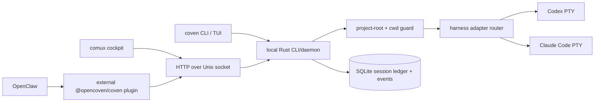

# Coven operational model

## Core boundary

Coven's Rust layer is the local authority boundary. It owns process launch, project-root validation, PTY lifecycle, daemon state, session/event persistence, and the local socket API.

TypeScript clients are integration layers. They may validate inputs for better UX, but Rust must revalidate every launch, input, kill, and path-sensitive request before acting.

See [Architecture diagrams](/ARCHITECTURE) for the fuller runtime topology and lifecycle diagrams.

OpenClaw core does not include OpenCoven or Coven. The OpenClaw integration lives outside the OpenClaw repo as the ClawHub package `@opencoven/coven`, sourced from `packages/openclaw-coven` in this repo. That package is an opt-in compatibility adapter, not part of the Coven trust root.

The current auth posture is documented in [Authentication and local access](/AUTH). Coven uses a same-user local Unix-socket access model today. It does not provide OAuth, JWT, bearer-token, API-key, cookie, RBAC, or remote network auth for the daemon API.

## Trust rules

- Treat every socket client as untrusted, including first-party clients.
- Never launch work without an explicit project root.
- Canonicalize `projectRoot` and `cwd` in Rust before comparing paths.
- Reject symlink escapes and outside-root `cwd` values.
- Keep harness execution allowlisted until a real policy layer exists.
- Build harness commands with argv APIs. Do not use `sh -c` for prompt execution.
- Keep provider credentials in the harness/provider's normal local auth flow.
- Do not store repository secrets, environment dumps, private URLs, or tokens in event logs intentionally.
- Do not let OpenClaw, comux, or npm package configuration widen Rust launch authority.

## Rust responsibilities

The Rust CLI/daemon should stay narrow and boring:

- `coven doctor` detects supported local harnesses.
- `coven run` and `POST /api/v1/sessions` launch only known harness ids.
- `coven sessions` opens the interactive session browser in terminals and prints table output for scripts/pipes.
- `coven attach` replays and follows Coven-managed event output.
- `coven archive`, `coven summon`, and `coven sacrifice --yes` manage completed session history without making users memorize ids in the TUI path.
- `coven daemon start/status/restart/stop` manages one local daemon state directory.
- The daemon exposes a small local API over `<covenHome>/coven.sock`.
- SQLite stores session metadata, archive state, and append-only event history.

The local API should remain stable and intentionally small. The current public contract is `v1`; new clients should use `/api/v1/...` routes. Archive/summon/sacrifice are currently CLI/store rituals; live runtime control remains on the socket API:

- `GET /api/v1/api-version`
- `GET /api/v1/health`
- `GET /api/v1/sessions`
- `POST /api/v1/sessions`
- `GET /api/v1/sessions/:id`
- `GET /api/v1/events?sessionId=...`
- `POST /api/v1/sessions/:id/input`
- `POST /api/v1/sessions/:id/kill`

Legacy unversioned routes remain as early-MVP aliases, but external clients should treat `v1` as the compatibility boundary.

## Client responsibilities

### comux

comux is a cockpit client. It may list, launch, open, and attach to Coven sessions through the local API, but it should not become the harness runtime.

### OpenClaw

OpenClaw integration is externalized through `@opencoven/coven`.

The plugin:

- registers an optional ACP backend named `coven`;
- validates plugin configuration and the local socket trust anchor;
- launches sessions through `POST /api/v1/sessions`;
- polls Coven events and maps them into ACP runtime events;
- maps only Codex and Claude Code agent ids by default for v0;
- uses fallback ACP backends only when explicitly configured.

OpenClaw remains responsible for chat/session routing, ACP bindings, task state, permissions UX, and user-facing delivery. Coven remains responsible for local harness supervision.

### npm CLI wrapper

The npm wrapper should only resolve and execute the native `coven` binary. It should not implement launch policy, path policy, or socket trust decisions that Rust does not also enforce.

## Compatibility policy

Externalization makes the socket API a product contract. Add compatibility protections before broad distribution:

- include `apiVersion` and supported API versions in `GET /api/v1/health`;
- keep legacy `GET /health` available as an early-MVP alias while new clients move to `/api/v1`;
- add `covenVersion` in `GET /api/v1/health` only if clients need daemon build identity distinct from contract version;
- use structured error codes for API failures;
- paginate `GET /api/v1/events` with a daemon-enforced limit;
- keep unknown fields ignored where safe and unknown required behavior rejected;
- add plugin tests against representative daemon responses;
- document breaking API changes in the Coven repo before updating the plugin.

## Hardening priorities

1. Enforce private `COVEN_HOME` ownership and permissions in Rust before creating, binding, or removing daemon state.
2. Add daemon request limits for request line length, header bytes, `Content-Length`, body bytes, and read duration.
3. Add API versioning and structured error codes.
4. Add event pagination that honors `afterEventId` or a monotonic sequence cursor.
5. Enable SQLite durability defaults suitable for a local daemon, including WAL and a busy timeout.
6. Add release gates for Rust dependency audit, npm/package dry runs, and plugin compatibility tests.
7. Keep generic/custom command adapters out of v0 until policy and approval behavior are explicit.

## Release split

Coven repo release gates:

- Rust format, clippy, tests, and locked dependency checks.
- Secret guard across current tree and history.
- Native binary packaging with checksums.
- Local smoke: doctor, daemon health, launch/list/attach/kill against a safe test harness.

Plugin package release gates:

- OpenClaw SDK compatibility tests.
- Config validation tests.
- Socket trust-anchor tests.
- Fallback behavior tests.
- ClawHub package dry run or publish validation.

These release paths should be coordinated but independent. A plugin update should not require OpenClaw core changes, and a Rust daemon update should not assume OpenClaw repo internals.
