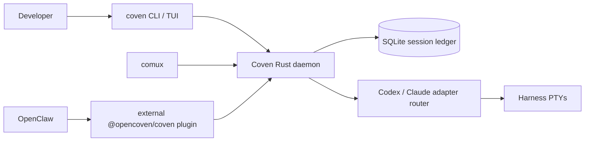
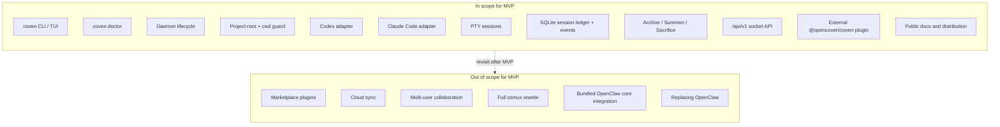

# Coven product spec

## Product thesis

Coven is a Rust-first harness substrate for running coding agents as project-scoped, observable, attachable sessions. It lets developers bring the harnesses they already trust into a controlled local runtime instead of forcing one agent provider or UI.

North star: **One project. Any harness. Visible work.**

## MVP scope

The MVP proves the core runtime loop:

- A standalone CLI binary named `coven`
- A local daemon for supervised sessions
- Explicit project-root boundaries
- Interactive PTY session execution
- Session metadata and event persistence
- Commands and TUI flows for running, browsing, rejoining, viewing, archiving, summoning, sacrificing, and killing live sessions through the daemon API
- A minimal local API for first-party clients
- An external OpenClaw plugin package that consumes that API without entering OpenClaw core
- Public distribution and documentation for early adopters

Out of scope for MVP: marketplace plugins, cloud sync, multi-user collaboration, a full comux rewrite, bundled OpenClaw core integration, or replacing OpenClaw.

## Built-in v0 harness direction

Coven v0 should ship with built-in adapters for Codex and Claude Code. These adapters should detect local CLI availability, construct commands without shell interpolation where possible, run the harness inside a validated project `cwd`, and expose output/input through Coven-managed PTY sessions.

Terminal UX should stay centered on the lightweight `coven` command and a human session browser:

```sh
coven
coven tui
coven run codex "fix tests"
coven run claude "polish this UI"
coven sessions
coven sessions --plain
```

In an interactive terminal, `coven sessions` opens a browser with readable actions such as **Rejoin**, **View Log**, **Summon**, **Archive**, and **Sacrifice** so users do not have to memorize session ids. Plain output remains available for scripts and pipes.

## Future Hermes and adapter path

Hermes and other harnesses should arrive through a small adapter contract after the built-in v0 path is stable. The adapter model should support future targets such as Hermes, Aider, Gemini, OpenCode, and custom command adapters without requiring Coven to become a full plugin marketplace in the MVP.

## Current architecture



For fuller diagrams, see [Architecture diagrams](/ARCHITECTURE).

## Relationship to comux, OpenClaw, and OpenMeow

Coven is the local runtime substrate. comux can become the visual cockpit for Coven-managed panes and session history. OpenClaw can delegate project-scoped harness launches to Coven only through the external `@opencoven/coven` plugin, not through bundled OpenClaw core code. OpenMeow can consume Coven session status, intake, or notifications where useful.

Coven should integrate with these projects without being owned by any one of them: it is the shared room where harnesses run, not the entire UI or orchestrator.

## External OpenClaw plugin boundary

The OpenClaw integration is externalized. The OpenClaw repo should not include OpenCoven or Coven code, and Coven should not depend on OpenClaw internals.

The package `@opencoven/coven` is a compatibility adapter:

- OpenClaw ACP runtime calls enter the plugin.
- The plugin validates config and connects to the local Coven socket.
- The Rust daemon revalidates project roots, cwd, harness ids, input, and kill requests.
- Coven launches and supervises the harness PTY.
- The plugin maps Coven events back into OpenClaw ACP runtime events.

This makes the socket API the contract. Protocol versioning, compatibility tests, and release notes belong in the Coven repo and plugin package, not in OpenClaw core.

## Public-first status

Coven is public now while the safety model, daemon behavior, adapter contracts, and user experience continue to mature. Public packaging should stay conservative, and readiness should be judged by whether early adopters can reliably run Codex and Claude Code in visible, attachable, project-scoped sessions.

## MVP scope at a glance



The boundary above is normative for v0. Anything in **OutOfScope** is recorded on the roadmap, not built into the runtime substrate.

## Canonical community handles

Use these exact public handles/links when Coven docs or package metadata mention community channels:

- Discord: `discord.gg/opencoven`
- X / Twitter: `@OpenCvn`
