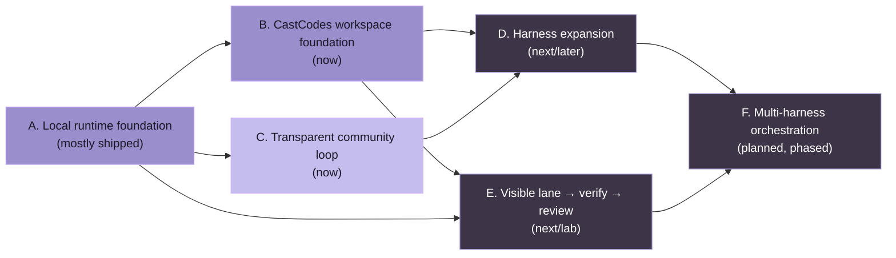

# OpenCoven public roadmap

_Last updated: 2026-05-26_

This roadmap is the public progress ledger for **OpenCoven**, **CastCodes**, and **Coven**.

It is intentionally written as a community-facing map, not an internal promise sheet. Items move when they are designed, implemented, tested, released, or deliberately cut. Dates are avoided unless a release is already scheduled.

## North star

OpenCoven is building a local-first agent workspace where autonomous coding harnesses can work inside explicit project rooms:

- **CastCodes** is the product users open: the local-first AI coding workspace and primary public proof surface.
- **Coven** is the runtime substrate: project-scoped harness sessions, PTYs, logs, artifacts, handoffs, policy, and local APIs.
- **OpenCoven** is the umbrella and lab behind the direction.

comux proved the terminal cockpit model. Its durable primitives are being folded into CastCodes so Coven has one primary product surface.

The simple promise:

> One project. Any harness. Visible work.

## How to read this roadmap

- **Shipped** means the work exists in public code or public package/release artifacts.
- **Now** means active stabilization or near-term implementation.
- **Next** means planned after the current stabilization slice.
- **Later** means directionally important, but not allowed to distract from the local-first MVP.
- **Lab** means experimental work we are exploring in public when possible, but not treating as a stable promise yet.

## Current snapshot

### CastCodes

**Status:** staged public workspace and primary Coven proof surface.

Shipped:

- Public `OpenCoven/cast-codes` repo.
- Public app identity: `CastCodes`, `cast-codes`, `dev.castcodes.CastCodes`, and `castcodes://`.
- Local-first public build boundary: no sign-in, hosted telemetry, hosted crash reporting, billing, shared sessions, upstream release feeds, or upstream feedback flows by default.
- Terminal and code workspace substrate.
- Cast Agent / Coven integration direction documented in the repo.
- Rebrand and attribution guards for public-surface changes.

Now:

- Make CastCodes the first-contact public story for Coven.
- Treat Cast Agent and Coven integration as the core direction, not a side feature.
- Define the parity milestones for absorbing the useful terminal-cockpit primitives comux proved.

Next:

- Launch isolated agent lanes from repository context.
- Choose harnesses through a CastCodes picker backed by Coven/Cast Agent.
- Create or attach a worktree/branch per lane.
- Show live terminal/output and structured Coven session status.
- Preserve and render logs/artifacts safely.
- Show changed files and inline diffs.
- Run verification gates and display results.
- Keep PR, merge, archive, and cleanup actions behind explicit approval.

Later:

- Command-palette rituals/templates: Start Coding, Review Stack, Release Check, Fix OpenClaw, Coven Dogfood Quest, and Multi-Harness Review.
- Handoff packets between harnesses.
- End-of-task retrospectives that capture what worked, what was missing, and what should become a CastCodes/Coven issue.

### Coven

**Status:** early public runtime MVP, usable by adventurous local-first developers and positioned as the runtime that powers CastCodes.

Shipped:

- Public `OpenCoven/coven` repo.
- Rust CLI command named `coven`.
- Beginner-friendly `coven` / `coven tui` entrypoint.
- `coven doctor` setup checks.
- Local daemon lifecycle: `coven daemon start/status/restart/stop`.
- Project-root and cwd boundary guard.
- Built-in Codex, Claude Code, and GitHub Copilot CLI harness adapters.
- PTY-backed `coven run codex|claude|copilot <prompt>` sessions.
- SQLite-backed session metadata and event log.
- Session browser and rituals: **Rejoin**, **View Log**, **Summon**, **Archive**, **Sacrifice**.
- Scriptable and human session output: `coven sessions`, `--plain`, and `--all`.
- Local HTTP-over-Unix-socket API for CastCodes and advanced local clients.
- Versioned `coven.daemon.v1` API contract with named apiVersion, machine-readable capabilities, structured errors, and monotonic event cursors. See [`docs/API-CONTRACT.md`](/API-CONTRACT).
- Compatibility tests for the external OpenClaw bridge against versioned daemon responses.
- First-run recovery hints for missing Codex, Claude Code, or GitHub Copilot CLIs.
- Real CLI smoke coverage for daemon restart, attach replay, kill, archive, summon, and sacrifice flows.
- Install verification and release wiring for macOS, Linux x64, and Windows x64 npm package paths.
- Published npm wrapper packages:
  - `@opencoven/cli`
  - `@opencoven/cli-macos`
  - `@opencoven/cli-linux-x64`
- External OpenClaw bridge package kept outside OpenClaw core as an advanced compatibility path.
- Architecture, operational model, product spec, brand docs, and MVP plan.

Now:

- **Cast launcher redesign** (Phases 1–6 on `cast/*` branches): collapses the Coven launcher chrome into a single-prompt surface with a two-lane Commands + Snapshot body, plan/outcome cards for every spell, and a sequential quest flow that hands off between phases with deterministic sub-prompts. The repo-local design notes live under `docs/design/`. PR #99 is the current review slice (Phase 6 verification + readiness).
- Keep the versioned daemon API contract and CastCodes integration work aligned. See [`docs/API-CONTRACT.md`](/API-CONTRACT).
- Keep the public docs aligned with the actual CLI/API surface.

Next:

- Turn the MVP checklist into linked GitHub issues/milestones.

Later:

- Generic command adapter after enough real usage.
- Additional harness adapters such as Hermes, Aider, Gemini, OpenCode, or user-defined local harnesses.
- Policy/approval hooks for sensitive actions.
- Richer session artifacts and attachments.
- **Multi-harness orchestration** (Phase 1-4, no committed timeline):
  - Phase 1: Handoff protocol and context transfer between harnesses
  - Phase 2: Capability discovery and intelligent task routing
  - Phase 3: Multi-instance coordination across harnesses
  - Phase 4: Audit dashboard and compliance tooling
- Optional cloud/team collaboration only after the local runtime is boringly reliable.

### comux migration reference

**Status:** reference/prototype evidence. comux remains useful as a standalone terminal cockpit, but it is no longer the future-facing public product surface for Coven.

What it proved:

- Public `comux` npm package and CLI command.
- tmux cockpit for visible parallel work.
- Git worktree isolation per agent lane.
- Agent launcher registry with multiple coding CLIs.
- Multi-select agent launches.
- Pane menu for inspect, merge, PR, attach, and cleanup flows.
- File browser, code preview, and diff-oriented review affordances.
- Project sidebar, pane visibility controls, and reopen flows.
- Rituals for repeatable project setups.
- Lifecycle hook docs and generated hook reference.
- Docs site and public README/spec/smoke docs.
- Coven session visibility and launch integration through the local bridge path.
- OpenClaw repair ritual direction started publicly.

Now:

- Preserve comux as legacy/reference context.
- Fold the useful primitives into CastCodes-native concepts.
- Avoid positioning comux as a second flagship cockpit in beginner/product docs.

Next:

- Use the CastCodes + Coven demo loop:
  1. Open a project in CastCodes.
  2. Launch a Coven-backed Codex or Claude Code lane.
  3. Watch live terminal output and structured session status.
  4. Inspect files, diffs, logs, and artifacts.
  5. Verify, merge, PR, archive, or clean up explicitly.
- Add public issues for rough edges discovered during dogfooding.
- Improve onboarding for CastCodes, agent CLI detection, and Coven availability.
- Make Discord updates easy to generate from shipped commits and roadmap issues.

Lab:

- Desktop shortcuts and faster project/session switching.
- Chat/intake handoff into CastCodes/Coven sessions.

### Advanced integration paths

**Status:** compatibility and advanced architecture, not the beginner public story.

Shipped:

- Technical OpenClaw bridge spike completed and intentionally parked before merging into core.
- External external OpenClaw bridge plugin direction established so OpenClaw core stays clean.
- Local socket/API boundary makes Coven the authority layer.

Now:

- Treat the Coven API as the compatibility boundary.
- Add compatibility tests before encouraging broad plugin usage.
- Keep intake/OpenClaw copy honest: advanced intake and orchestration sit above Coven; they do not replace CastCodes as the public workspace or Coven as the runtime substrate.

Next:

- Publicly document the supported plugin path once API versioning lands.
- Keep advanced demos secondary to the CastCodes + Coven product demo.

## Milestone map



Colour coding mirrors maturity: filled lavender is shipped or stabilising; outlined slate is next/later. Edges show prerequisite direction, not a strict schedule.


## Public milestones

### Milestone A — Local runtime foundation

Status: **mostly shipped**

- [x] Public repo and docs
- [x] `coven` CLI
- [x] Project-root safety
- [x] Codex and Claude adapters
- [x] PTY sessions
- [x] SQLite session/event ledger
- [x] Daemon lifecycle
- [x] Local sessions/events API
- [x] Versioned API contract
- [x] Compatibility tests for external clients

### Milestone B — CastCodes workspace foundation

Status: **now / migration target**

- [x] Public CastCodes repo and app identity
- [x] Local terminal and code workspace substrate
- [x] Cast Agent / Coven integration direction documented
- [ ] CastCodes direction doc linked from public surfaces
- [ ] isolated agent lane from repo context
- [ ] Coven-backed harness picker
- [ ] worktree/branch isolation per lane
- [ ] changed-file and inline diff review surface for lanes
- [ ] verification result display
- [ ] explicit PR/merge/archive/cleanup workflow
- [ ] documented end-to-end CastCodes + Coven demo

### Milestone C — Transparent community loop

Status: **now**

- [x] Public roadmap document
- [ ] GitHub milestone labels for `roadmap`, `now`, `next`, `later`, `area:coven`, `area:comux`, `good first issue`, `help wanted`
- [ ] First public Discord roadmap post
- [ ] Weekly shipped/building/next update cadence
- [ ] Public issue board linked from Discord

### Milestone D — Harness expansion

Status: **next/later**

- [x] Future harness research started
- [x] Adapter contract documented
- [ ] Generic command adapter design from real usage
- [ ] Third harness proof
- [ ] Harness compatibility docs

### Milestone E — Visible lane to verification to review

Status: **next/lab**

- [ ] CastCodes creates or attaches a Coven-backed lane
- [ ] Coven owns the session and event log
- [ ] CastCodes shows the session for review
- [ ] verification gates run and display results
- [ ] user explicitly merges, PRs, archives, or deletes work

### Milestone F — Multi-harness orchestration (Phase 1-4)

Status: **planned, no committed start date**

**Phase 1: Handoff Protocol (Weeks 1-2)**
- [ ] Handoff API design and TypeScript implementation
- [ ] Context transfer format and validation
- [ ] Harness-to-harness explicit handoff (e.g., OpenClaw → Claude Code)
- [ ] Handoff ledger (PostgreSQL)
- [ ] End-to-end test: Cody hands off test failure to Claude for file editing

**Phase 2: Capability Discovery & Router (Weeks 3-4)**
- [ ] Harness capability registry and declaration
- [ ] Task router: auto-select best-fit harness
- [ ] Load balancing and fallback chains
- [ ] SLA enforcement and timeout handling
- [ ] Test: "Fix this bug" routes to best-fit harness automatically

**Phase 3: Multi-Instance Coordination (Weeks 5-6)**
- [ ] Distributed context store (Redis + PostgreSQL)
- [ ] Harness registration and health heartbeat
- [ ] Task affinity routing (resource constraints)
- [ ] Scale to multiple Coven instances per user
- [ ] Test: Local + remote harnesses coordinate without collision

**Phase 4: Audit & Observability (Weeks 7-8)**
- [ ] Audit dashboard: task timeline and handoff trace
- [ ] Compliance export (redacted traces)
- [ ] Prometheus metrics and alerting
- [ ] Full visibility into orchestrated work
- [ ] Test: Legal/compliance can query full history

## Discord transparency model

We should keep Discord updates lightweight and repeatable.

### Suggested channels

- `#roadmap` or a forum-style `Roadmap` channel for milestone threads.
- `#dev-updates` for weekly summaries.
- `#help-wanted` for scoped issues that community members can actually pick up.

### Weekly update template

```md
## OpenCoven weekly update — YYYY-MM-DD

### Shipped
- ...

### Building now
- ...

### Next up
- ...

### Help wanted
- ...

### Links
- Roadmap: https://github.com/OpenCoven/coven/blob/main/docs/ROADMAP.md
- Coven issues: https://github.com/OpenCoven/coven/issues
- CastCodes issues: https://github.com/OpenCoven/cast-codes/issues
```

### Rules for honest updates

- Do not promise dates unless we are already in release mode.
- Link shipped work to commits, releases, issues, or docs.
- Mark experiments as **Lab** instead of pretending they are committed roadmap items.
- Lead beginner/product updates with **CastCodes as the workspace** and **Coven as the runtime**.
- Mention comux or OpenClaw only when the update is explicitly about migration, legacy/reference context, or advanced compatibility.
- Prefer small public issues over giant vague tasks.
- Ask for help only when the task has a clear acceptance condition.

## First public Discord post

```md
We updated the public roadmap around the CastCodes + Coven story so progress is easier to follow.

The short version:
- CastCodes is the local-first AI coding workspace and primary public proof surface.
- Coven is the runtime substrate: project-scoped Codex/Claude sessions, PTYs, logs, daemon API.
- comux proved useful terminal-cockpit primitives that are being folded into CastCodes-native workflows.
- The next serious focus is hardening the Coven API contract and polishing the CastCodes + Coven demo loop.

Roadmap: https://github.com/OpenCoven/coven/blob/main/docs/ROADMAP.md
Coven: https://github.com/OpenCoven/coven
CastCodes: https://github.com/OpenCoven/cast-codes

We’ll start posting lightweight shipped / building / next updates here so the work is easier to follow and easier to help with.
```
