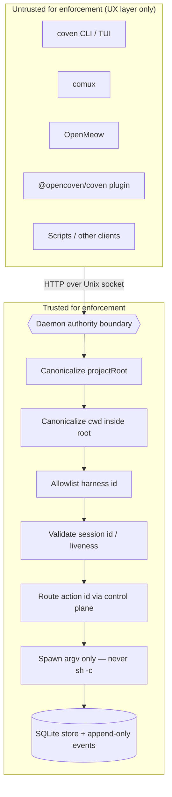

# Coven safety model

Coven is local-first, but local does not mean harmless. It can launch agent harnesses in real repositories, forward input to live processes, and preserve logs. This document states the safety boundaries that docs, clients, and code should preserve.

## Trust boundary

The Rust daemon is the authority boundary.

Every client is untrusted for enforcement purposes, including:

- the CLI/TUI;
- comux;
- OpenMeow;
- the external OpenClaw plugin;
- scripts; and
- future desktop clients.

Clients may improve UX, but they must not be the only place where a sensitive decision is enforced.



Anything in **UntrustedZone** can lie, drift, or be replaced. Anything in **TrustedZone** is the Rust daemon's job and must fail closed on unknowns. The arrow direction is the only direction a sensitive decision is allowed to flow: from untrusted into the boundary, where it is revalidated.

## Authentication and local access

Coven's current auth solution is a same-user local access model, not a network authentication protocol.

- The daemon API runs over `<covenHome>/coven.sock`, not TCP.
- There is no daemon OAuth, JWT, bearer token, API key, browser cookie, RBAC, or hosted account session in v0.
- Provider credentials stay in the harness/provider local auth flow, such as Codex or Claude Code.
- Clients are untrusted for enforcement; the Rust daemon must still revalidate every sensitive request.
- The external OpenClaw plugin performs socket trust-anchor validation before connecting, but Rust-side private `COVEN_HOME` ownership and permission checks remain a hardening priority.
- Do not expose the raw socket API through localhost TCP, a browser page, a remote bridge, or a mobile pairing flow without a separate explicit auth design.

The detailed contract lives in [Authentication and local access](/AUTH).

## Core rules

- Launch only with an explicit project root.
- Canonicalize `projectRoot` and `cwd` before comparing paths.
- Reject working directories outside the project root.
- Keep harness ids allowlisted until a real policy layer exists.
- Build harness commands with argv APIs.
- Do not execute prompts through `sh -c`.
- Keep provider credentials in the provider or harness authentication flow.
- Treat the socket API as a local product contract, not a private implementation detail.
- Fail closed on unknown API versions, unknown action ids, unsupported harnesses, and invalid session ids.

## Data and secrets

Coven should not require repository-stored secrets.

Do not commit runtime state:

- `.coven/`
- `*.sqlite`
- `*.sqlite3`
- `*.db`
- `*.sock`
- `.env*`
- private keys
- certificates
- token-bearing logs

Docs and examples must use placeholders such as `/path/to/project`, `/Users/example`, `session-1`, and `intent-1`.

## Event log caution

The event log records harness output. A harness may print sensitive data if the user asks it to inspect a sensitive repository or command output includes secrets.

Recommended user guidance:

- Do not run untrusted prompts in sensitive repositories.
- Do not ask a harness to dump environment variables.
- Do not paste secrets into prompts.
- Use throwaway projects for demos and smoke tests.
- Run `python scripts/check-secrets.py` before publishing docs, fixtures, or release artifacts.

## Local socket posture

The daemon API runs over a local Unix socket. It is intended for same-user local clients.

Hardening priorities:

- private `COVEN_HOME` ownership and permissions;
- safe socket creation and cleanup;
- request size limits;
- read timeouts;
- structured error codes;
- event pagination; and
- compatibility tests for external clients.

## Live session control

Live input and kill requests require a valid live session id.

Expected behavior:

- unknown session id returns not found;
- non-live session input/kill returns conflict;
- destructive session deletion refuses running sessions;
- interactive deletion requires explicit confirmation.

## Desktop automation and local UI control

Future desktop automation adapters should be treated as privileged local capabilities.

Required posture:

- discover capabilities before showing actions;
- label risky actions clearly;
- require explicit approval for clicks, typing, deleting, sending, buying, posting, or modifying external state;
- log action requests and outcomes without recording secrets;
- keep adapters behind the Coven control plane rather than letting each client bind directly to OS automation APIs.

The split should remain:

```text
client intent -> Coven policy/control plane -> adapter -> desktop/app
```

## External actions

Coven should ask or require host-level policy before actions that leave the machine or affect external services, including:

- sending messages;
- sending email;
- posting publicly;
- purchasing;
- deleting remote data;
- pushing to git remotes; and
- modifying cloud resources.

The local runtime can make these actions visible, but visibility is not consent.
