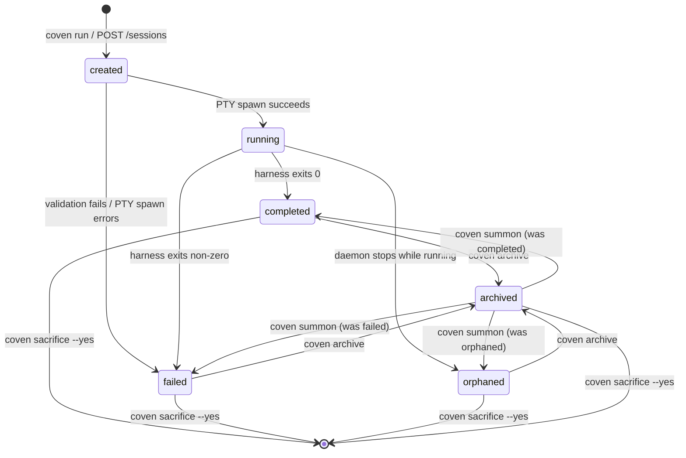
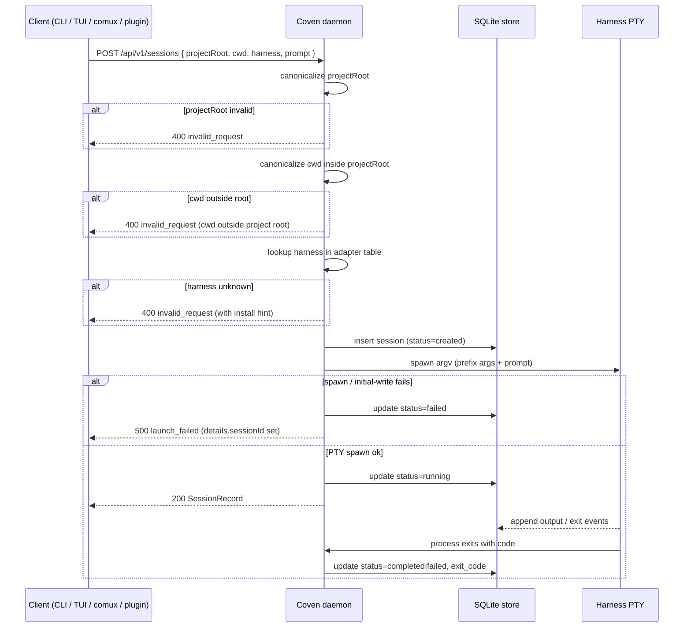

# Session Lifecycle

This document explains what happens from `coven run` through completion, replay, archive, summon, and deletion.

## Lifecycle states

The current store records session status as a string. Common states include:

- `created` - the session record exists before live execution begins.
- `running` - the harness process is active under daemon supervision.
- `completed` - the harness exited successfully.
- `failed` - setup or launch failed before normal completion.
- `orphaned` - a previous daemon stopped while a session was still marked running.

Archive state is stored separately as `archived_at`. A completed or failed session can be hidden from the active list without changing its final status.



The diagram above is normative for the v0 store. `running` sessions cannot be archived or sacrificed directly — kill them or wait for exit first. `created → running` is the only transition that requires PTY spawn; every other transition is a store-only state change managed by the Rust daemon.

## Launch path

The normal launch flow:

1. User or client sends a task through the CLI or local API.
2. Coven resolves the project root.
3. Coven canonicalizes the project root and working directory.
4. Coven rejects outside-root working directories.
5. Coven verifies the harness id is supported.
6. Coven creates a session record in SQLite.
7. The daemon spawns the harness in a PTY using argv APIs.
8. Output and exit data are written as events.
9. Session status and exit code are updated.

The Rust layer performs the authority checks even when a TypeScript client has already validated the request for UX.



## Detached records

`coven run ... --detach` creates the session record without launching the harness. This is useful for testing and development flows that need a ledger record without starting an external process.

Detached records should not be presented as completed agent work.

## Attach and replay

`coven attach <session-id>` replays known event output and follows live output when the session is still active.

For a completed session, attach acts like a log viewer. For a running session, attach also forwards input to the live daemon session.

## Session browser behavior

`coven sessions` chooses output mode based on context:

- In an interactive terminal, it opens the session browser.
- When piped or run with `--plain`, it prints table output.
- `--json` prints machine-readable session records for local clients.
- `--all` includes archived sessions.
- `--manage` forces the browser.

The browser offers contextual actions so users do not have to memorize session ids.

## Archive

Archive hides a non-running session from the default active list while preserving the session record and event log.

```sh
coven archive <session-id>
```

Use archive for old work that should remain inspectable.

## Summon

Summon restores an archived session to the active list and then replays/follows it:

```sh
coven summon <session-id>
```

Summon does not re-run the original harness prompt. It changes archive state and opens the existing record.

## Sacrifice

Sacrifice permanently deletes a non-running session and cascades deletion to its events:

```sh
coven sacrifice <session-id> --yes
```

The command refuses live sessions. The interactive browser asks the user to type `sacrifice` before deletion.

Use sacrifice only when the session and its logs should be removed from the local ledger.

## Orphan recovery

If the daemon starts and finds sessions that were marked `running` from a previous daemon lifetime, those sessions are marked `orphaned`.

An orphaned session means Coven no longer owns a live process for that record. The event log may still be useful, but live input and kill operations should fail.

## Event durability

Events are append-only records in SQLite. This gives clients a stable replay source even when the original PTY process has exited.

Do not intentionally write secrets, environment dumps, private URLs, or token-bearing command output into events. Coven cannot guarantee that harness output is secret-free, so users should avoid running untrusted prompts in sensitive repositories.

## Search and continuation (added 2026-05)

- `coven sessions search <query>` runs a SQLite FTS5 query over `events.payload_json`.
  Supports the full FTS5 query syntax (`phoenix OR rises`, `"exact phrase"`, `phoe*`).
  Output is a flat list of hits ordered most-recent-first; pass `--json` to get the raw
  SearchHit array for client tools.
- `coven run <harness> --continue` resumes the most recently created, non-archived
  session whose `project_root` matches the current directory. The harness is launched
  with `ConversationHint::Resume` so codex/claude pick up the prior turn's context.
- `coven run <harness> --continue <ID>` resumes by explicit session id.
- `coven run <harness> --labels foo,bar --visibility workspace --archive "task"` tags
  and archives a one-shot run in a single command. `--labels` and `--visibility` are
  creation-time only (ignored when resuming). Valid visibility values: `private`
  (default), `workspace`, `shared`.
- `--detach` and `--continue` are mutually exclusive — resuming-but-not-running is
  incoherent.
