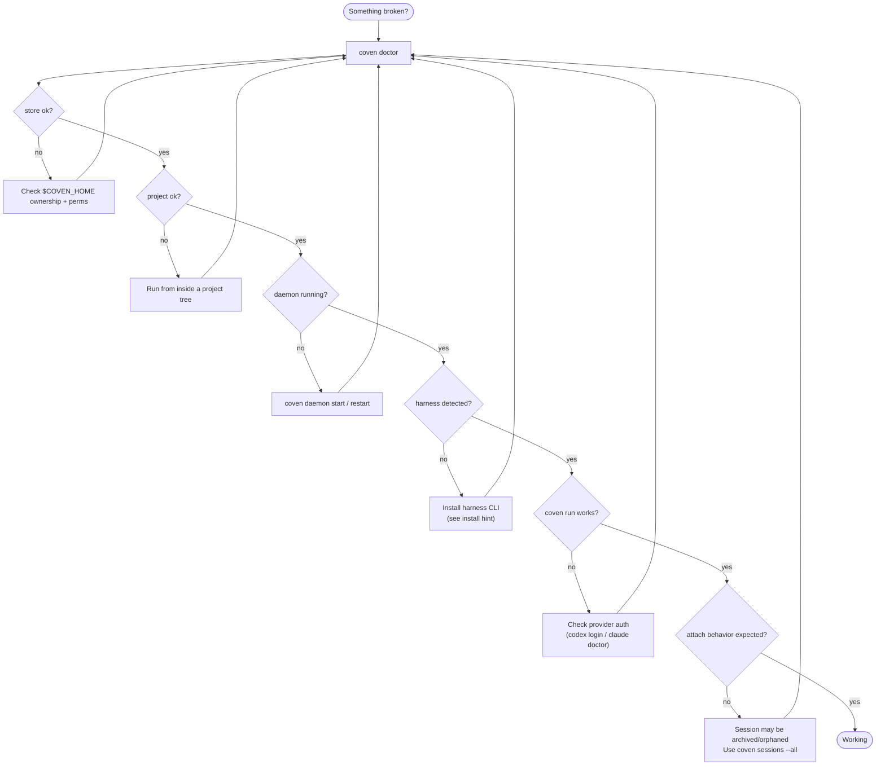

# Troubleshooting Coven

Start with:

```sh
coven doctor
```

`doctor` is the fastest way to check store, project, daemon, and harness readiness.



Follow the failing branch. Almost every issue in the rest of this page is one of these branches in detail.

## `coven` command not found

If using npm:

```sh
npx @opencoven/cli doctor
pnpm dlx @opencoven/cli doctor
```

If building from source:

```sh
cargo run -p coven-cli -- doctor
```

If you installed a native binary, make sure its directory is on `PATH`.

## Harness missing

`coven doctor` prints install hints for each built-in harness.

Codex:

```sh
npm install -g @openai/codex
codex login
```

Claude Code:

```sh
npm install -g @anthropic-ai/claude-code
claude doctor
```

Then retry:

```sh
coven doctor
```

## Daemon unavailable

Start or restart it:

```sh
coven daemon start
coven daemon status
coven daemon restart
```

If a client cannot connect, verify it is using the same `COVEN_HOME` as the CLI.

## System health and pressure

If sessions feel slow, the daemon is sluggish to start, or `coven doctor` succeeds but harness work stalls, the underlying machine may be under CPU, memory, or disk pressure.

`coven pc` surfaces a local system report without launching a harness. All read operations are side-effect free:

```sh
coven pc                  # full report: CPU, memory, disk, top processes
coven pc status           # one-line health summary
coven pc top --n 10       # top-N processes by CPU usage
coven pc disk             # disk usage breakdown
```

Relief operations mutate system state and require an explicit `--confirm` gate:

```sh
coven pc kill <pid> --confirm     # SIGTERM with PID identity re-check
coven pc cache clear --confirm    # clear ~/Library/Caches + /Library/Caches
```

`coven pc` is currently macOS-first. See [Diagnostics and relief](GETTING-STARTED.md#diagnostics-and-relief) in Getting started for the full command reference.

## Stale running sessions

If a daemon stopped while sessions were running, those records may become `orphaned` on the next daemon start.

Use:

```sh
coven sessions --all
```

Then view logs, archive the record, or sacrifice it if it is no longer useful.

## Session does not accept input

Input only works for live daemon-owned sessions.

If the session is completed, failed, archived, or orphaned, attach works as replay/log viewing rather than live input.

## `cwd` rejected

Coven rejects working directories that resolve outside the project root.

Use a path inside the project:

```sh
coven run codex "inspect package" --cwd packages/cli
```

Do not use symlink tricks or parent paths to escape the project boundary.

## API version rejected

New clients should use `/api/v1`.

Check daemon compatibility:

```text
GET /api/v1/health
```

If the client expects a newer API than the daemon exposes, update Coven or the client so their supported versions overlap.

## `coven sessions` printed a table instead of opening the browser

Coven opens the browser only in an interactive terminal.

Force browser mode:

```sh
coven sessions --manage
```

Force table mode:

```sh
coven sessions --plain
```

## Archive, summon, and sacrifice confusion

- Archive hides a non-running session but keeps events.
- Summon restores an archived session to the active list.
- Sacrifice permanently deletes a non-running session and its events.

Use the interactive browser when possible:

```sh
coven sessions --all --manage
```

## Secret scan failure

Run:

```sh
python scripts/check-secrets.py
```

If it fails, remove the secret from the working tree. If a secret entered git history, rotate the credential before rewriting history or publishing.

Do not paste matched secret values into issues, logs, docs, or chat.

## Contributor checks fail after docs-only edits

At minimum run:

```sh
python scripts/check-secrets.py
git diff --check
```

For code changes, run the full gate:

```sh
cargo fmt --check
cargo clippy --workspace --all-targets -- -D warnings
cargo test --workspace --locked
python scripts/check-secrets.py
```
