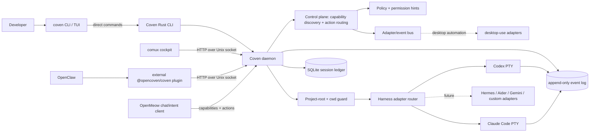
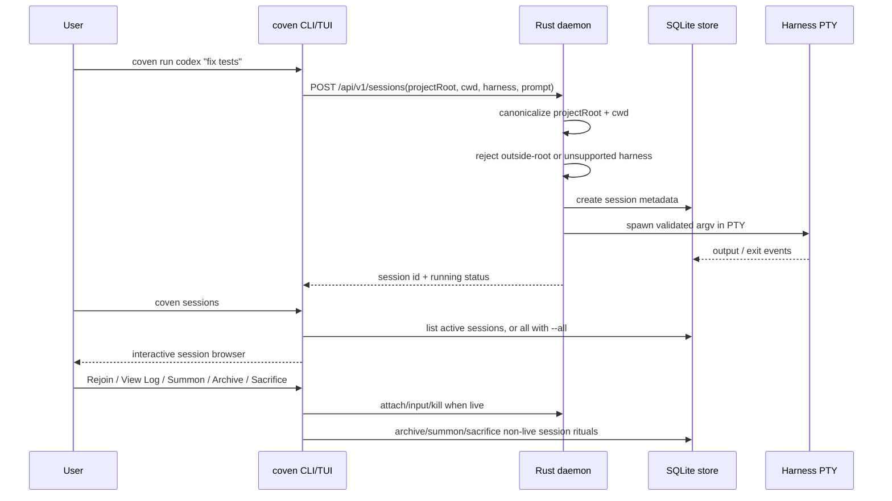
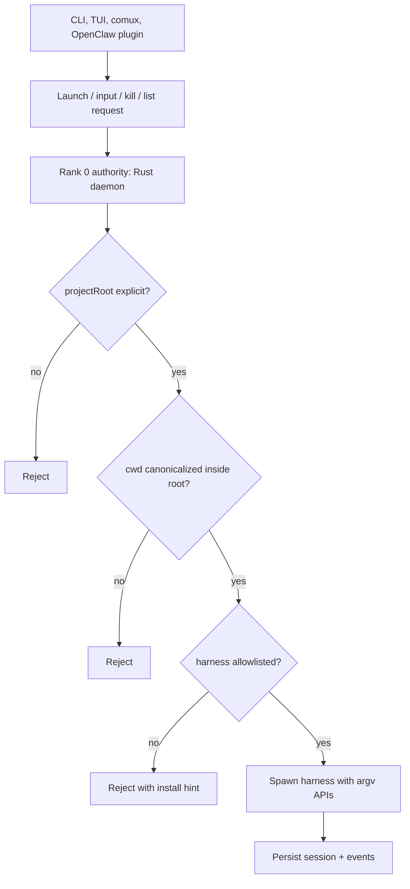

Coven is a local-first harness substrate. The Rust CLI/daemon is the authority layer; clients such as the CLI TUI, comux, and the optional OpenClaw plugin are presentation/integration layers.

The versioned local socket API contract lives in [API contract](/reference/api-contract). Clients should handshake with [`GET /api/v1/health`](/daemon/health) and negotiate against `apiVersion: "coven.daemon.v1"` plus the `capabilities` object before depending on session or event response shapes. All error responses use the structured `{ error: { code, message, details } }` envelope documented in [Error envelope](/daemon/error-envelope).

## Runtime topology



## Session lifecycle



## Authority boundary



## OpenMeow / automation boundary

OpenMeow should remain a chat UI, local echo/optimistic rendering surface, intent-capture layer, and tiny fast-path host for ultra-simple local actions. It should not become the automation engine.

Coven is the canonical shared local runtime for reusable automation because it centralizes:

- daemon/process ownership;
- policy and permission decisions;
- config/profile storage;
- capability discovery;
- action routing and event emission;
- adapter ownership for Accessibility, AppleScript, keyboard/mouse, window, filesystem, clipboard, and app-specific bridges.

The intended flow is:

```text
user -> OpenMeow -> Coven -> adapters -> desktop/apps
desktop/apps -> Coven -> OpenMeow UI updates
```

`GET /api/v1/capabilities` lets OpenMeow and other clients discover what Coven can route. `POST /api/v1/actions` gives clients a stable intent envelope without coupling them directly to brittle OS automation APIs.

## Future: multi-harness orchestration (Phase 1-4)

Coven v0 is single-harness per session. Future phases will add multi-harness orchestration:

<Columns>
  <Card title="Phase 1 — Handoff" href="/familiars/handoff" icon="git-branch">
    Explicit transfer of task + full context between harnesses. Adds `POST /api/v1/handoff`.
  </Card>
  <Card title="Phase 2 — Routing" href="/familiars/orchestration" icon="route">
    Capability discovery, router, load balancing. Adds `POST /api/v1/task/execute`.
  </Card>
  <Card title="Phase 3 — Affinity" icon="anchor">
    Multi-instance, distributed context, affinity constraints. Adds health heartbeat + node registration.
  </Card>
  <Card title="Phase 4 — Audit" icon="scroll">
    Handoff ledger queries and metrics for compliance and observability.
  </Card>
</Columns>

The Rust daemon stays the authority boundary throughout. Orchestration logic can live above the daemon, delegating safety-critical decisions (process spawning, cwd validation, capability checking) to Coven.

## Related

- [Runtime topology](/concepts/runtime-topology)
- [Authority boundary](/concepts/authority-boundary)
- [Control plane](/concepts/control-plane)
- [Session lifecycle](/sessions/lifecycle)
- [Safety model](/daemon/safety-model)
