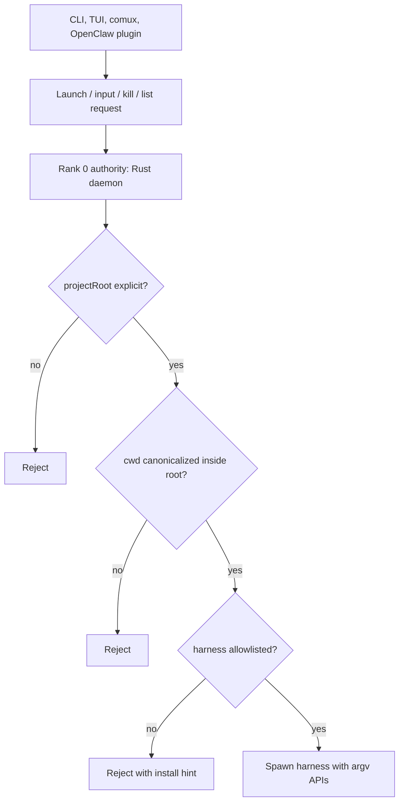

```mermaid
flowchart TD
  Client[CLI, TUI, comux, OpenClaw plugin] --> Request[Launch / input / kill / list request]
  Request --> Rust[Rank 0 authority: Rust daemon]
  Rust --> RootCheck{projectRoot explicit?}
  RootCheck -- no --> RejectRoot[Reject]
  RootCheck -- yes --> CwdCheck{cwd canonicalized inside root?}
  CwdCheck -- no --> RejectCwd[Reject]
  CwdCheck -- yes --> HarnessCheck{harness allowlisted?}
  HarnessCheck -- no --> RejectHarness[Reject with install hint]
  HarnessCheck -- yes --> Spawn[Spawn harness with argv APIs]
```

Clients are convenience layers. The Rust daemon is the only thing allowed to spawn a PTY, canonicalize a path, or mutate the session ledger.
