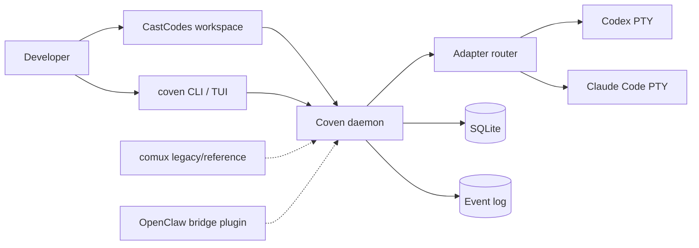

```mermaid
flowchart LR
  User[Developer] --> CastCodes[CastCodes workspace]
  CastCodes --> Daemon[Coven daemon]
  User --> CLI[coven CLI / TUI]
  CLI --> Daemon
  Comux[comux legacy/reference] -.-> Daemon
  Plugin["OpenClaw bridge plugin"] -.-> Daemon
  Daemon --> Adapter[Adapter router]
  Adapter --> Codex[Codex PTY]
  Adapter --> Claude[Claude Code PTY]
  Daemon --> Store[(SQLite)]
  Daemon --> Events[(Event log)]
```

See [Architecture](/concepts/architecture) for the full picture and [Authority boundary](/concepts/authority-boundary) for trust rules.
