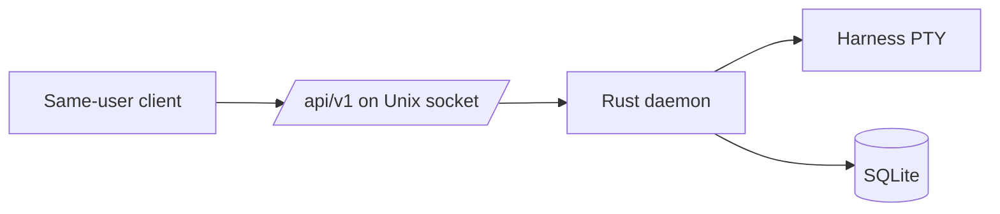

Coven's safety model rests on four invariants:

1. **The Rust daemon is the only authority.** Clients can ask; only the daemon decides whether to spawn a PTY, canonicalize a path, or mutate the ledger.
2. **The socket is same-user local trust.** No daemon OAuth, JWTs, bearer tokens, API keys, or browser cookies.
3. **Coven never stores provider credentials.** Each harness keeps using its own login.
4. **Destructive operations are explicit.** Sacrifice refuses live sessions and requires `--yes`. Relief verbs in `coven pc` require `--confirm`.

## Trust boundary

Anyone able to read/write `<covenHome>/coven.sock` has full local access. Coven assumes filesystem permissions enforce that boundary.

## What Coven validates

- **Project root.** Must be explicit, absolute, and canonicalize to itself.
- **Working directory.** Must canonicalize inside the project root.
- **Harness id.** Must match an allowlisted adapter.
- **Live input.** Forwarded only to running sessions you own.
- **Kill requests.** Refused if the session is not live.
- **Session ids.** Validated as ULIDs the daemon issued.

See [Authority boundary](/concepts/authority-boundary).

## Secret handling

- Coven does not read provider API keys.
- Coven does not log harness stdout containing user data unless the operator opts in.
- Diagnostics bundles redact known secret-shaped tokens by default. See [Diagnostics bundle](/help/diagnostics-bundle).
- Runtime state under `$COVEN_HOME` must not be committed to source control.

## Remote access

Coven does **not** bind a TCP port by default. If you need a remote daemon, tunnel the Unix socket — see [Remote access](/daemon/remote-access). Tailscale and SSH local-forwards both work.

## Automation approvals

Coven's destructive operations require explicit confirmation:

- `coven sacrifice <id> --yes` — permanent delete.
- `coven pc relief --confirm` — kill processes or clear caches.
- `coven patch openclaw` — never commits or pushes in v0.

Clients that wrap Coven (comux, OpenMeow, OpenClaw plugin) must surface the same confirmations and never strip them.

## Related

- [Auth posture](/daemon/auth-posture)
- [Trust boundary](/daemon/trust-boundary)
- [Remote access](/daemon/remote-access)
- [Provider auth boundary](/harnesses/provider-auth)
