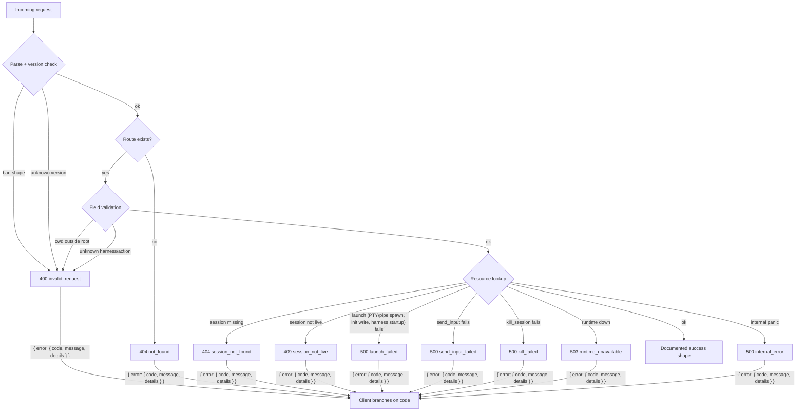
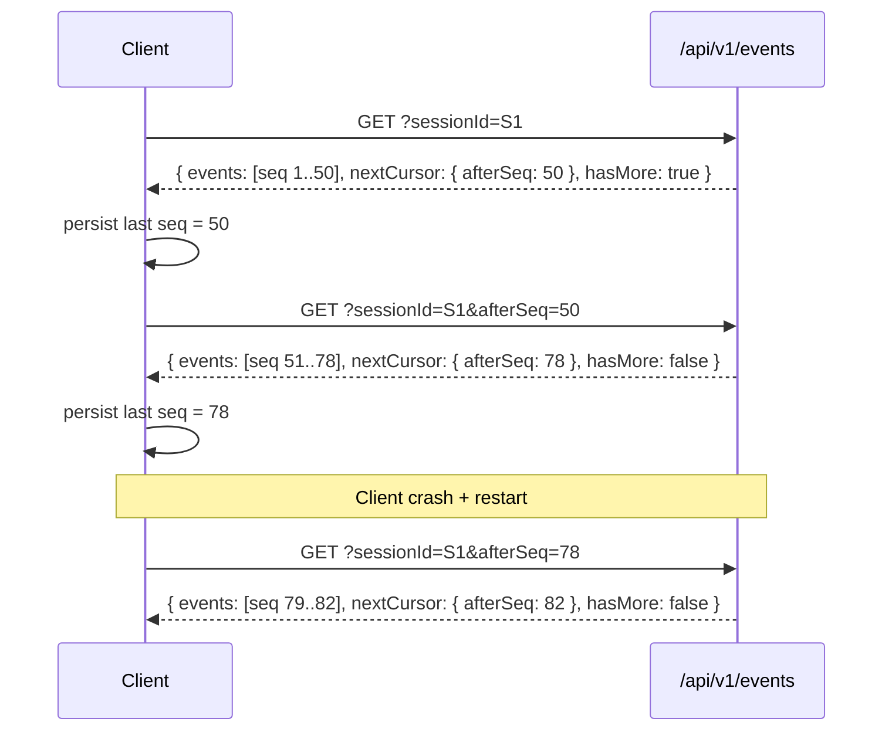

# Contrato de la API local de Coven

La API por socket del daemon de Coven es un límite de compatibilidad público para comux y clientes externos como `@opencoven/coven`.

## Versión estable actual

- `GET /api/v1/health` expone `apiVersion: "coven.daemon.v1"`, `covenVersion` y un objeto `capabilities` legible por máquina.
- Los clientes deben leer `/api/v1/health` antes de asumir cualquier forma de respuesta de otros endpoints.
- Las rutas heredadas sin versión como `GET /health` siguen siendo alias del MVP temprano; los nuevos clientes deberían usar `/api/v1`.
- Los clientes del plano de control deben descubrir capabilities antes de enviar ids de acción.
- Todos los fallos de la API se devuelven como sobres estructurados `{ "error": { "code", "message", "details" } }`.
- Los eventos incluyen un cursor monótono `seq` para lecturas incrementales.

## `GET /api/v1/health`

`GET /api/v1/health` devuelve la accesibilidad del daemon, la versión nombrada del contrato, la versión de coven y capabilities legibles por máquina:

```json
{
  "ok": true,
  "apiVersion": "coven.daemon.v1",
  "covenVersion": "0.0.0",
  "capabilities": {
    "sessions": true,
    "events": true,
    "eventCursor": "sequence",
    "structuredErrors": true
  },
  "daemon": {
    "pid": 12345,
    "startedAt": "2026-05-09T06:43:00Z",
    "socket": "/Users/alice/.coven/coven.sock"
  }
}
```

Si los metadatos del daemon no están disponibles, `daemon` puede ser `null`.

### Campos de capability

| Campo             | Tipo    | Descripción                                                      |
|-------------------|---------|-------------------------------------------------------------------|
| `sessions`        | boolean | La API de sesiones (`/sessions`, `/sessions/:id`) está disponible. |
| `events`          | boolean | La API de eventos (`/events`) está disponible.                    |
| `eventCursor`     | string  | Tipo de cursor soportado; `"sequence"` significa que `afterSeq` es estable. |
| `structuredErrors`| boolean | Todos los errores usan la forma `{ error: { code, message, details } }`. |

## Sobre estructurado de error



Todos los errores de la API usan el siguiente sobre estable. Los clientes deben ramificar en `error.code`, no en `error.message`:

```json
{
  "error": {
    "code": "session_not_found",
    "message": "Session was not found.",
    "details": {
      "sessionId": "abc-123"
    }
  }
}
```

`details` es opcional y se incluye cuando aporta contexto útil.

### Códigos de error estables

| Código                 | Estado HTTP | Descripción                                      |
|------------------------|-------------|--------------------------------------------------|
| `not_found`            | 404         | Ruta genérica no encontrada.                     |
| `invalid_request`      | 400 o 404   | Petición mal formada, id de harness desconocido, campo obligatorio ausente, o versión de API no compatible. |
| `session_not_found`    | 404         | El id de sesión no existe.                       |
| `session_not_live`     | 409         | La sesión existe pero no está en ejecución.      |
| `project_root_violation`| 400        | Reservado. Las violaciones de cwd actualmente emiten `invalid_request`; promover a un código propio permitiría a los clientes ramificar sin parsear el mensaje. |
| `pty_spawn_failed`     | 500         | Reservado. Los fallos de spawn de PTY actualmente emiten `launch_failed`; promover a un código propio distinguiría "no se pudo abrir el PTY" de "el CLI del harness falló al iniciar". |
| `launch_failed`        | 500         | El daemon aceptó la petición pero el runtime (PTY/pipe spawn, escritura inicial, arranque del CLI) falló. `details.sessionId` es la fila insertada y marcada como `failed`. |
| `send_input_failed`    | 500         | El daemon aceptó el payload de input pero la escritura del runtime falló (pipe cerrado, proceso muerto, error de IO). `details.sessionId` es la sesión afectada. |
| `kill_failed`          | 500         | El daemon aceptó la petición de kill pero la señal/llamada del runtime falló (permisos, proceso ausente, error de IO). `details.sessionId` es la sesión afectada. |
| `runtime_unavailable`  | 503         | El runtime de la sesión no está disponible.      |
| `internal_error`       | 500         | Error interno inesperado.                        |

## Forma del catálogo de capabilities (`v1`)

`GET /api/v1/capabilities` devuelve el catálogo de capabilities del daemon/plano de control. Este es el handshake previsto para OpenMeow al decidir qué acciones mostrar o enrutar a través de Coven.

```json
{
  "capabilities": [
    {
      "id": "coven.control.actions",
      "label": "Coven control-plane action router",
      "adapter": "coven-daemon",
      "status": "available",
      "policy": "allow",
      "actions": ["coven.capabilities.refresh"]
    },
    {
      "id": "desktop.automation",
      "label": "Desktop automation adapters",
      "adapter": "desktop-use",
      "status": "planned",
      "policy": "requiresApproval",
      "actions": []
    }
  ]
}
```

Valores enum conocidos en `v1`:

- `status`: `available`, `planned`
- `policy`: `allow`, `requiresApproval`

Los clientes deben ignorar ids de capability e ids de acción futuros desconocidos a menos que los soporten explícitamente.

## Forma de acción de control (`v1`)

`POST /api/v1/actions` acepta un sobre de acción con forma de política. El daemon valida el id de acción antes de permitir cualquier trabajo del adaptador.

```json
{
  "action": "coven.capabilities.refresh",
  "origin": "open-meow",
  "intentId": "intent-1",
  "args": {}
}
```

Las acciones seguras completadas inmediatamente devuelven `200`:

```json
{
  "ok": true,
  "accepted": true,
  "action": "coven.capabilities.refresh",
  "status": "completed",
  "event": {
    "kind": "capabilities.refreshed",
    "action": "coven.capabilities.refresh",
    "origin": "open-meow",
    "intentId": "intent-1",
    "payload": { "capabilities": 3 }
  }
}
```

Los ids de acción desconocidos devuelven `400` y fallan en cerrado:

```json
{
  "ok": false,
  "accepted": false,
  "action": "desktop.deleteEverything",
  "status": "rejected",
  "reason": "unknown action `desktop.deleteEverything`"
}
```

## Forma del registro de sesión (`v1`)

En `v1`, las respuestas de sesión se mantienen como objetos JSON crudos usando los nombres snake_case de los campos del daemon en Rust.

Endpoints que devuelven esta forma:

- `GET /api/v1/sessions` → `SessionRecord[]`
- `POST /api/v1/sessions` → `SessionRecord`
- `GET /api/v1/sessions/:id` → `SessionRecord`

```json
{
  "id": "session-1",
  "project_root": "/repo",
  "harness": "codex",
  "title": "Fix the tests",
  "status": "running",
  "exit_code": null,
  "archived_at": null,
  "created_at": "2026-05-09T06:43:00Z",
  "updated_at": "2026-05-09T06:43:05Z"
}
```

## Forma del registro de evento y paginación por cursor (`v1`)

`GET /api/v1/events` devuelve un sobre paginado con cursores monótonos `seq`.

### Parámetros de query

| Parámetro     | Requerido | Descripción                                             |
|---------------|-----------|---------------------------------------------------------|
| `sessionId`   | Sí        | Sesión de la cual obtener eventos.                      |
| `afterSeq`    | No        | Devuelve solo eventos con `seq > afterSeq` (preferido). |
| `afterEventId`| No        | Cursor de compatibilidad — se resuelve a una posición de secuencia. |
| `limit`       | No        | Número máximo de eventos a devolver (impuesto por el daemon, máx. 1000). |

### Sobre de respuesta

```json
{
  "events": [
    {
      "seq": 42,
      "id": "event-uuid",
      "session_id": "session-uuid",
      "kind": "output",
      "payload_json": "{\"data\":\"hello\"}",
      "created_at": "2026-05-09T06:43:10Z"
    }
  ],
  "nextCursor": {
    "afterSeq": 42
  },
  "hasMore": false
}
```

`nextCursor` es `null` cuando no hay eventos. `hasMore` es `true` cuando se aplicó un `limit` y pueden existir más eventos.

### Patrón de lectura incremental

1. Sondea `GET /events?sessionId=<id>` para obtener todos los eventos (con `limit` opcional).
2. Usa `nextCursor.afterSeq` en peticiones posteriores: `GET /events?sessionId=<id>&afterSeq=<seq>`.
3. Repite hasta que `hasMore` sea `false`.

Esto da a los clientes lecturas incrementales estables. La entrega exactly-once también requiere checkpointing del lado del cliente e idempotencia.



Persistir `afterSeq` sobrevive a los reinicios del daemon: los eventos son append-only y los números seq son monótonos, así que un sondeo reanudado siempre retoma donde se detuvo.

## Formas de respuesta de control en vivo (`v1`)

Ambos endpoints de control en vivo devuelven la misma forma de respuesta aceptada en caso de éxito:

- `POST /api/v1/sessions/:id/input`
- `POST /api/v1/sessions/:id/kill`

```json
{
  "ok": true,
  "accepted": true
}
```

Las respuestas no exitosas compartidas usan el sobre estructurado de error:

- `404` cuando la sesión no existe:

```json
{
  "error": {
    "code": "session_not_found",
    "message": "Session was not found.",
    "details": { "sessionId": "session-1" }
  }
}
```

- `409` cuando la sesión existe pero no está viva:

```json
{
  "error": {
    "code": "session_not_live",
    "message": "Session is not live.",
    "details": { "sessionId": "session-1" }
  }
}
```

## Compatibilidad con comux y el puente OpenClaw

- comux lee el objeto `capabilities` desde `/health` para decidir qué funciones usar.
- El puente OpenClaw `@opencoven/coven` (`packages/openclaw-coven`) se actualiza en este repo junto con el daemon y usa `apiVersion === "coven.daemon.v1"` como su guardia de contrato.
- Las actualizaciones de cliente para usar cursores `afterSeq` y sobres de eventos paginados pueden ocurrir independientemente de la actualización del daemon; la forma impuesta por el daemon es la fuente de verdad.
- El campo `supportedApiVersions` se ha eliminado de la respuesta de health en `coven.daemon.v1`; los clientes deben comprobar `apiVersion` directamente.

## Política de compatibilidad y migración

- Los clientes de `coven.daemon.v1` pueden depender de los nombres de campos documentados y las formas de respuesta de nivel superior anteriores.
- Los campos aditivos son retrocompatibles. Los clientes deben ignorar campos desconocidos cuando sea seguro.
- Cualquier cambio incompatible debe entregarse bajo un nuevo valor de `apiVersion` expuesto por `GET /api/v1/health` o su ruta sucesora.
- Antes de que un cliente cambie a un nuevo contrato mayor, el repo de Coven debe publicar docs de contrato actualizadas y una nota de migración que mapee la forma vieja a la nueva.

## Handshake recomendado del cliente

1. Llamar a `GET /api/v1/health`.
2. Verificar `apiVersion === "coven.daemon.v1"` y `capabilities.structuredErrors === true`.
3. Comprobar `capabilities.eventCursor === "sequence"` antes de usar paginación con `afterSeq`.
4. Solo entonces depender de las formas documentadas de sesiones/eventos de `v1`.

## Límite del alcance

El contrato `coven.daemon.v1` cubre health del daemon, descubrimiento de capabilities, enrutamiento de acciones, sesiones, eventos, input en vivo y kill en vivo. No trates futuros nombres de rutas de orquestación, handoff o enrutamiento de tareas como API reservada hasta que estén implementados y documentados en este archivo.
