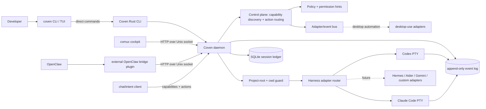
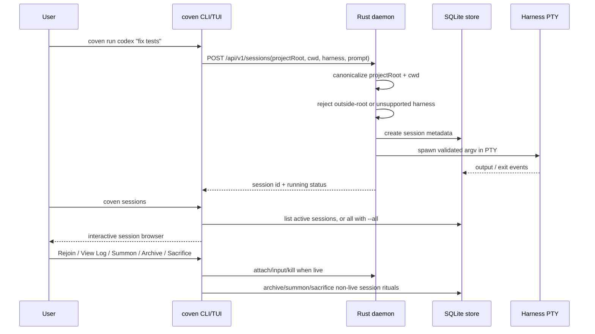
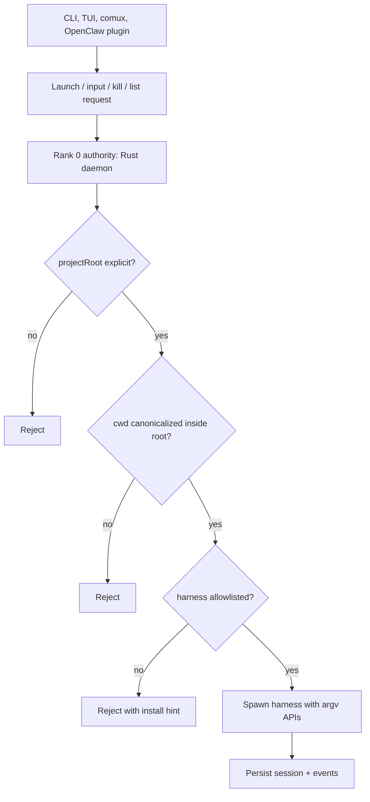

# Arquitectura de Coven

Coven es un sustrato de harness local-first. La CLI/daemon en Rust es la capa de autoridad; los clientes como la TUI de la CLI, comux y el plugin opcional OpenClaw son capas de presentación/integración.

El contrato versionado de la API por socket local vive en [`docs/API-CONTRACT.md`](/API-CONTRACT). Los clientes deben usar `GET /api/v1/health` y negociar contra `apiVersion: "coven.daemon.v1"` y el objeto `capabilities` antes de depender de las formas de respuesta de sesiones o eventos. Todas las respuestas de error usan el sobre estructurado `{ error: { code, message, details } }` documentado allí.

## Topología del runtime



## Ciclo de vida de la sesión



## Límite de autoridad



## Límite de captura / automatización

El cliente de chat/captura debe seguir siendo una interfaz de chat, una superficie de renderizado optimista/eco local, una capa de captura de intenciones y un host pequeño y rápido para acciones locales ultra simples. No debe convertirse en el motor de automatización.

Coven es el runtime local compartido canónico para la automatización reutilizable porque centraliza:

- la propiedad del daemon/procesos
- las decisiones de política y permisos
- el almacenamiento de configuración/perfiles
- el descubrimiento de capacidades
- el enrutamiento de acciones y la emisión de eventos
- la propiedad de adaptadores para Accessibility, AppleScript, teclado/ratón, ventanas, sistema de archivos, portapapeles y puentes específicos de aplicaciones

El flujo previsto es:

```text
user -> chat/capture client -> Coven -> adapters -> desktop/apps
desktop/apps -> Coven -> chat/capture client UI updates
```

`GET /api/v1/capabilities` permite al cliente de chat/captura y a otros clientes descubrir qué puede enrutar Coven. `POST /api/v1/actions` ofrece a los clientes un sobre de intención estable sin acoplarlos directamente a APIs frágiles de automatización del sistema operativo.

## Límite de adaptadores futuros

El runtime público actual de Coven es de un único harness por sesión. El daemon ya mantiene el límite de bajo nivel correcto para el trabajo de coordinación futuro: los clientes pueden descubrir capacidades, lanzar harnesses conocidos, leer eventos y preservar la imposición del project-root en Rust.

No documentes los comandos de orquestación futuros como visibles para el usuario hasta que existan en la CLI y en la API por socket. Las capas de coordinación futuras deben construirse sobre el contrato actual de sesión/evento sin saltarse la validación del daemon.

---

## Superficie actual visible para el usuario

- `coven` y `coven tui` abren la paleta de slash-commands amigable para principiantes.
- `coven doctor` verifica el estado del store/proyecto/harness e imprime los próximos pasos.
- `coven daemon start/status/restart/stop` gestiona el daemon local.
- `coven run codex|claude <prompt>` lanza una sesión PTY con alcance al proyecto.
- `coven sessions` abre el navegador de sesiones para humanos en la terminal; `--plain` conserva la salida apta para scripts.
- Las acciones del navegador de sesiones presentan opciones legibles: **Rejoin**, **View Log**, **Summon**, **Archive** y **Sacrifice**.
- `coven attach|summon|archive|sacrifice <session-id>` siguen siendo verbos explícitos de más bajo nivel para scripts y flujos de copiar/pegar.

## Resumen de distribución

Los paquetes wrapper de npm se publican para los primeros adoptantes:

- `@opencoven/cli`
- `@opencoven/cli-macos`
- `@opencoven/cli-linux-x64`
- `@opencoven/cli-windows` para Windows x64

Las versiones del paquete fuente permanecen como plantilla en el repositorio; el workflow de release dispatch proporciona la versión publicada y construye los paquetes de plataforma. Verifica el registro de npm y las releases de GitHub antes de hacer afirmaciones específicas de versión sobre las releases.
