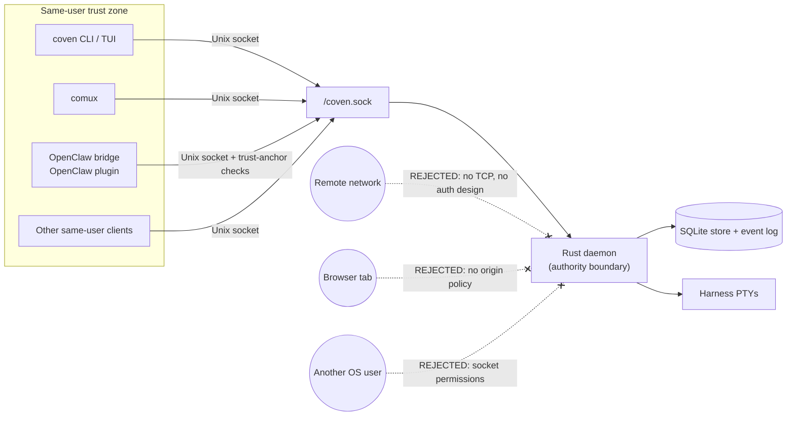

# Autenticación y acceso local

_Última actualización: 2026-05-14_

Coven no tiene actualmente autenticación de usuario a nivel de daemon en el sentido de OAuth, JWT, bearer token, API key, cookie de navegador o cuenta alojada.

La solución actual es un **modelo de acceso local del mismo usuario**:

- El daemon expone HTTP solo sobre el socket Unix local en `<covenHome>/coven.sock`.
- La ruta de socket por defecto es `~/.coven/coven.sock`.
- Los clientes pueden validar peticiones para mejorar la UX, pero el daemon en Rust es el límite de aplicación.
- Las credenciales del proveedor del harness se quedan en el flujo de auth local normal del proveedor del harness.
- Coven no debe leer, proxificar, persistir ni emitir credenciales de Codex, Claude Code, OpenAI, Anthropic, GitHub u OpenClaw.

Esta es intencionalmente una postura MVP local-first. Es adecuada para clientes locales del mismo usuario como la CLI/TUI de Coven, comux y el plugin externo OpenClaw. No es un esquema de auth de API remota.

El límite son los permisos del sistema de archivos más la localidad de procesos del mismo usuario. Cualquier cosa fuera de la zona discontinua se rechaza por diseño; introducir una superficie remota, de navegador o entre usuarios requiere un diseño de auth separado (no un túnel del socket existente).

## Qué protege la API hoy

### Localidad del socket Unix

La API no se expone como TCP por defecto. Los clientes se conectan al socket Unix local propiedad del directorio de estado de Coven del usuario.

Los nuevos clientes deben tratar la ruta del socket como el ancla de confianza y deben conectarse solo a la API versionada bajo `/api/v1/...`.

### Comprobaciones de autoridad en Rust

El daemon debe revalidar los campos sensibles de la petición antes de actuar, incluso cuando un cliente ya los haya validado:

- versión de API;
- raíz de proyecto;
- directorio de trabajo;
- id de harness;
- id de sesión;
- estado de sesión viva;
- peticiones de input;
- peticiones de kill; y
- ids de acción del plano de control.

Las versiones de API desconocidas, los ids de acción desconocidos, los harnesses no soportados, los ids de sesión inválidos y los directorios de trabajo fuera de raíz deben fallar en cerrado.

### Auth del proveedor en manos del harness

Coven lanza CLIs de harness local soportadas. No implementa el login del proveedor.

Ejemplos:

- La autenticación de Codex sigue siendo `codex login` o la configuración local propia de la CLI de Codex.
- La autenticación de Claude Code sigue siendo `claude doctor` o la configuración local propia de la CLI de Claude Code.

`coven doctor` puede informar de pistas de configuración para estas herramientas, pero Coven no posee sus credenciales.

### Salvaguardas del plugin externo OpenClaw

La integración con OpenClaw se externaliza a través de external OpenClaw bridge plugin. El núcleo de OpenClaw no es una raíz de confianza de Coven.

El plugin está deshabilitado por defecto y debe seleccionarse explícitamente como backend ACP. Valida el ancla de confianza del socket local antes de conectarse:

- `covenHome` debe ser un directorio absoluto y no symlink.
- `socketPath` se restringe a `<covenHome>/coven.sock`.
- La ruta del socket no debe ser un symlink.
- El socket resuelto debe ser un socket Unix.
- La raíz del socket, el directorio del socket y el socket deben pertenecer al usuario actual.
- La raíz y el directorio del socket no deben ser accesibles por grupo o por todos.
- La ruta del socket se huellea alrededor de la conexión para detectar carreras de reemplazo.

Estas comprobaciones del lado del cliente mejoran la defensa en profundidad. No reemplazan la aplicación del daemon en Rust.

## Lo que esto no es

La solución de auth actual no es:

- OAuth;
- OpenID Connect;
- sesiones JWT;
- auth con bearer token;
- auth con API key;
- auth con cookies de navegador;
- RBAC;
- autorización multi-usuario;
- una política CSRF/origen;
- un límite de cuenta en la nube; ni
- permiso para exponer la API por socket en TCP local, una red remota o una página de navegador.

Si un futuro dashboard, app móvil, puente remoto o servicio expuesto al navegador necesita hablar con Coven, necesita un diseño adicional explícito de auth y emparejamiento. No tunelices ni proxifiques el socket crudo del daemon en un servicio de red y llames a eso autenticado.

## Brecha de hardening actual

El cliente TypeScript del plugin OpenClaw ya realiza una validación estricta del ancla de confianza del socket.

El daemon en Rust actualmente posee la aplicación de peticiones y el comportamiento de la API por socket, pero las comprobaciones del lado de Rust de propiedad y permisos privados de `COVEN_HOME` antes de crear, enlazar o eliminar estado del daemon siguen siendo una prioridad de hardening. Hasta que eso se implemente, la validación del socket del lado del cliente debe tratarse como defensa en profundidad para clientes cooperativos, no como un límite completo de auth del lado del daemon.

Antes de una distribución amplia, Rust debe fallar en cerrado cuando:

- `COVEN_HOME` no pertenece al usuario actual;
- `COVEN_HOME` es accesible por grupo o por todos;
- `COVEN_HOME` se resuelve a través de un symlink;
- la ruta del socket se resuelve fuera de `COVEN_HOME`;
- una ruta de socket existente es un symlink o un archivo no-socket; o
- la creación o limpieza del socket cruzaría el límite del directorio de estado de confianza.

## Requisitos para nuevos clientes

Los nuevos clientes de Coven deben:

- usar rutas `/api/v1/...`;
- llamar a `GET /api/v1/health` antes de asumir compatibilidad;
- tratar el daemon en Rust como el límite de autoridad;
- mantener las credenciales del proveedor en el flujo de auth del proveedor o del harness;
- evitar almacenar secretos del repositorio, volcados de entorno, URLs privadas o logs portadores de tokens;
- rechazar rutas de socket configurables que no se resuelvan a `<covenHome>/coven.sock`;
- fallar en cerrado ante ids de harness desconocidos o versiones de API no compatibles; y
- evitar añadir cualquier transporte de red, navegador o remoto sin un diseño de auth separado.
