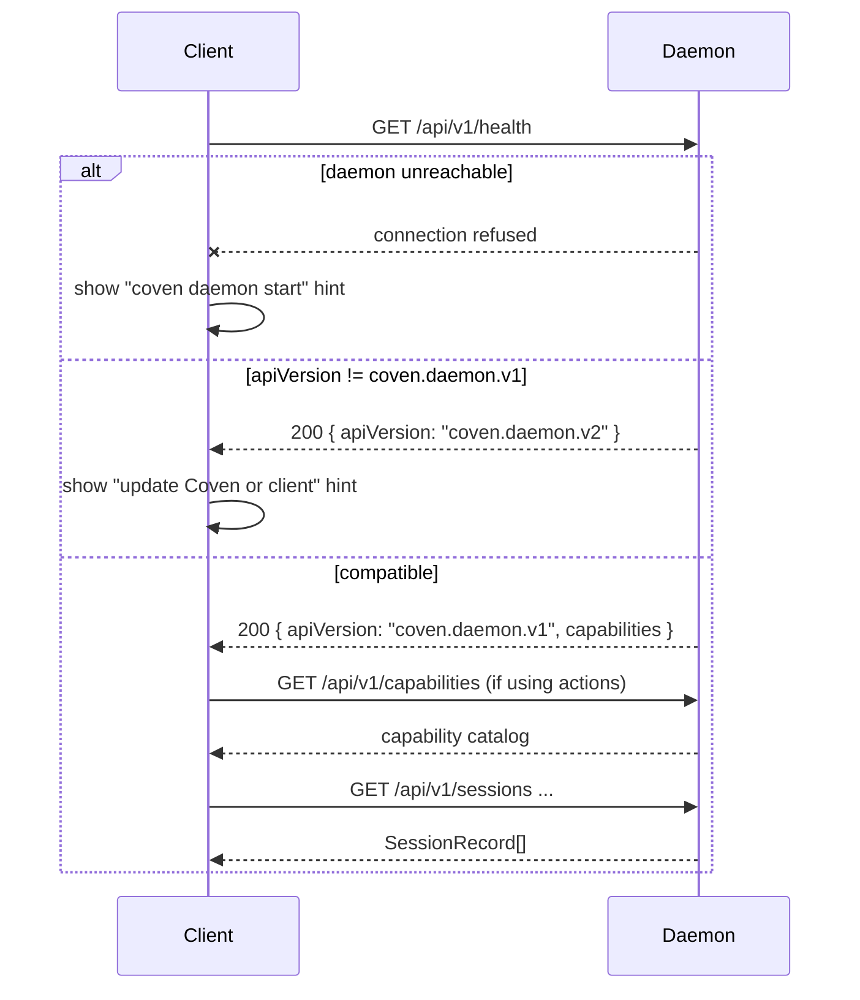

# Guía de integración de clientes

Coven es un sustrato de runtime. Los clientes deben presentar, enrutar y observar el trabajo sin apoderarse del límite de autoridad.

## Regla de integración

Habla con Coven a través de la API por socket local. No dupliques la política de ruta, harness, sesión viva o borrado de Coven de una forma que pueda divergir del daemon.

Handshake recomendado:

1. Llama a `GET /api/v1/health`.
2. Confirma que `apiVersion === "coven.daemon.v1"` y que los campos `capabilities` necesarios están disponibles.
3. Llama a `GET /api/v1/capabilities` si usas acciones del plano de control.
4. Usa solo rutas versionadas `/api/v1/...`.



Los clientes deben tratar el handshake como **obligatorio antes de cualquier otra petición**. Saltarlo significa depender de formas de respuesta indefinidas de una versión futura del daemon.

## Responsabilidades del cliente

Los clientes pueden poseer:

- la navegación;
- los paneles;
- la UI de chat o de captura;
- los formularios de tareas;
- las superficies de diff/review;
- la renderización de notificaciones;
- la selección de sesión;
- el estado optimista de UI local; y
- la UX de aprobación del usuario.

Los clientes no deben ser el único punto de aplicación para:

- los límites de raíz de proyecto;
- las restricciones de cwd;
- las allowlists de harness;
- las comprobaciones de sesión viva;
- las reglas de borrado destructivo;
- la confianza del socket;
- las aprobaciones de acciones externas.

## comux

comux es la capa de cockpit.

Buenas responsabilidades de comux:

- listar sesiones de Coven;
- lanzar sesiones desde el contexto visible de proyecto/worktree;
- abrir sesiones en paneles;
- adjuntar/reanudar trabajo vivo;
- leer `coven sessions --json` para descubrimiento local simple cuando el control a nivel de daemon es innecesario;
- mostrar logs y artefactos;
- ayudar a revisar diffs;
- ayudar a hacer merge, PR, archivar o limpiar explícitamente.

comux debe seguir siendo útil cuando Coven no está instalado. Si Coven falta, presenta estados claros de instalación y fallback en lugar de asumir que el daemon existe.

## Plugin de OpenClaw

La integración con OpenClaw pertenece al paquete externo external OpenClaw bridge plugin, no al núcleo de OpenClaw.

El plugin debe:

- registrar un backend Coven opcional;
- validar la configuración para la UX;
- conectarse al socket local;
- lanzar sesiones a través de `POST /api/v1/sessions`;
- mapear eventos de Coven a eventos de runtime de OpenClaw;
- preservar el comportamiento de fallback solo cuando esté configurado explícitamente; y
- tratar el daemon en Rust como la autoridad de lanzamiento.

El plugin no debe:

- saltarse el daemon para los lanzamientos;
- depender de los internos del núcleo de OpenClaw;
- almacenar credenciales del proveedor;
- asumir que las rutas no versionadas son estables; ni
- ampliar los permisos de raíz de proyecto.

## Superficies de captura

Los clientes de chat/captura se tratan mejor como capas de captura y presentación.

Responsabilidades útiles:

- capturar la intención del usuario;
- mostrar el estado local;
- presentar aprobaciones;
- mostrar notificaciones;
- entregar trabajo a Coven;
- mostrar actualizaciones de sesión desde Coven.

Evita convertir los clientes de captura en el motor de automatización. La automatización reutilizable debe vivir detrás de capabilities y acciones de Coven para que el límite de política permanezca centralizado.

## Clientes de escritorio y salas de control

Una sala de control nativa puede facilitar el manejo de Coven mostrando:

- sesiones activas;
- sesiones archivadas;
- salud del daemon;
- raíces de proyecto;
- disponibilidad de harness;
- integraciones de cliente;
- catálogo de capabilities;
- cola de aprobación de acciones;
- logs y trazas;
- enlaces a docs y troubleshooting.

Usa `coven sessions --json` para sesiones activas y `coven sessions --json --all` cuando el cliente también necesite registros archivados. La CLI devuelve un objeto de nivel superior con un array `sessions`, y cada registro usa los mismos nombres de campo `SessionRecord` expuestos por la API del daemon, incluidos `project_root`, `status`, `created_at`, `updated_at` y el `archived_at` anulable.

La sala de control debe seguir usando la misma API por socket y el mismo handshake de capabilities que los demás clientes.

## Adaptadores de automatización de escritorio

La automatización de escritorio es útil cuando una app no tiene una API limpia. También es lo suficientemente potente como para necesitar una política clara.

Patrón recomendado:

```text
user request
  -> client captures intent
  -> Coven exposes capability and policy hints
  -> client asks for approval when required
  -> Coven routes a known action id
  -> adapter performs the local UI action
  -> event/result returns to the client
```

No dejes que los clientes de UI se enlacen directamente con librerías de automatización del SO y luego llamen a eso "integración de Coven". El límite reutilizable debe ser el plano de control de Coven.

## Expectativas de compatibilidad

Para cada integración:

- usa `/api/v1`;
- llama a health primero;
- ignora los campos aditivos desconocidos cuando sea seguro;
- falla en cerrado ante comportamiento requerido desconocido;
- prueba contra respuestas representativas del daemon;
- actualiza `docs/API-CONTRACT.md` cuando cambien las formas de respuesta.

## Manejo de errores

Un buen cliente debe traducir los errores del daemon en UI orientada a la acción:

- daemon no disponible: muestra instrucciones de inicio/reinicio;
- versión de API no compatible: pide al usuario que actualice Coven o el cliente;
- harness faltante: muestra la guía de `coven doctor`;
- cwd fuera de raíz: explica el límite del proyecto;
- sesión no viva: ofrece visualización del log en lugar de input en vivo;
- acción destructiva bloqueada: explica que la sesión está en ejecución o le falta confirmación.
