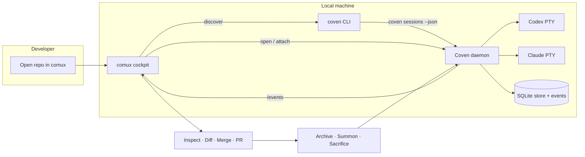

# Bucle de demo comux + Coven

Este es el contrato del lado de Coven para hacer visibles en comux las sesiones de Codex y Claude Code gestionadas por Coven.



El bucle de demo es extremo a extremo: comux nunca se salta el daemon, y el daemon nunca confía en comux para la aplicación de raíz de proyecto, harness o borrado destructivo.

## Bucle

1. Abre el repositorio objetivo en comux.
2. Arranca Coven si es necesario:

   ```sh
   coven daemon start
   ```

3. Lanza una sesión respaldada por Coven desde el mismo repositorio:

   ```sh
   coven run codex "fix the failing tests"
   coven run claude "review the diff"
   ```

4. Deja que comux descubra sesiones a través de cualquiera de las rutas de cliente soportadas:
   - `coven sessions --json` para descubrimiento local simple por CLI.
   - `GET /api/v1/sessions` después de `GET /api/v1/health` para clientes del daemon.
5. Abre la sesión como un panel visible de comux, o adjúntate manualmente:

   ```sh
   coven attach <session-id>
   ```

6. Inspecciona archivos, diffs y la salida de la sesión desde comux.
7. Haz merge, crea un PR, archiva, invoca, sacrifica o limpia explícitamente tras la verificación.

## Descubrimiento por CLI

`coven sessions --json` imprime un objeto estable con un array `sessions`. Los registros usan los mismos nombres snake_case que la API del daemon:

```json
{
  "sessions": [
    {
      "id": "session-1",
      "project_root": "/repo",
      "harness": "codex",
      "title": "Fix the tests",
      "status": "running",
      "exit_code": null,
      "archived_at": null,
      "created_at": "2026-05-14T07:00:00Z",
      "updated_at": "2026-05-14T07:00:01Z"
    }
  ]
}
```

Usa `--all --json` cuando las sesiones archivadas también deban ser visibles.

## Descubrimiento por daemon

Los clientes del daemon deben usar la API por socket versionada:

1. `GET /api/v1/health`
2. Verifica `apiVersion === "coven.daemon.v1"` y `capabilities.sessions === true`.
3. `GET /api/v1/sessions`
4. Filtra las sesiones por raíz de proyecto verificada antes de mostrarlas en una UI limitada al proyecto.

El socket del daemon usa por defecto `~/.coven/coven.sock`. El daemon sigue siendo la autoridad para raíces de proyecto, cwd, ids de harness, comprobaciones de sesión viva, input, peticiones de kill, estado de archivo y reglas de borrado destructivo.

## Estados no disponibles

Los clientes deben mantener su UI principal usable cuando Coven falta o está detenido:

- CLI faltante: muestra la guía de instalación para `@opencoven/cli`.
- Daemon detenido o socket faltante: sugiere `coven daemon start`.
- Harness faltante: sugiere `coven doctor`.
- Versión de API no compatible: pide al usuario que actualice Coven o el cliente.

## Roadmap

El roadmap más amplio de OpenCoven sigue siendo el punto de seguimiento público para la demo extremo a extremo: [ROADMAP.md](/ROADMAP).
