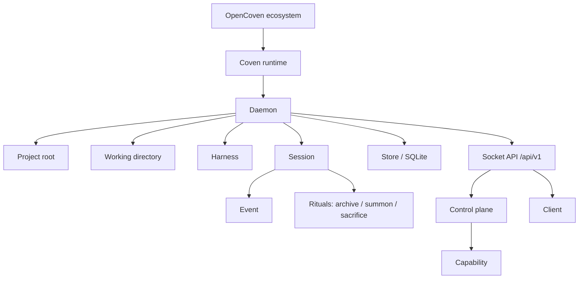

# Conceptos de Coven

Esta página define los sustantivos usados en la CLI, el daemon, la API, los docs y las integraciones de clientes de Coven.



Cada término abajo es un nodo del grafo anterior.

## OpenCoven

OpenCoven es el ecosistema y la organización alrededor del runtime, el cockpit y las integraciones.

Usa **OpenCoven** al hablar de la familia más amplia del proyecto.

## Coven

Coven es el sustrato de runtime local. Posee las sesiones de harness limitadas al proyecto, los PTYs, los logs, el estado del daemon local y la API por socket.

Usa **Coven** para la CLI, el daemon, el crate de Rust, el wrapper de npm y el runtime de sesión local.

## `coven`

`coven` es el comando orientado al usuario.

No le digas a los usuarios que ejecuten `opencoven` o `@opencoven`. Los nombres de paquete viven bajo `@opencoven/*`, pero el comando es siempre `coven`.

## Harness

Un harness es una CLI externa de agente de codificación que Coven puede lanzar y supervisar.

Harnesses v0 actuales:

- Codex, con id de harness `codex`.
- Claude Code, con id de harness `claude`.

Coven no almacena credenciales del proveedor. Cada harness sigue usando su propio flujo local de autenticación.

## Raíz de proyecto

La raíz de proyecto es el límite explícito para una sesión. Coven valida y canonicaliza la raíz de proyecto antes de lanzar trabajo.

La raíz importa porque define dónde se permite al harness arrancar. Un cliente no puede ampliar este límite enviando un `cwd` distinto o un valor de configuración más laxo.

## Directorio de trabajo

El directorio de trabajo es el directorio de lanzamiento de una sesión de harness. Debe estar dentro de la raíz de proyecto tras la canonicalización.

Ejemplos:

```sh
coven run codex "fix tests"
coven run codex "inspect the CLI package" --cwd packages/cli
```

El segundo comando es válido solo cuando `packages/cli` se resuelve dentro de la raíz de proyecto seleccionada.

## Sesión

Una sesión es un registro propiedad de Coven de una ejecución de harness.

Incluye:

- un id de sesión estable;
- raíz de proyecto;
- id de harness;
- título legible;
- estado;
- código de salida opcional;
- estado de archivo; y
- timestamps de creación/actualización.

Los registros de sesión se almacenan en SQLite.

## Evento

Un evento es un registro append-only asociado a una sesión.

Los eventos incluyen registros de salida, salida del proceso y metadatos. Permiten a los clientes reproducir o inspeccionar lo que pasó después de que el proceso saliera o el daemon se reiniciara.

## Daemon

El daemon es el proceso local de Rust que posee el estado de sesión viva y expone la API HTTP-sobre-socket-Unix.

El daemon es el límite de autoridad. Valida:

- las peticiones de lanzamiento;
- las raíces de proyecto;
- los directorios de trabajo;
- los ids de harness;
- el input en vivo;
- las peticiones de kill; y
- los ids de sesión.

## Almacén

El almacén es la base de datos SQLite local de Coven. Contiene metadatos de sesión y el historial append-only de eventos.

El estado de runtime queda fuera del control de fuente. No hagas commit de `.coven/`, bases de datos, sockets, logs ni archivos de entorno.

## Cliente

Un cliente es cualquier cosa que habla con Coven en lugar de lanzar harnesses directamente.

Formas de cliente conocidas:

- CLI/TUI `coven`.
- Cockpit comux.
- Paquete externo del plugin OpenClaw external OpenClaw bridge plugin.
- Futura superficie de captura o de escritorio.

Los clientes son capas de conveniencia, no raíces de confianza.

## Plano de control

El plano de control es la capa de capabilities y enrutamiento de acciones por delante de los futuros adaptadores.

Permite a los clientes descubrir lo que Coven puede hacer mediante `GET /api/v1/capabilities` y enviar acciones conocidas mediante `POST /api/v1/actions`. Los ids de acción desconocidos fallan en cerrado.

## Capability

Una capability describe una funcionalidad propiedad del daemon o del adaptador que un cliente puede presentar.

Los registros de capability incluyen:

- id;
- etiqueta;
- adaptador propietario;
- estado;
- pista de política; y
- ids de acción.

## Rituales

Los rituales son los verbos amigables para humanos de gestión de sesiones de Coven:

- **Archive** oculta una sesión completada de la lista activa preservando los eventos.
- **Summon** restaura una sesión archivada.
- **Sacrifice** borra permanentemente una sesión no en ejecución y sus eventos.

Los nombres de los rituales son lenguaje de producto. El comportamiento de seguridad subyacente debe seguir siendo preciso y conservador.

## API por socket

La API por socket es el límite público de compatibilidad para clientes locales.

Prefijo estable actual:

```text
/api/v1
```

Los clientes deben hacer handshake con:

```text
GET /api/v1/health
```

antes de depender de otras formas de respuesta.
