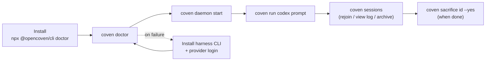

# Empieza con Coven

Esta guía lleva a un nuevo usuario desde un checkout fresco o instalación con npm hasta una sesión de agente visible limitada al proyecto.

## Qué es Coven

Coven es un runtime local-first para harnesses de agentes de codificación. Ejecuta CLIs soportadas como Codex y Claude Code dentro de límites explícitos de proyecto, registra metadatos y eventos de sesión, y expone el trabajo a través de una CLI, una TUI y una API por socket local.

La promesa corta:

> Un proyecto. Cualquier harness. Trabajo visible.

## Rutas de instalación

Usa el wrapper de npm cuando quieras la instalación pública más rápida:

```sh
npx @opencoven/cli doctor
pnpm dlx @opencoven/cli doctor
```

Compila desde fuente cuando estés contribuyendo a Coven:

```sh
git clone https://github.com/OpenCoven/coven.git
cd coven
cargo build --workspace
cargo run -p coven-cli -- doctor
```

## Prerrequisitos

Coven necesita:

- Rust stable, si se compila desde fuente.
- Git.
- Un runtime local tipo Unix para la ruta actual del socket del daemon y del PTY.
- Al menos una CLI de harness compatible en `PATH`.

Harnesses v0 compatibles:

- `codex`
- `claude`

Instala y autentica un harness antes de esperar que `coven run` funcione:

```sh
npm install -g @openai/codex
codex login

npm install -g @anthropic-ai/claude-code
claude doctor
```

## Primera ejecución

Desde un directorio de proyecto:

```sh
coven
```

El comando por defecto abre la TUI prompt-first. Puedes:

- escribir una tarea directamente y pulsar Enter (p. ej. `fix the failing tests` o un comando slash como `/run codex fix the failing tests`);
- seleccionar un elemento del menú con las flechas o su atajo de una sola tecla y pulsar Enter;
- pulsar `h` o escribir `/help` para ver ejemplos de lenguaje natural y comandos slash;
- pulsar `Ctrl+C` o `Esc` para salir.

Si prefieres ejecutar las comprobaciones de configuración explícitas:

```sh
coven doctor
```

`coven doctor` comprueba:

- la preparación del almacén;
- la detección del proyecto;
- la disponibilidad del harness incorporado; y
- los siguientes pasos para configuración faltante.

## Ejecuta una sesión

Arranca el daemon y luego lanza una sesión de harness desde un repositorio o directorio de proyecto:

```sh
coven daemon start
coven run codex "fix the failing tests"
```

o:

```sh
coven run claude "polish the CLI help text"
```

Para una lista de sesiones más legible, pasa un título:

```sh
coven run codex "update the docs" --title "Docs refresh"
```

Usa un directorio de trabajo específico solo cuando esté dentro de la raíz de proyecto detectada:

```sh
coven run codex "inspect this package" --cwd packages/cli
```

Coven rechaza directorios de trabajo fuera de la raíz. Los clientes pueden validar para una mejor UX, pero el daemon en Rust es la autoridad.

## Explorar sesiones

En un terminal interactivo:

```sh
coven sessions
```

Esto abre el explorador de sesiones. Puedes seleccionar una sesión y elegir acciones contextuales:

- **Rejoin** para sesiones vivas.
- **View Log** para sesiones completadas.
- **Summon** para sesiones archivadas.
- **Archive** para sesiones completadas visibles.
- **Sacrifice** para borrado permanente de sesiones y eventos no en ejecución.

Para scripts o flujos de copiar/pegar:

```sh
coven sessions --plain
coven sessions --all --plain
coven sessions --json
coven sessions --json --all
```

## Attach, archive, summon y sacrifice

Los verbos de sesión de bajo nivel siguen disponibles:

```sh
coven attach <session-id>
coven archive <session-id>
coven summon <session-id>
coven sacrifice <session-id> --yes
```

Archive es reversible. Summon restaura una sesión archivada a la lista activa. Sacrifice es destructivo y rechaza sesiones vivas.

## Detén el daemon

```sh
coven daemon stop
```

Usa `restart` cuando el socket o el estado del daemon parezcan obsoletos:

```sh
coven daemon restart
```

## Diagnósticos y relief

`coven pc` es una herramienta de diagnóstico y relief del sistema, primero para macOS, expuesta a través de la CLI de Coven. Todas las operaciones de lectura son libres de efectos secundarios.

Inspecciona:

```sh
coven pc                  # full report: CPU, memory, disk, top processes
coven pc status           # one-line health summary with 🟢/🟡/🔴 indicators
coven pc status --json    # machine-readable health summary
coven pc top --n 10       # top-N processes by CPU usage
coven pc disk             # disk usage breakdown
```

Las operaciones de relief mutan el estado del sistema y requieren una puerta explícita `--confirm`:

```sh
coven pc kill <pid> --confirm     # SIGTERM with PID identity re-check
coven pc cache clear --confirm    # clear ~/Library/Caches + /Library/Caches
```

Restricciones de seguridad en v1:

- Todas las operaciones de escritura requieren `--confirm`. No hay ruta de bypass.
- La terminación es solo SIGTERM. Nada de SIGKILL.
- La identidad del proceso se reverifica justo antes de SIGTERM para prevenir reutilización de PID.
- El borrado de caché usa una lista de rutas codificadas. Sin expansión de glob.
- Los argumentos del proceso se redactan por defecto; pasa `--verbose` para inspeccionarlos.
- Sin `sudo`, sin mutación de LaunchAgent, sin control de servicios del sistema.

## Flujo extremo a extremo



El bucle "install → doctor → daemon → run → sessions" es todo el camino feliz para una primera sesión. Todo lo demás en esta guía es fallback o troubleshooting.


## Bucle de verificación del contribuidor

Antes de abrir un PR:

```sh
cargo fmt --check
cargo clippy --workspace --all-targets -- -D warnings
cargo test --workspace --locked
python scripts/check-secrets.py
```

Para cambios de daemon/sesión, ejecuta también el smoke test:

```sh
cargo test -p coven-cli --test smoke -- --nocapture
```

El smoke test usa un `COVEN_HOME` temporal y un ejecutable de harness falso. No requiere credenciales privadas de harness.
