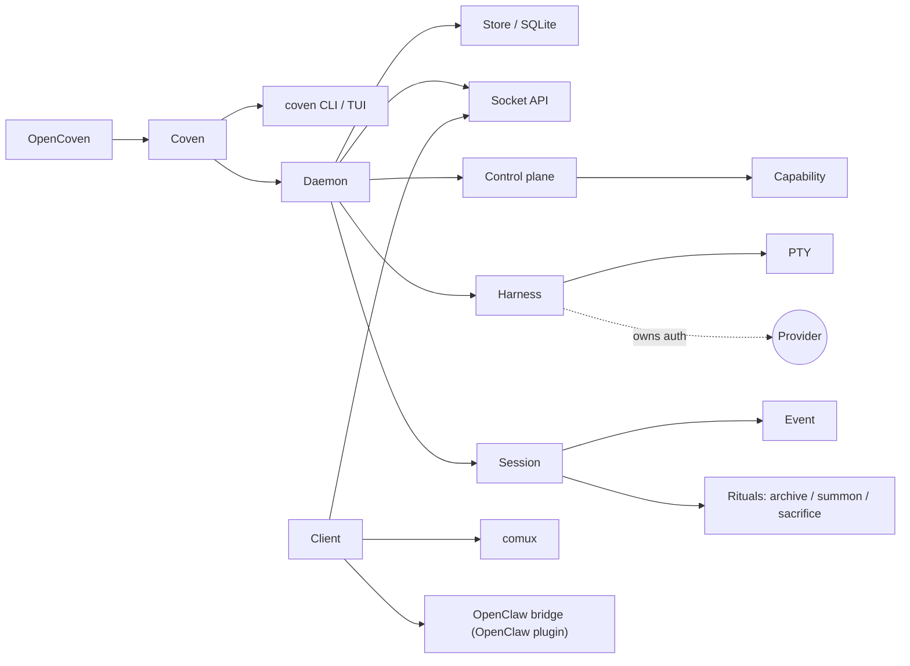

# Glosario

Cómo encajan los términos a primera vista:

Las definiciones siguen en orden alfabético.

## ACP

Agent Client Protocol. En este repo, ACP aparece como una superficie de integración para runtimes de agentes externos y compatibilidad con OpenClaw. Coven en sí no es una implementación de ACP; el plugin externo de OpenClaw mapea entre eventos de runtime de OpenClaw y sesiones de Coven.

## Versión de API

El contrato de compatibilidad nombrado expuesto por la API por socket del daemon. Valor estable actual: `coven.daemon.v1`.

## Archive

Ocultar una sesión no en ejecución de la lista activa preservando su registro y eventos.

## Capability

Una funcionalidad del daemon o del adaptador descubrible devuelta por `GET /api/v1/capabilities`.

## Cliente

Cualquier proceso o UI que habla con el daemon de Coven, incluida la CLI, comux o el plugin de OpenClaw.

## comux

La capa de cockpit para trabajo visible de agente, paneles, worktrees, revisión y flujo de merge. comux puede consumir sesiones de Coven pero no es el runtime de Coven.

## Plano de control

La capa del daemon que expone capabilities y enruta ids de acción conocidos a los adaptadores que posee.

## Coven

El sustrato de runtime local de OpenCoven y el producto de línea de comandos.

## `coven`

El comando orientado al usuario.

## `coven pc`

Subcomando de diagnóstico y relief del sistema, primero para macOS. Informa de CPU, memoria, disco y procesos top. Las operaciones de escritura (kill de proceso, borrado de caché) están protegidas por `--confirm`.

## `COVEN_HOME`

El directorio local donde Coven almacena el estado de daemon/socket/base de datos cuando está configurado. El estado de runtime no debe hacerse commit al control de fuente.

## Daemon

El proceso local en Rust que posee el estado de sesión viva y la API por socket.

## Evento

Un registro append-only para salida, salida del proceso o metadatos de la sesión.

## Harness

Una CLI de agente de codificación compatible que Coven puede lanzar y supervisar.

## OpenCoven

El ecosistema y organización más amplios alrededor de Coven, comux y las integraciones relacionadas.

## Plugin de OpenClaw

El paquete externo external OpenClaw bridge plugin, que permite a OpenClaw usar Coven mediante la API por socket. No forma parte del núcleo de OpenClaw.

## Raíz de proyecto

El límite explícito de repositorio o proyecto para una sesión.

## PTY

Pseudoterminal. Coven usa PTYs para que los harnesses se comporten como herramientas nativas de terminal mientras su salida puede seguir registrándose y reproduciéndose.

## TUI prompt-first

La interfaz por defecto de `coven` y `coven tui`. Acepta texto de tarea libre o comandos slash como `/run codex <task>` como input, junto con navegación por menús con teclas de flecha.

## Relief

Operaciones del lado de escritura en `coven pc` que mutan el estado del sistema (terminación de procesos, borrado de caché). Siempre requieren una flag `--confirm` explícita.

## Sacrifice

Borrar permanentemente una sesión no en ejecución y sus eventos.

## Sesión

Un registro propiedad de Coven de una ejecución de harness.

## API por socket

La API HTTP-sobre-socket-Unix local expuesta por el daemon.

## Summon

Restaurar una sesión archivada a la lista activa y luego reproducirla/seguirla.

## Coordinación futura

El handoff multi-harness y el enrutamiento de tareas no son funciones públicas actuales de la CLI/API. Deben documentarse solo como trabajo de roadmap hasta que se implementen.
