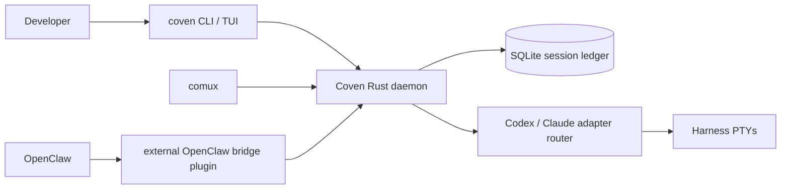
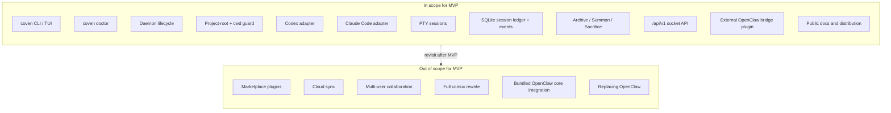

# Spec de producto de Coven

## Tesis de producto

Coven es un sustrato de harness primero en Rust para ejecutar agentes de codificación como sesiones limitadas al proyecto, observables y adjuntables. Permite a los desarrolladores traer los harnesses en los que ya confían a un runtime local controlado en lugar de forzar a un único proveedor de agente o UI.

Estrella polar: **Un proyecto. Cualquier harness. Trabajo visible.**

## Alcance MVP

El MVP demuestra el bucle de runtime central:

- Un binario CLI independiente llamado `coven`
- Un daemon local para sesiones supervisadas
- Límites explícitos de raíz de proyecto
- Ejecución interactiva de sesiones por PTY
- Persistencia de metadatos y eventos de sesión
- Comandos y flujos TUI para ejecutar, navegar, reanudar, ver, archivar, invocar, sacrificar y matar sesiones vivas a través de la API del daemon
- Una API local mínima para clientes de primera parte
- Un paquete de plugin externo de OpenClaw que consume esa API sin entrar en el núcleo de OpenClaw
- Distribución pública y documentación para early adopters

Fuera del alcance del MVP: plugins de marketplace, sincronización en la nube, colaboración multi-usuario, una reescritura completa de comux, integración bundled con el núcleo de OpenClaw o reemplazo de OpenClaw.

## Dirección de harness incorporado v0

Coven v0 debe entregarse con adaptadores incorporados para Codex y Claude Code. Estos adaptadores deben detectar la disponibilidad local de la CLI, construir comandos sin interpolación por shell donde sea posible, ejecutar el harness dentro de un `cwd` validado del proyecto y exponer salida/input a través de sesiones PTY gestionadas por Coven.

La UX de terminal debe seguir centrada en el comando ligero `coven` y un explorador humano de sesiones:

```sh
coven
coven tui
coven run codex "fix tests"
coven run claude "polish this UI"
coven sessions
coven sessions --plain
```

En un terminal interactivo, `coven sessions` abre un explorador con acciones legibles como **Rejoin**, **View Log**, **Summon**, **Archive** y **Sacrifice** para que los usuarios no tengan que memorizar ids de sesión. La salida en texto plano sigue disponible para scripts y pipes.

## Futura ruta de Hermes y de adaptador

Hermes y otros harnesses deben llegar mediante un pequeño contrato de adaptador después de que la ruta v0 incorporada sea estable. El modelo de adaptador debe soportar futuros objetivos como Hermes, Aider, Gemini, OpenCode y adaptadores de comando personalizados sin requerir que Coven se convierta en un marketplace de plugins completo en el MVP.

## Arquitectura actual



Para diagramas más completos, consulta [Diagramas de arquitectura](/ARCHITECTURE).

## Relación con comux y OpenClaw

Coven es el sustrato de runtime local. comux puede convertirse en el cockpit visual para paneles e historial de sesión gestionados por Coven. OpenClaw puede delegar los lanzamientos de harness limitados al proyecto a Coven solo a través del plugin externo external OpenClaw bridge plugin, no a través de código bundled del núcleo de OpenClaw. El cliente de chat/captura puede consumir el estado de sesión, la captura o las notificaciones de Coven donde sea útil.

Coven debe integrarse con estos proyectos sin ser propiedad de ninguno: es la habitación compartida donde se ejecutan los harnesses, no toda la UI ni el orquestador.

## Límite del plugin externo de OpenClaw

La integración con OpenClaw se externaliza. El repo de OpenClaw no debe incluir código de OpenCoven o Coven, y Coven no debe depender de los internos de OpenClaw.

El paquete external OpenClaw bridge plugin es un adaptador de compatibilidad:

- Las llamadas de runtime ACP de OpenClaw entran al plugin.
- El plugin valida la configuración y se conecta al socket local de Coven.
- El daemon en Rust revalida raíces de proyecto, cwd, ids de harness, input y peticiones de kill.
- Coven lanza y supervisa el PTY del harness.
- El plugin mapea eventos de Coven de vuelta a eventos de runtime ACP de OpenClaw.

Esto hace de la API por socket el contrato. El versionado del protocolo, los tests de compatibilidad y las notas de release pertenecen al repo de Coven y al paquete del plugin, no al núcleo de OpenClaw.

## Estado público desde el inicio

Coven es público ahora mientras el modelo de seguridad, el comportamiento del daemon, los contratos de adaptador y la experiencia de usuario continúan madurando. El empaquetado público debe seguir siendo conservador, y la disposición debe juzgarse por si los early adopters pueden ejecutar de forma fiable Codex y Claude Code en sesiones visibles, adjuntables y limitadas al proyecto.

## Alcance MVP de un vistazo



El límite anterior es normativo para v0. Cualquier cosa en **OutOfScope** se registra en el roadmap, no se construye en el sustrato de runtime.

## Handles canónicos de la comunidad

Usa estos handles/enlaces públicos exactos cuando los docs o metadatos del paquete de Coven mencionen canales de la comunidad:

- Discord: `discord.gg/opencoven`
- X / Twitter: `@OpenCvn`
