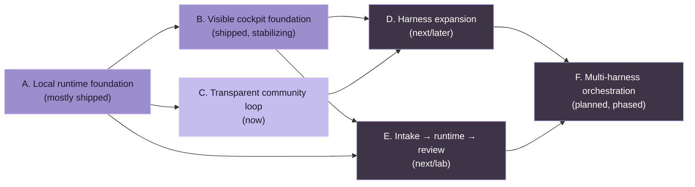

# Roadmap público de OpenCoven

_Última actualización: 2026-05-09_

Este roadmap es el ledger público de progreso para **OpenCoven**, **Coven** y **comux**.

Está escrito intencionalmente como un mapa orientado a la comunidad, no como una hoja de promesas internas. Los elementos se mueven cuando se diseñan, implementan, prueban, publican o se cortan deliberadamente. Se evitan las fechas a menos que un release ya esté programado.

## Estrella polar

OpenCoven está construyendo un workspace de agentes local-first donde harnesses autónomos de codificación pueden trabajar dentro de habitaciones explícitas:

- **Coven** es el sustrato de runtime: sesiones de harness limitadas al proyecto, PTYs, logs y APIs locales.
- **comux** es el cockpit: paneles visibles, worktrees, carriles de agente, rituales, revisión y flujo de merge.
- **Las superficies de captura y la integración con OpenClaw** son superficies de captura y orquestación que pueden entregar trabajo al mismo runtime local sin ocultar lo que pasó.

La promesa simple:

> Un proyecto. Cualquier harness. Trabajo visible.

## Cómo leer este roadmap

- **Shipped** significa que el trabajo existe en código público o en artefactos públicos de paquete/release.
- **Now** significa estabilización activa o implementación a corto plazo.
- **Next** significa planificado después de la sección actual de estabilización.
- **Later** significa direccionalmente importante, pero no se le permite distraer del MVP local-first.
- **Lab** significa trabajo experimental que estamos explorando en público cuando es posible, pero sin tratarlo todavía como una promesa estable.

## Instantánea actual

### Coven

**Estado:** MVP público temprano, usable por desarrolladores aventureros local-first.

Shipped:

- Repo público `OpenCoven/coven`.
- Comando CLI en Rust llamado `coven`.
- Entrypoint amigable para principiantes `coven` / `coven tui`.
- Comprobaciones de configuración `coven doctor`.
- Ciclo de vida del daemon local: `coven daemon start/status/restart/stop`.
- Guardia de límite de raíz de proyecto y cwd.
- Adaptadores incorporados de harness Codex y Claude Code.
- Sesiones `coven run codex|claude <prompt>` respaldadas por PTY.
- Metadatos de sesión y log de eventos respaldados por SQLite.
- Explorador de sesiones y rituales: **Rejoin**, **View Log**, **Summon**, **Archive**, **Sacrifice**.
- Salida de sesión scriptable y humana: `coven sessions`, `--plain` y `--all`.
- API HTTP-sobre-socket-Unix local para clientes.
- Contrato versionado de API `coven.daemon.v1` con apiVersion nombrada, capabilities legibles por máquina, errores estructurados y cursores de eventos monótonos. Consulta [`docs/API-CONTRACT.md`](/API-CONTRACT).
- Tests de compatibilidad para el puente externo de OpenClaw contra respuestas versionadas del daemon.
- Pistas de recuperación de primera ejecución para CLIs de Codex o Claude Code faltantes.
- Cobertura real de smoke de CLI para flujos de reinicio del daemon, replay de attach, kill, archive, summon y sacrifice.
- Verificación de instalación y wiring de release para rutas de paquete npm de macOS, Linux x64 y Windows x64.
- Paquetes wrapper de npm publicados:
  - `@opencoven/cli`
  - `@opencoven/cli-macos`
  - `@opencoven/cli-linux-x64`
- Paquete puente externo de OpenClaw mantenido fuera del núcleo de OpenClaw.
- Docs de arquitectura, modelo operativo, spec de producto, marca y plan MVP.

Now:

- Mantener alineados el contrato versionado de la API del daemon y el trabajo de compatibilidad con clientes externos. Consulta [`docs/API-CONTRACT.md`](/API-CONTRACT).
- Mantener los docs públicos alineados con la superficie real de CLI/API.

Next:

- Convertir la lista de verificación del MVP en issues/milestones enlazados de GitHub.

Later:

- Adaptador genérico de comando tras suficiente uso real.
- Adaptadores adicionales de harness como Hermes, Aider, Gemini, OpenCode o harnesses locales definidos por el usuario.
- Hooks de política/aprobación para acciones sensibles.
- Artefactos y adjuntos de sesión más ricos.
- **Orquestación multi-harness** (Phase 1-4, TBD timeline):
  - Phase 1: Protocolo de handoff y transferencia de contexto entre harnesses
  - Phase 2: Descubrimiento de capabilities y enrutamiento inteligente de tareas
  - Phase 3: Coordinación multi-instancia entre harnesses
  - Phase 4: Dashboard de auditoría y tooling de cumplimiento
- Colaboración opcional en nube/equipo solo después de que el runtime local sea aburridamente fiable.

### comux

**Estado:** producto público temprano, útil como cockpit de terminal independiente y convirtiéndose en el primer cliente visual de Coven.

Shipped:

- Paquete público de npm `comux` y comando CLI.
- Cockpit tmux para trabajo paralelo visible.
- Aislamiento por worktree de git por carril de agente.
- Registro de launcher de agentes con múltiples CLIs de codificación.
- Lanzamientos de agente multi-selección.
- Menú de panel para flujos de inspección, merge, PR, attach y limpieza.
- Explorador de archivos, vista previa de código y affordances de revisión orientadas a diff.
- Sidebar de proyecto, controles de visibilidad de panel y flujos de reapertura.
- Rituales para configuraciones repetibles de proyecto.
- Docs de hooks de ciclo de vida y referencia de hooks generada.
- Sitio de docs y README/spec/smoke públicos.
- Visibilidad de sesiones de Coven e integración de lanzamiento mediante la ruta de puente local.
- Dirección de ritual de reparación de OpenClaw iniciada públicamente.

Now:

- Estabilizar la UX de sesiones de Coven en comux: list, open, launch, attach/rejoin y estados no disponibles.
- Mantener comux útil sin Coven instalado.
- Continuar el dogfooding de comux-sobre-comux para higiene de ramas/worktrees.
- Apretar los flujos de revisión/merge para que la salida del agente permanezca explícita e inspeccionable.

Next:

- Promover un bucle de demo crujiente `comux + Coven`:
  1. Abrir proyecto en comux.
  2. Lanzar una sesión Codex o Claude respaldada por Coven.
  3. Verla como un panel/sesión visible.
  4. Inspeccionar archivos y diffs.
  5. Hacer merge, PR, archivar o limpiar explícitamente.
- Añadir issues públicos para asperezas descubiertas durante el dogfooding.
- Mejorar el onboarding para tmux, detección de CLI de agente y disponibilidad de Coven.
- Hacer fácil generar actualizaciones de Discord desde commits entregados e issues de roadmap.

Lab:

- Exploración de cockpit nativo de macOS.
- Atajos de escritorio y cambio más rápido de proyecto/sesión.
- Handoff de captura del cliente de chat/captura a sesiones de comux/Coven.

### Ruta de integración OpenClaw / captura

**Estado:** dirección de puente opcional, no bundled en el núcleo de OpenClaw.

Shipped:

- Spike técnico del puente de OpenClaw completado y parqueado intencionalmente antes de fusionar al núcleo.
- Dirección del plugin externo external OpenClaw bridge plugin establecida para que el núcleo de OpenClaw permanezca limpio.
- El límite del socket/API local hace de Coven la capa de autoridad.

Now:

- Tratar la API de Coven como el límite de compatibilidad.
- Añadir tests de compatibilidad antes de promover el uso amplio del plugin.
- Mantener honesto el copy de captura/OpenClaw: la captura y la orquestación se sientan por encima de Coven; no reemplazan el sustrato de runtime.

Next:

- Documentar públicamente la ruta de plugin soportada una vez aterrice el versionado de API.
- Añadir una demo que muestre una tarea pasando de captura a runtime de Coven a revisión en comux.

## Mapa de milestones



El código de color refleja la madurez: lavanda rellena es shipped o estabilizando; pizarra contorneada es next/later. Las aristas muestran la dirección de prerrequisito, no un horario estricto.


## Milestones públicos

### Milestone A — Base del runtime local

Estado: **mostly shipped**

- [x] Repo público y docs
- [x] CLI `coven`
- [x] Seguridad de raíz de proyecto
- [x] Adaptadores Codex y Claude
- [x] Sesiones PTY
- [x] Ledger SQLite de sesiones/eventos
- [x] Ciclo de vida del daemon
- [x] API local de sessions/events
- [x] Contrato de API versionado
- [x] Tests de compatibilidad para clientes externos

### Milestone B — Base del cockpit visible

Estado: **shipped, stabilizing**

- [x] Paquete público `comux`
- [x] Paneles tmux
- [x] worktrees de git
- [x] registro de launcher de agentes
- [x] explorador de archivos / revisión por diff
- [x] rituales
- [x] menú de panel orientado a merge y PR
- [x] Visibilidad de sesiones de Coven
- [ ] Pulido de UX para attach/rejoin de Coven
- [ ] Demo documentada extremo a extremo comux + Coven

### Milestone C — Bucle transparente de comunidad

Estado: **now**

- [x] Documento de roadmap público
- [ ] Etiquetas de milestone de GitHub para `roadmap`, `now`, `next`, `later`, `area:coven`, `area:comux`, `good first issue`, `help wanted`
- [ ] Primer post público de roadmap en Discord
- [ ] Cadencia semanal de actualización shipped/building/next
- [ ] Tablero público de issues enlazado desde Discord

### Milestone D — Expansión de harness

Estado: **next/later**

- [x] Investigación de futuros harnesses iniciada
- [x] Contrato de adaptador documentado
- [ ] Diseño de adaptador genérico de comando a partir de uso real
- [ ] Prueba de tercer harness
- [ ] Docs de compatibilidad de harness

### Milestone E — De captura a runtime a revisión

Estado: **next/lab**

- [ ] La captura del cliente de chat/captura u OpenClaw crea o solicita una tarea de Coven
- [ ] Coven posee la sesión y el log de eventos
- [ ] comux muestra la sesión para revisión
- [ ] el usuario hace merge, PR, archiva o borra trabajo explícitamente

### Milestone F — Orquestación multi-harness (Fase 1-4)

Estado: **planned, TBD start**

**Fase 1: Protocolo de handoff (semanas 1-2)**
- [ ] Diseño de API de handoff e implementación TypeScript
- [ ] Formato y validación de transferencia de contexto
- [ ] Handoff explícito de harness a harness (p. ej., OpenClaw → Claude Code)
- [ ] Ledger de handoff (PostgreSQL)
- [ ] Test extremo a extremo: Cody hace handoff de un fallo de test a Claude para edición de archivo

**Fase 2: Descubrimiento de capabilities y router (semanas 3-4)**
- [ ] Registro y declaración de capabilities de harness
- [ ] Router de tareas: auto-selección del mejor harness
- [ ] Balanceo de carga y cadenas de fallback
- [ ] Aplicación de SLA y manejo de timeouts
- [ ] Test: "Fix this bug" se enruta automáticamente al mejor harness

**Fase 3: Coordinación multi-instancia (semanas 5-6)**
- [ ] Almacén distribuido de contexto (Redis + PostgreSQL)
- [ ] Registro de harness y heartbeat de salud
- [ ] Enrutamiento por afinidad de tarea (restricciones de recursos)
- [ ] Escalar a múltiples instancias de Coven por usuario
- [ ] Test: harnesses locales + remotos coordinan sin colisión

**Fase 4: Auditoría y observabilidad (semanas 7-8)**
- [ ] Dashboard de auditoría: timeline de tarea y traza de handoff
- [ ] Exportación de cumplimiento (trazas redactadas)
- [ ] Métricas de Prometheus y alertas
- [ ] Visibilidad completa del trabajo orquestado
- [ ] Test: legal/cumplimiento puede consultar el historial completo

## Modelo de transparencia en Discord

Debemos mantener las actualizaciones de Discord ligeras y repetibles.

### Canales sugeridos

- `#roadmap` o un canal de tipo foro `Roadmap` para hilos de milestone.
- `#dev-updates` para resúmenes semanales.
- `#help-wanted` para issues acotadas que los miembros de la comunidad realmente puedan tomar.

### Plantilla de actualización semanal

```md
## OpenCoven weekly update — YYYY-MM-DD

### Shipped
- ...

### Building now
- ...

### Next up
- ...

### Help wanted
- ...

### Links
- Roadmap: https://github.com/OpenCoven/coven/blob/main/docs/ROADMAP.md
- Coven issues: https://github.com/OpenCoven/coven/issues
- comux issues: https://github.com/BunsDev/comux/issues
```

### Reglas para actualizaciones honestas

- No prometas fechas a menos que ya estemos en modo release.
- Enlaza el trabajo shipped a commits, releases, issues o docs.
- Marca los experimentos como **Lab** en lugar de fingir que son elementos comprometidos del roadmap.
- Separa **runtime de Coven**, **cockpit comux** y **captura/OpenClaw** para que la gente entienda la arquitectura.
- Prefiere issues públicos pequeños sobre tareas vagas gigantes.
- Pide ayuda solo cuando la tarea tenga una condición clara de aceptación.

## Primer post público en Discord

```md
We opened a public roadmap for OpenCoven/Coven/comux so progress is easier to follow.

The short version:
- Coven is the local runtime substrate: project-scoped Codex/Claude sessions, PTYs, logs, daemon API.
- comux is the visible cockpit: tmux panes, worktrees, rituals, review, merge/PR flows.
- The next serious focus is hardening the Coven API contract and polishing the comux + Coven demo loop.

Roadmap: https://github.com/OpenCoven/coven/blob/main/docs/ROADMAP.md
Coven: https://github.com/OpenCoven/coven
comux: https://github.com/BunsDev/comux

We'll start posting lightweight shipped / building / next updates here so the work is easier to follow and easier to help with.
```
