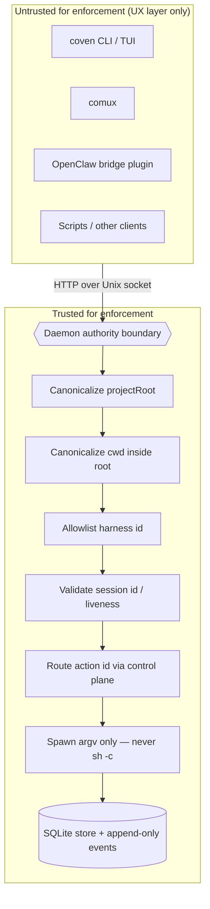

# Modelo de seguridad de Coven

Coven es local-first, pero local no significa inofensivo. Puede lanzar harnesses de agentes en repositorios reales, reenviar input a procesos vivos y preservar logs. Este documento expone los límites de seguridad que los docs, los clientes y el código deben preservar.

## Límite de confianza

El daemon en Rust es el límite de autoridad.

Cada cliente es no confiable para fines de aplicación, incluidos:

- la CLI/TUI;
- comux;
- el plugin externo de OpenClaw;
- los scripts; y
- los futuros clientes de escritorio.

Los clientes pueden mejorar la UX, pero no deben ser el único lugar donde se aplique una decisión sensible.



Cualquier cosa en **UntrustedZone** puede mentir, divergir o ser reemplazada. Cualquier cosa en **TrustedZone** es trabajo del daemon en Rust y debe fallar en cerrado ante lo desconocido. La dirección de la flecha es la única dirección en la que se permite que fluya una decisión sensible: desde lo no confiable hacia el límite, donde se revalida.

## Autenticación y acceso local

La solución de auth actual de Coven es un modelo de acceso local del mismo usuario, no un protocolo de autenticación de red.

- La API del daemon corre sobre `<covenHome>/coven.sock`, no TCP.
- No hay OAuth, JWT, bearer token, API key, cookie de navegador, RBAC ni sesión de cuenta alojada del daemon en v0.
- Las credenciales del proveedor permanecen en el flujo local de auth del proveedor/harness, como Codex o Claude Code.
- Los clientes son no confiables para la aplicación; el daemon en Rust debe seguir revalidando cada petición sensible.
- El plugin externo de OpenClaw realiza validación del ancla de confianza del socket antes de conectarse, pero las comprobaciones de propiedad y permisos privados de `COVEN_HOME` del lado de Rust siguen siendo una prioridad de hardening.
- No expongas la API por socket cruda a través de TCP localhost, una página de navegador, un puente remoto o un flujo de emparejamiento móvil sin un diseño de auth explícito separado.

El contrato detallado vive en [Autenticación y acceso local](/AUTH).

## Reglas principales

- Lanza solo con una raíz de proyecto explícita.
- Canonicaliza `projectRoot` y `cwd` antes de comparar rutas.
- Rechaza directorios de trabajo fuera de la raíz de proyecto.
- Mantén los ids de harness en allowlist hasta que exista una capa de política real.
- Construye los comandos de harness con APIs de argv.
- No ejecutes prompts mediante `sh -c`.
- Mantén las credenciales del proveedor en el flujo de autenticación del proveedor o del harness.
- Trata la API por socket como un contrato local de producto, no un detalle privado de implementación.
- Falla en cerrado ante versiones de API desconocidas, ids de acción desconocidos, harnesses no soportados e ids de sesión inválidos.

## Datos y secretos

Coven no debe requerir secretos almacenados en el repositorio.

No hagas commit del estado de runtime:

- `.coven/`
- `*.sqlite`
- `*.sqlite3`
- `*.db`
- `*.sock`
- `.env*`
- claves privadas
- certificados
- logs portadores de tokens

Los docs y ejemplos deben usar placeholders como `/path/to/project`, `/Users/example`, `session-1` e `intent-1`.

## Precaución con el log de eventos

El log de eventos registra la salida del harness. Un harness puede imprimir datos sensibles si el usuario le pide inspeccionar un repositorio sensible o si la salida del comando incluye secretos.

Guía recomendada para el usuario:

- No ejecutes prompts no confiables en repositorios sensibles.
- No pidas a un harness que vuelque variables de entorno.
- No pegues secretos en los prompts.
- Usa proyectos descartables para demos y smoke tests.
- Ejecuta `python scripts/check-secrets.py` antes de publicar docs, fixtures o artefactos de release.

## Postura del socket local

La API del daemon corre sobre un socket Unix local. Está destinada a clientes locales del mismo usuario.

Prioridades de hardening:

- propiedad y permisos privados de `COVEN_HOME`;
- creación y limpieza seguras del socket;
- límites de tamaño de petición;
- timeouts de lectura;
- códigos de error estructurados;
- paginación de eventos; y
- tests de compatibilidad para clientes externos.

## Control de sesión viva

Las peticiones de input en vivo y kill requieren un id de sesión viva válido.

Comportamiento esperado:

- id de sesión desconocido devuelve not found;
- input/kill a sesión no viva devuelve conflicto;
- el borrado destructivo de sesión rechaza sesiones en ejecución;
- el borrado interactivo requiere confirmación explícita.

## Automatización de escritorio y control de UI local

Los futuros adaptadores de automatización de escritorio deben tratarse como capabilities locales privilegiadas.

Postura requerida:

- descubre capabilities antes de mostrar acciones;
- etiqueta claramente las acciones arriesgadas;
- requiere aprobación explícita para clics, escritura, borrado, envío, compra, publicación o modificación de estado externo;
- registra las peticiones de acción y los resultados sin registrar secretos;
- mantén los adaptadores detrás del plano de control de Coven en lugar de dejar que cada cliente se enlace directamente con APIs de automatización del SO.

La división debe permanecer como:

```text
client intent -> Coven policy/control plane -> adapter -> desktop/app
```

## Acciones externas

Coven debe preguntar o requerir una política a nivel de host antes de las acciones que salen de la máquina o afectan servicios externos, incluidas:

- envío de mensajes;
- envío de email;
- publicación pública;
- compra;
- borrado de datos remotos;
- push a remotos de git; y
- modificación de recursos en la nube.

El runtime local puede hacer estas acciones visibles, pero visibilidad no es consentimiento.
