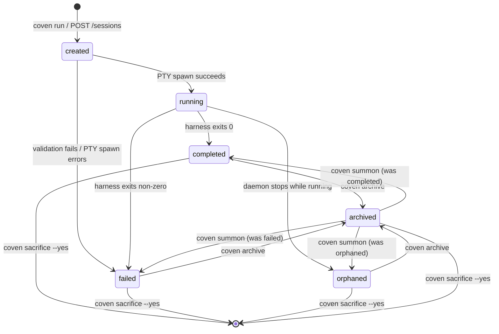
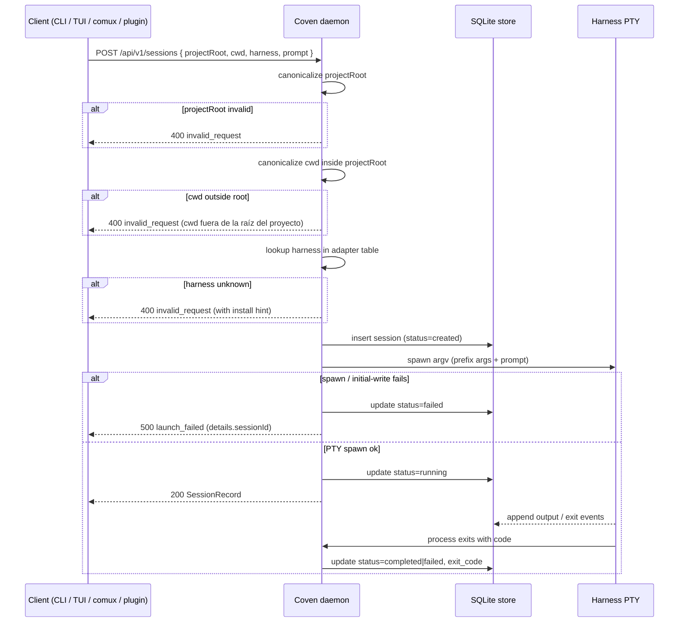

# Ciclo de vida de la sesión

Este documento explica qué pasa desde `coven run` hasta la finalización, reproducción, archivado, invocación y borrado.

## Estados del ciclo de vida

El almacén actual registra el estado de la sesión como una cadena. Los estados comunes incluyen:

- `created` - el registro de sesión existe antes de que comience la ejecución viva.
- `running` - el proceso de harness está activo bajo supervisión del daemon.
- `completed` - el harness salió con éxito.
- `failed` - la configuración o el lanzamiento falló antes de la finalización normal.
- `orphaned` - un daemon previo se detuvo mientras una sesión seguía marcada como en ejecución.

El estado de archivo se almacena por separado como `archived_at`. Una sesión completada o fallida puede ocultarse de la lista activa sin cambiar su estado final.



El diagrama anterior es normativo para el almacén v0. Las sesiones `running` no pueden archivarse ni sacrificarse directamente — mátalas o espera la salida primero. `created → running` es la única transición que requiere spawn de PTY; cada otra transición es un cambio de estado solo en el almacén gestionado por el daemon en Rust.

## Ruta de lanzamiento

El flujo normal de lanzamiento:

1. El usuario o cliente envía una tarea a través de la CLI o la API local.
2. Coven resuelve la raíz de proyecto.
3. Coven canonicaliza la raíz de proyecto y el directorio de trabajo.
4. Coven rechaza directorios de trabajo fuera de la raíz.
5. Coven verifica que el id de harness sea compatible.
6. Coven crea un registro de sesión en SQLite.
7. El daemon hace spawn del harness en un PTY usando APIs de argv.
8. Los datos de salida y de salida del proceso se escriben como eventos.
9. El estado de la sesión y el código de salida se actualizan.

La capa de Rust realiza las comprobaciones de autoridad incluso cuando un cliente TypeScript ya ha validado la petición para mejorar la UX.



## Registros desacoplados

`coven run ... --detach` crea el registro de sesión sin lanzar el harness. Esto es útil para flujos de prueba y desarrollo que necesitan un registro de ledger sin iniciar un proceso externo.

Los registros desacoplados no deben presentarse como trabajo de agente completado.

## Attach y replay

`coven attach <session-id>` reproduce la salida conocida del evento y sigue la salida viva cuando la sesión sigue activa.

Para una sesión completada, attach actúa como un visor de logs. Para una sesión en ejecución, attach también reenvía input a la sesión viva del daemon.

## Comportamiento del explorador de sesiones

`coven sessions` elige el modo de salida según el contexto:

- En un terminal interactivo, abre el explorador de sesiones.
- Cuando se canaliza por pipe o se ejecuta con `--plain`, imprime salida en tabla.
- `--json` imprime registros de sesión legibles por máquina para clientes locales.
- `--all` incluye sesiones archivadas.
- `--manage` fuerza el explorador.

El explorador ofrece acciones contextuales para que los usuarios no tengan que memorizar ids de sesión.

## Archive

Archive oculta una sesión no en ejecución de la lista activa por defecto preservando el registro de sesión y el log de eventos.

```sh
coven archive <session-id>
```

Usa archive para trabajo antiguo que debe permanecer inspeccionable.

## Summon

Summon restaura una sesión archivada a la lista activa y luego la reproduce/sigue:

```sh
coven summon <session-id>
```

Summon no re-ejecuta el prompt original del harness. Cambia el estado de archivo y abre el registro existente.

## Sacrifice

Sacrifice borra permanentemente una sesión no en ejecución y propaga el borrado a sus eventos:

```sh
coven sacrifice <session-id> --yes
```

El comando rechaza sesiones vivas. El explorador interactivo pide al usuario que escriba `sacrifice` antes de borrar.

Usa sacrifice solo cuando la sesión y sus logs deban eliminarse del ledger local.

## Recuperación de huérfanos

Si el daemon arranca y encuentra sesiones marcadas como `running` de una vida anterior del daemon, esas sesiones se marcan `orphaned`.

Una sesión huérfana significa que Coven ya no posee un proceso vivo para ese registro. El log de eventos puede seguir siendo útil, pero las operaciones de input en vivo y kill deben fallar.

## Durabilidad de eventos

Los eventos son registros append-only en SQLite. Esto da a los clientes una fuente estable de reproducción incluso cuando el proceso PTY original ha salido.

No escribas intencionalmente secretos, volcados de entorno, URLs privadas o salida de comando portadora de tokens en los eventos. Coven no puede garantizar que la salida del harness esté libre de secretos, así que los usuarios deben evitar ejecutar prompts no confiables en repositorios sensibles.
