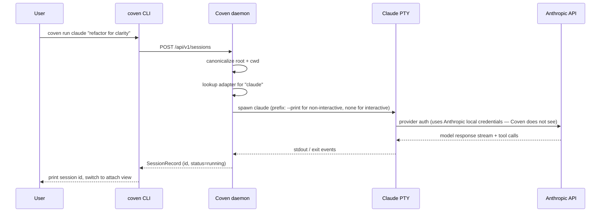

Claude Code es la CLI de agente de codificación de Anthropic. Coven la envuelve en un PTY limitado al proyecto para que los lanzamientos, attaches y rituales funcionen igual que para cualquier otro harness.

| Campo | Valor |
|---|---|
| Id de harness | `claude` |
| Instalación | `npm install -g @anthropic-ai/claude-code` |
| Auth | `claude doctor` (una sola vez, lado de Anthropic) |
| Comprobación de doctor | `coven doctor` informa la ruta y versión de Claude resueltas. |

## Configuración

<Steps>
  <Step title="Instala Claude Code">
    ```bash
    npm install -g @anthropic-ai/claude-code
    ```
  </Step>
  <Step title="Ejecuta el propio doctor de Claude">
    ```bash
    claude doctor
    ```
    Las credenciales del proveedor se quedan con Claude Code. Coven nunca las lee.
  </Step>
  <Step title="Confirma con Coven">
    ```bash
    coven doctor
    ```
    La salida debe incluir `claude: ok (/usr/local/bin/claude)`.
  </Step>
  <Step title="Lanzar">
    ```bash
    coven run claude "polish this UI"
    ```
  </Step>
</Steps>

## Flags por sesión

```bash
coven run claude "refactor for clarity" --cwd packages/web --title "Web refactor"
```

- `--cwd` — canonicalizado dentro de la raíz de proyecto.
- `--title` — establece un título legible en el explorador de sesiones.
- `--json` — imprime metadatos estructurados de lanzamiento para clientes.

## Límite de auth del proveedor

Claude Code posee su propio flujo OAuth y caché de tokens. Coven nunca lee claves de Anthropic ni cookies de sesión.

## Solución de problemas

| Síntoma | Causa probable | Solución |
|---|---|---|
| `coven doctor` informa `claude` faltante | Claude Code no está en `PATH` | `npm install -g @anthropic-ai/claude-code`, luego vuelve a ejecutar doctor. |
| Claude pide login | Auth sin completar | `claude doctor`. |
| La sesión muestra una pausa larga de pre-flight | Claude resolviendo configuración | Solo la primera ejecución; los lanzamientos posteriores son rápidos. |

## Cómo supervisa Coven a Claude Code



Las llamadas a herramientas de Claude Code se ejecutan dentro del proceso de Claude — Coven no las arbitra. El PTY captura su salida como stdout/stderr ordinario.


## Relacionado

- [Instalación de CLIs de harness](/harnesses/installing)
- [Límite de auth del proveedor](/harnesses/provider-auth)
- [Solución de problemas de harness](/harnesses/troubleshooting)
