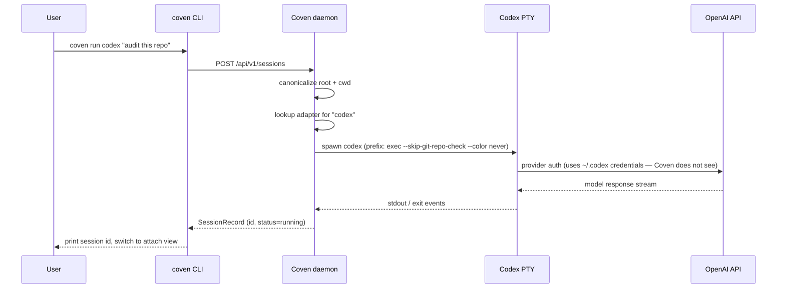

Codex es la CLI de agente de codificación de OpenAI. Coven la envuelve en un PTY limitado al proyecto para que los lanzamientos, attaches y rituales funcionen igual que para cualquier otro harness.

| Campo | Valor |
|---|---|
| Id de harness | `codex` |
| Instalación | `npm install -g @openai/codex` |
| Auth | `codex login` (una sola vez, lado de OpenAI) |
| Comprobación de doctor | `coven doctor` informa la ruta y versión de Codex resueltas. |

## Configuración

<Steps>
  <Step title="Instala Codex">
    ```bash
    npm install -g @openai/codex
    ```
    Otros métodos de instalación (Homebrew cask, gestores de paquetes) están listados en el [repo de Codex](https://github.com/openai/codex).
  </Step>
  <Step title="Inicia sesión en OpenAI">
    ```bash
    codex login
    ```
    Las credenciales del proveedor se quedan con Codex. Coven nunca las lee.
  </Step>
  <Step title="Confirma con Coven">
    ```bash
    coven doctor
    ```
    La salida debe incluir una línea como `codex: ok (/usr/local/bin/codex)`.
  </Step>
  <Step title="Lanzar">
    ```bash
    coven run codex "fix the failing tests"
    ```
  </Step>
</Steps>

## Flags por sesión

```bash
coven run codex "audit this repo" --cwd packages/cli --title "CLI audit"
```

- `--cwd` — canonicalizado dentro de la raíz de proyecto.
- `--title` — establece un título legible en el explorador de sesiones.
- `--json` — imprime metadatos estructurados de lanzamiento para clientes.

## Límite de auth del proveedor

Codex posee su propio flujo OAuth y caché de tokens. Si ves `Invalidated OAuth token`, ejecuta `codex login` de nuevo. Coven mantendrá el registro de sesión existente para que puedas relanzar con el mismo título.

Para la ruta de rescate local:

```bash
coven patch openclaw "fix Codex auth profile order after invalidated OAuth token"
```

## Solución de problemas

| Síntoma | Causa probable | Solución |
|---|---|---|
| `coven doctor` informa `codex` faltante | Codex no está en `PATH` | `npm install -g @openai/codex`, luego vuelve a ejecutar doctor. |
| Codex pide login en cada ejecución | Token obsoleto | `codex login`. |
| La sesión se cuelga al iniciar | Codex esperando un prompt de TTY | Desadjunta con `Ctrl-]`, relanza con `coven run` directamente. |

## Cómo supervisa Coven a Codex



La línea punteada digna de notar: Coven nunca se conecta a la API de OpenAI por sí mismo. La ruta de credenciales es **CLI de Codex ↔ OpenAI**, con Coven solo observando la salida del PTY.


## Relacionado

- [Instalación de CLIs de harness](/harnesses/installing)
- [Límite de auth del proveedor](/harnesses/provider-auth)
- [Solución de problemas de harness](/harnesses/troubleshooting)
