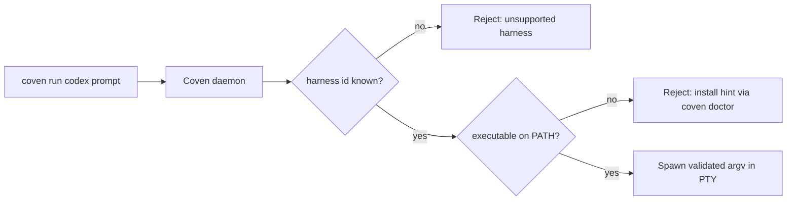

Coven **no** incluye las CLIs de harness. Cada harness compatible es una CLI independiente que Coven detecta en `PATH` en el momento del lanzamiento y supervisa a través de un adaptador PTY. Esta página muestra los comandos de instalación para cada harness v0 y explica cómo `coven doctor` informa los resultados de detección.

## Cómo funciona la detección

Tanto `coven doctor` como `POST /api/v1/sessions` resuelven un id de harness (`codex`, `claude`, …) a un nombre de ejecutable en `PATH` usando la tabla de adaptadores en [Adaptadores de harness](/HARNESS-ADAPTERS). Si el binario falta, Coven falla en cerrado con una pista de instalación en lugar de intentar lanzar.



El daemon revalida el id de harness en cada petición de lanzamiento. Los clientes no pueden ampliar la allowlist enviando un argv o ruta diferente; solo se aceptan los ids de adaptador incorporados.

## Harnesses v0 compatibles

| Id de harness | Ejecutable | Comando de instalación | Login del proveedor | Página de detalle |
|---|---|---|---|---|
| `codex` | `codex` | `npm install -g @openai/codex` | `codex login` | [Harness de Codex](/harnesses/codex) |
| `claude` | `claude` | `npm install -g @anthropic-ai/claude-code` | `claude doctor` | [Harness de Claude Code](/harnesses/claude-code) |
| `copilot` | `copilot` | `npm install -g @github/copilot` | `copilot login` | [Harness de Copilot CLI](/harnesses/copilot-cli) |

Otras CLIs (Hermes, Aider, Gemini CLI, Cline, comandos personalizados) **no** forman parte de v0. Consulta [Notas sobre futuros harnesses](/FUTURE-HARNESSES) para conocer la dirección del adaptador.

## Instalación paso a paso

<Steps>
  <Step title="Instala al menos un harness">
    Elige el harness que quieras manejar primero. Puedes instalar más después.

    ```bash
    # OpenAI Codex
    npm install -g @openai/codex

    # Anthropic Claude Code
    npm install -g @anthropic-ai/claude-code

    # GitHub Copilot CLI
    npm install -g @github/copilot
    ```

    Otras rutas de instalación (Homebrew, gestores de paquetes, compilar desde fuente) están documentadas en el README propio de cada proyecto. Coven solo requiere que el binario esté en `PATH` bajo el nombre de ejecutable esperado.
  </Step>

  <Step title="Completa la auth del proveedor en la CLI del harness">
    Coven nunca toca las credenciales del proveedor. Ejecuta el flujo de login propio de cada CLI una vez.

    ```bash
    codex login
    claude doctor
    copilot login
    ```

    Consulta [Límite de auth del proveedor](/harnesses/provider-auth) para conocer la justificación.
  </Step>

  <Step title="Verifica que Coven ve el harness">
    ```bash
    coven doctor
    ```

    Salida esperada (abreviada):

    ```text
    store:    ok
    project:  ok  (/path/to/project)
    daemon:   running  (pid 12345)
    codex:    ok       (/usr/local/bin/codex 0.x.y)
    claude:   ok       (/usr/local/bin/claude 0.x.y)
    ```

    Si una fila muestra `missing`, doctor también imprime el comando exacto de instalación mostrado en la tabla anterior.
  </Step>

  <Step title="Lanza una sesión">
    ```bash
    coven run codex "describe this repo"
    coven run claude "polish the CLI help text"
    ```
  </Step>
</Steps>

## Actualizar un harness

Coven no auto-actualiza las CLIs de harness. Trátalas como instalaciones globales ordinarias de npm (u otro gestor de paquetes):

```bash
npm install -g @openai/codex@latest
npm install -g @anthropic-ai/claude-code@latest
npm install -g @github/copilot@latest
```

Después de actualizar, vuelve a ejecutar `coven doctor` para confirmar que la ruta/versión resuelta aún coincide con lo que esperas.

## Ubicaciones personalizadas de ejecutable

Si un harness está instalado bajo un directorio fuera de `PATH` (por ejemplo, un `node_modules/.bin` local del proyecto), asegúrate de que ese directorio esté en `PATH` **antes** de que arranque el daemon. Coven respeta el entorno del proceso del daemon, no el entorno del shell que lo invoca, al lanzar PTYs.

Si cambias `PATH` a nivel de sistema, reinicia el daemon:

```bash
coven daemon restart
coven doctor
```

## Solución de problemas

| Síntoma | Causa probable | Solución |
|---|---|---|
| `coven doctor` informa un harness como `missing` incluso tras instalar | El daemon no recogió el nuevo `PATH` del shell | `coven daemon restart`, luego `coven doctor`. |
| Doctor encuentra el binario pero `coven run` falla inmediatamente | Auth del proveedor incompleta | Re-ejecuta `codex login` / `claude doctor` / `copilot login`. Consulta [auth del proveedor](/harnesses/provider-auth). |
| Doctor muestra una versión obsoleta | Binario más antiguo más temprano en `PATH` | `which -a codex` (o `claude`) y elimina el duplicado. |
| Doctor informa `unsupported harness` | Error tipográfico en el id de harness | Usa uno de los ids de la tabla anterior. |


## Relacionado

- [Harnesses](/harnesses/index)
- [Harness de Codex](/harnesses/codex)
- [Harness de Claude Code](/harnesses/claude-code)
- [Adaptadores de harness](/HARNESS-ADAPTERS)
- [Notas sobre futuros harnesses](/FUTURE-HARNESSES)
