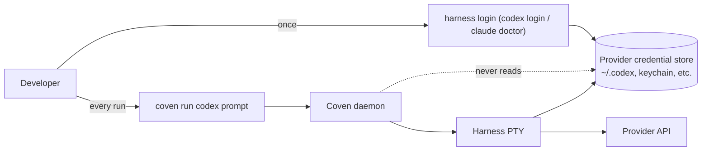

Coven supervisa PTYs de harness. Nunca lee, proxifica, persiste ni emite credenciales del proveedor. Cada harness compatible sigue usando **su propio** flujo de login para OpenAI, Anthropic o cualquier futuro proveedor con el que hable. Esta página registra por qué, qué significa eso en la práctica y el límite exacto que el daemon en Rust aplica.

## TL;DR

- Los tokens del proveedor viven donde sea que el harness ya los ponga — típicamente `~/.codex/`, `~/.config/anthropic/` o un keychain del sistema gestionado por esa CLI.
- El daemon de Coven nunca los lee, nunca los almacena en SQLite, nunca los reenvía por la API por socket y nunca los registra en el ledger de eventos.
- `coven doctor` solo comprueba si el binario del harness existe; **no** prueba credenciales del proveedor. Cada harness ya entrega su propio `login` / `doctor` para eso.
- Trata a Coven como si tuviera conocimiento **cero** del estado de auth del proveedor. El límite es intencional.

## Por qué Coven se niega a poseer credenciales

La flecha que importa es la que falta: el daemon no tiene línea punteada hacia el almacén de credenciales del proveedor. Tres razones:

1. **Menor radio de impacto.** Un daemon, socket o cliente comprometido de Coven no puede filtrar tokens del proveedor que nunca tuvo. Un bug en el log de eventos no puede registrar accidentalmente un token que Coven nunca poseyó.
2. **Sin drift de credenciales.** Codex, Claude Code y los futuros harnesses iteran sobre sus propios flujos de auth (refresh OAuth, códigos de dispositivo, claves en el dispositivo). Coven tendría que perseguir cada cambio. Al quedarse fuera, nunca nos desincronizamos.
3. **Claridad de auditoría.** Cuando algo va mal con facturación, límites de tasa o tokens revocados, el usuario sabe que la respuesta vive en **un** lugar — la CLI propia del harness. Coven no es una capa de credenciales que debugear.

## Qué significa esto en cada superficie

### CLI

`coven run codex|claude <prompt>` lanza el harness con un vector de argumentos vacío aparte del prompt validado y los args de prefijo del adaptador. No inyecta `OPENAI_API_KEY`, `ANTHROPIC_API_KEY` ni ninguna env var portadora de tokens. Si el harness necesita una credencial, la lee de la misma manera que si se lanzara directamente desde tu shell.

### API del daemon

`POST /api/v1/sessions` acepta una raíz de proyecto, cwd, id de harness, prompt y título opcional. No hay campo para una API key, token OAuth, refresh token, id de cuenta o id de organización. El esquema está documentado en [Contrato de la API](/API-CONTRACT) — ninguno de esos campos existe.

### Log de eventos

El log de eventos append-only registra el stdout/stderr del harness tal como se emite. El daemon no introspecciona ni redacta; eso significa que si **tú** pides al harness que imprima `cat ~/.codex/auth.json`, la salida **sí** aterrizará en el ledger. Consulta el [Modelo de seguridad](/SAFETY-MODEL#event-log-caution) para la guía del lado del usuario.

### Integraciones de cliente

Los clientes (comux, OpenMeow, el plugin de OpenClaw) se conectan al socket local. No pueden obtener tokens del proveedor desde el daemon porque el daemon no los tiene. Cualquier cliente que quiera mostrar "logged in as ..." debe llamar directamente al comando de estado propio del harness.

## Login del proveedor por harness

| Harness | Comando de login | Dónde viven las credenciales | Notas |
|---|---|---|---|
| `codex` | `codex login` | `~/.codex/auth.json` (o keychain de plataforma, según la versión de Codex) | Usa `codex logout` para revocar. Coven no necesita reiniciarse. |
| `claude` | `claude doctor` y luego sigue las indicaciones | `~/.config/anthropic/` y/o keychain del sistema | `claude doctor` también es una comprobación general de salud; Coven solo depende de que el binario esté presente. |

Si el flujo `login` del harness en sí tiene un problema (refresh token expirado, org revocada, fallo de red), Coven lo presenta como una salida normal del harness — la sesión termina con cualquier código de salida que devuelva la CLI, y el log de eventos contiene el mensaje de error impreso por la CLI.

## Qué aplica Coven

La responsabilidad del daemon es **quedarse fuera de la ruta de credenciales**. Concretamente:

- El daemon no lee variables de entorno que parezcan credenciales del proveedor antes de lanzar un harness.
- El daemon no inyecta env vars del proveedor en el hijo PTY más allá de heredar lo que el propio proceso del daemon recibió al arrancar.
- La CLI no acepta una flag `--token`, `--api-key`, `--openai-key` o similar en `coven run`. Si ves una en un fork o PR, eso es una regresión — por favor, abre una issue.
- La API por socket no acepta campos de credenciales. Los campos desconocidos se ignoran; los campos explícitos de credencial serían rechazados y tratados como una violación del contrato.

## Qué debe hacer el usuario

Como Coven se niega a poseer credenciales, **el usuario** es responsable de:

- Ejecutar el flujo de `login` / `doctor` propio de cada harness al menos una vez antes de esperar que `coven run` tenga éxito.
- Rotar tokens del proveedor a través de la CLI del harness cuando sea necesario.
- Tratar cualquier salida del harness que imprima una credencial (porque tú lo pediste) como registrada en el ledger — límpiala con [`coven sacrifice`](/SESSION-LIFECYCLE#sacrifice) si es necesario.

## Relacionado

- [Autenticación y acceso local](/AUTH)
- [Modelo de seguridad](/SAFETY-MODEL)
- [Instalar CLIs de harness](/harnesses/installing)
- [Adaptadores de harness](/HARNESS-ADAPTERS)
- [Harness de Codex](/harnesses/codex)
- [Harness de Claude Code](/harnesses/claude-code)
