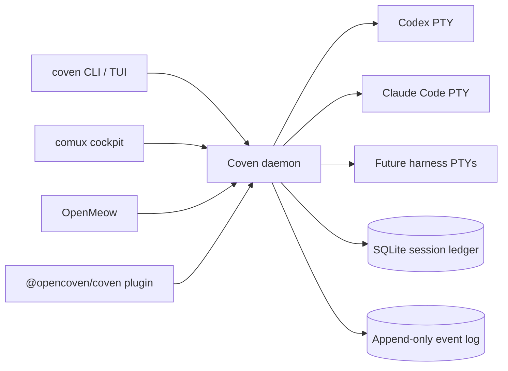

<div class="home-intro">
  
  <div>
    <p class="home-intro-kicker"><strong>Trae cualquier familiar al círculo.</strong></p>
    <p><strong>OpenCoven es un ecosistema abierto para familiares de IA persistentes. Coven es el sustrato de runtime local que supervisa cada harness — Codex, Claude Code y los futuros Hermes, Aider y Gemini CLIs — dentro de límites explícitos del proyecto.</strong></p>
    <p>Lanza una sesión, observa el PTY, adjúntate más tarde, archiva cuando termines. Un daemon, un socket, todos los familiares en igualdad de condiciones.</p>
  </div>
</div>

<Columns>
  <Card title="Empezar" href="/GETTING-STARTED" icon="rocket">
    Instala Coven, ejecuta `coven doctor` y lanza una sesión de harness limitada al proyecto.
  </Card>
  <Card title="Modelo de runtime" href="/ARCHITECTURE" icon="compass">
    Daemon, supervisión de PTY, validación de la raíz del proyecto, sesiones, eventos y autoridad del socket local.
  </Card>
  <Card title="Referencia de la CLI" href="/reference/cli" icon="terminal">
    Comandos `coven` actuales: run, sessions, attach, daemon, doctor, archive, summon y sacrifice.
  </Card>
</Columns>

## ¿Qué es Coven?

Coven es un **sustrato de runtime local-first**: un único daemon en Rust que posee los PTYs de los harnesses, el estado de las sesiones y un registro append-only de eventos en tu propia máquina. Clientes como la CLI/TUI `coven`, el cockpit comux, OpenMeow y el plugin externo OpenClaw coordinan a través de un único contrato versionado HTTP-sobre-socket-Unix.

**¿Para quién es?** Desarrolladores y operadores que quieren que sus familiares de IA sigan ejecutándose localmente, recuerden lo que hicieron y permanezcan dentro de límites del proyecto que puedas auditar.

**¿Qué lo hace diferente hoy?**

- **Local-first** — el daemon, el almacén y el socket viven bajo `$COVEN_HOME`. Sin relay en la nube, sin OAuth del daemon.
- **Neutral respecto al harness** — Codex y Claude Code hoy, con una barra de adaptador documentada para futuros harnesses. Mismo ciclo de vida, mismos rituales.
- **Limitado al proyecto** — cada lanzamiento lleva una raíz de proyecto explícita y un directorio de trabajo canonicalizado. El daemon en Rust revalida cada petición.
- **Inspeccionable** — las sesiones y los eventos son filas de SQLite que puedes explorar con `coven sessions`, reproducir con `coven attach` o sacrificar cuando ya no las necesites.
- **Con licencia MIT** — empaquetado para early adopters bajo `@opencoven/*`, comando siempre `coven`.

**¿Qué necesitas?** Una toolchain estable de Rust (o el wrapper publicado `@opencoven/cli`), al menos una CLI de harness compatible en `PATH` y un proyecto donde ejecutarlo.

## Cómo funciona



El daemon es la única fuente de verdad para las sesiones, el ciclo de vida del PTY y el enrutamiento de capabilities.

## Capacidades clave

<Columns>
  <Card title="Runtime neutral respecto al harness" icon="layers" href="/HARNESS-ADAPTERS">
    Codex y Claude Code lanzados a través de una única capa de PTY supervisada.
  </Card>
  <Card title="Sesiones limitadas al proyecto" icon="folder-tree" href="/SESSION-LIFECYCLE">
    Cada sesión fija una raíz de proyecto canónica y se niega a moverse.
  </Card>
  <Card title="Registro de eventos append-only" icon="scroll" href="/SESSION-LIFECYCLE">
    Reproduce la salida, recupérate de reinicios del daemon y audita lo que un harness hizo realmente.
  </Card>
  <Card title="Rituales" icon="moon" href="/SESSION-LIFECYCLE">
    Archive, summon y sacrifice — verbos explícitos y seguros para principiantes alrededor de operaciones destructivas.
  </Card>
  <Card title="API por socket local" icon="plug" href="/API">
    `GET /api/v1/health` primero; luego sesiones, eventos, capabilities y acciones por socket Unix.
  </Card>
  <Card title="Integración de clientes" icon="plug-zap" href="/CLIENT-INTEGRATION">
    comux, OpenMeow y el puente OpenClaw se integran como clientes del socket, no como autoridades de lanzamiento.
  </Card>
</Columns>

## Inicio rápido

<Steps>
  <Step title="Instala Coven">
    ```bash
    npm install -g @opencoven/cli
    ```
    ¿Compilando desde fuente? Consulta [Empezar](/GETTING-STARTED).
  </Step>
  <Step title="Verifica tu entorno">
    ```bash
    coven doctor
    ```
    `doctor` informa si `codex` y `claude` están en `PATH`, si el socket del daemon puede enlazarse y qué instalar a continuación.
  </Step>
  <Step title="Arranca el daemon">
    ```bash
    coven daemon start
    coven daemon status
    ```
  </Step>
  <Step title="Lanza tu primera sesión">
    ```bash
    cd /path/to/your/project
    coven run codex "describe this repo"
    ```
    O abre el explorador humano de sesiones:

    ```bash
    coven sessions
    ```
  </Step>
</Steps>

¿Necesitas la guía completa de instalación y configuración para desarrolladores? Consulta [Empezar](/GETTING-STARTED).

## Explorador de sesiones

`coven sessions` abre un explorador amigable de cada sesión viva y archivada. Elige una y luego escoge un ritual:

- **Rejoin** — adjúntate a un PTY vivo y sigue su salida.
- **View log** — abre el registro append-only de eventos.
- **Summon** — restaura una sesión archivada a la lista activa.
- **Archive** — oculta una sesión terminada sin borrar los eventos.
- **Sacrifice** — borra permanentemente una sesión no en ejecución (requiere `--yes`).

También existen variantes amigables para pipes: `coven sessions --plain` para tablas, `coven sessions --json` para clientes.

## Configuración (opcional)

El estado de Coven vive bajo `$COVEN_HOME` (por defecto `~/.coven` en macOS/Linux). El daemon enlaza un socket Unix en `<covenHome>/coven.sock` y rechaza TCP por defecto.

- Si **no haces nada**, Coven usa tus inicios de sesión locales de harness existentes.
- Si quieres restringirlo, acota `$COVEN_HOME` por raíz de proyecto o por familiar.

Ejemplo:

```bash
export COVEN_HOME="$HOME/.local/share/coven"
coven daemon restart
```

## Empieza aquí

<Columns>
  <Card title="Conceptos" href="/CONCEPTS" icon="book-open">
    Topología del runtime, límite de autoridad, ciclo de vida de la sesión y el plano de control.
  </Card>
  <Card title="Harnesses" href="/HARNESS-ADAPTERS" icon="layers">
    Configuración por harness, límite de auth del proveedor y expectativas del adaptador.
  </Card>
  <Card title="API local" href="/API" icon="plug">
    API por socket versionada para comux, OpenMeow, plugin OpenClaw y tus propios clientes.
  </Card>
  <Card title="Sesiones" href="/SESSION-LIFECYCLE" icon="moon">
    Archive, summon y sacrifice — los verbos seguros para principiantes alrededor del estado de sesión.
  </Card>
  <Card title="Ayuda" href="/TROUBLESHOOTING" icon="life-buoy">
    Problemas comunes de configuración, variables de entorno y cómo presentar un paquete de diagnósticos.
  </Card>
</Columns>

## Saber más

<Columns>
  <Card title="Modelo operativo" href="/OPERATIONAL-MODEL" icon="list">
    Límite de autoridad, garantías del almacén, harnesses compatibles y señales del roadmap.
  </Card>
  <Card title="Modelo de seguridad" href="/SAFETY-MODEL" icon="shield">
    Límite de confianza, manejo de secretos, postura del socket y aprobaciones de automatización.
  </Card>
  <Card title="Troubleshooting" href="/TROUBLESHOOTING" icon="wrench">
    Diagnósticos del daemon, pistas de instalación de harness, recuperación de huérfanos y verificación.
  </Card>
  <Card title="Roadmap" href="/ROADMAP" icon="map">
    Milestones actuales, dirección del adaptador y límites del producto público.
  </Card>
</Columns>
