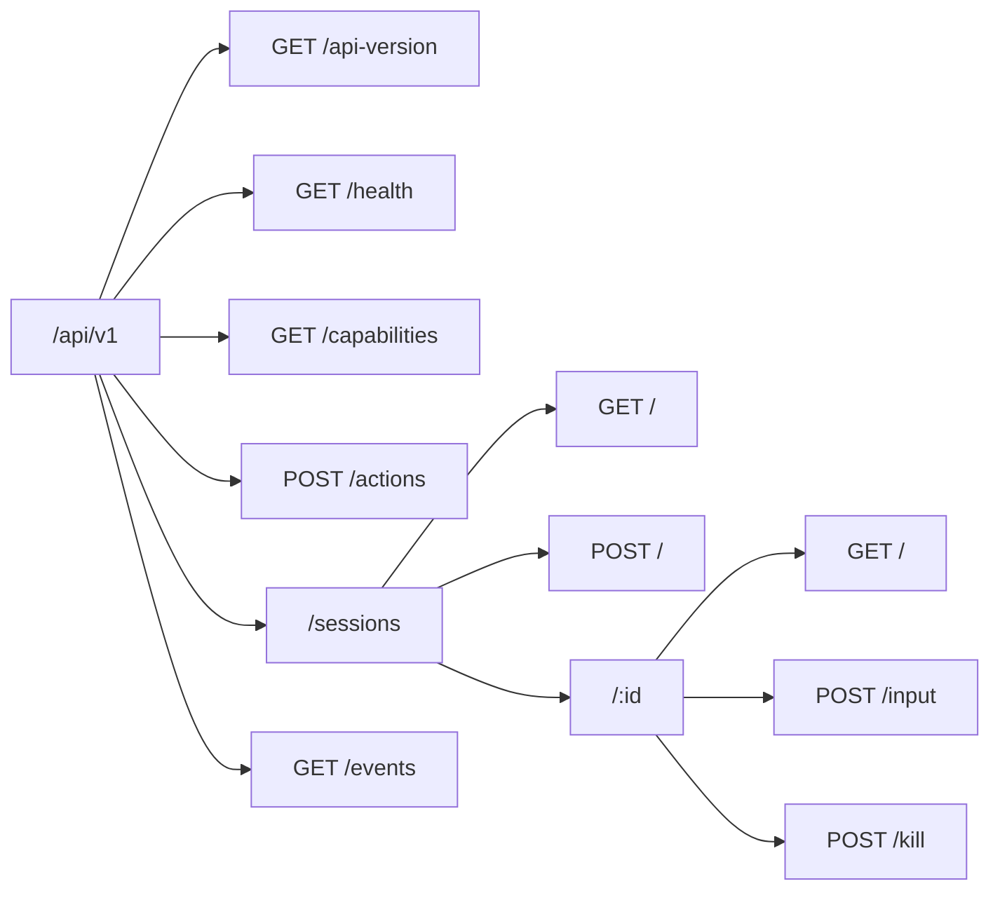

El daemon de Coven expone su API pública como HTTP sobre un socket Unix bajo `<covenHome>/coven.sock`. El contrato activo es **`coven.daemon.v1`** servido bajo `/api/v1`.



## Endpoints

| Método | Ruta | Propósito | Cuerpo | Éxito | Errores |
|---|---|---|---|---|---|
| GET | `/api/v1/api-version` | Versión activa de API + versiones compatibles. | — | `{ apiVersion, supportedApiVersions }` | — |
| GET | `/api/v1/health` | Accesibilidad del daemon, versión, capabilities, pid. | — | `{ ok, apiVersion, covenVersion, capabilities, daemon }` | `503 runtime_unavailable` |
| GET | `/api/v1/capabilities` | Catálogo de capabilities con pistas de política. | — | `{ capabilities: [...] }` | — |
| POST | `/api/v1/actions` | Enrutar un id de acción conocido del plano de control. | `{ action, origin, intentId, args }` | `{ ok, accepted, status, event }` | `400 invalid_request` (acción desconocida) |
| GET | `/api/v1/sessions` | Listar sesiones activas. | — | `SessionRecord[]` | — |
| POST | `/api/v1/sessions` | Lanzar una sesión de harness limitada al proyecto. | `{ projectRoot, cwd?, harness, prompt, title?, launchMode?, conversation?, conversationId? }` | `SessionRecord` | `400 invalid_request` (incluye cwd fuera de proyecto, id de harness desconocido, body mal formado), `500 launch_failed` (runtime spawn / escritura inicial / arranque del CLI falló; fila marcada como `failed`) |
| GET | `/api/v1/sessions/:id` | Obtener una sesión. | — | `SessionRecord` | `404 session_not_found` |
| POST | `/api/v1/sessions/:id/input` | Reenviar input a una sesión viva. | `{ data }` | `{ ok, accepted }` | `400 invalid_request` (body mal formado / `data` ausente o no-string), `404 session_not_found`, `409 session_not_live`, `500 send_input_failed` |
| POST | `/api/v1/sessions/:id/kill` | Matar una sesión viva. | — | `{ ok, accepted }` | `404 session_not_found`, `409 session_not_live`, `500 kill_failed` |
| GET | `/api/v1/events` | Leer eventos de sesión paginados. | — (`?sessionId`, `?afterSeq`, `?afterEventId`, `?limit`) | `{ events, nextCursor, hasMore }` | `400 invalid_request` |

Todas las respuestas de error usan el sobre estructurado documentado en [Contrato de la API](/API-CONTRACT#structured-error-envelope).

## Siempre empieza con health

```http
GET /api/v1/health
```

La respuesta te indica la `apiVersion` activa, las `capabilities` del daemon y el pid/uptime en ejecución. Trata el resto de la API como indefinido hasta que hayas leído esos campos.

Consulta [API local de Coven](/API) para ejemplos de respuesta y [Contrato de la API](/API-CONTRACT) para las formas estables y los sobres de fallo.

## Relacionado

- [API local de Coven](/API)
- [Contrato de la API](/API-CONTRACT)
- [Autenticación y acceso local](/AUTH)
- [Integración de clientes](/CLIENT-INTEGRATION)
