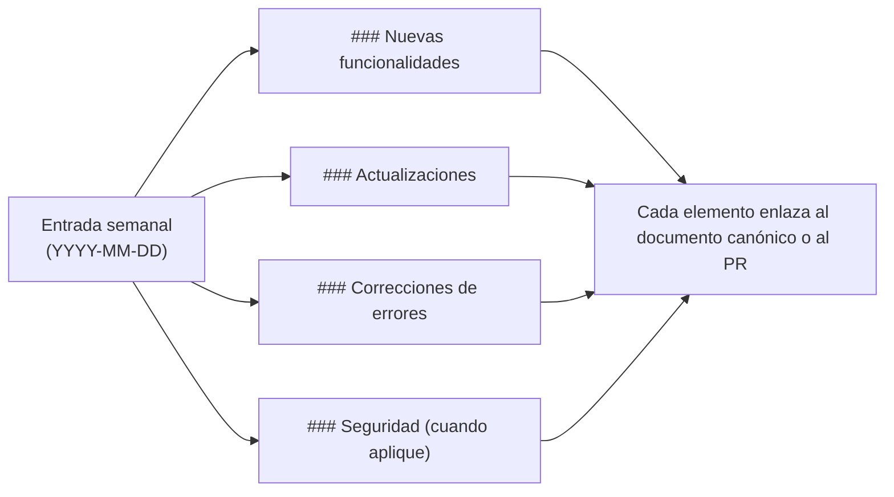

## Semana del 24 de junio de 2026

### Nuevas funcionalidades

- **Wrapper de npm external OpenClaw bridge plugin copublicado (v0.0.49).** El pipeline de release ahora publica un segundo nombre de wrapper, external OpenClaw bridge plugin, junto con `@opencoven/cli`. Ambos wrappers dependen de los mismos paquetes nativos `@opencoven/cli-*`, así que instalar cualquiera de los dos termina en el mismo binario `coven`. Esto permite que docs y onboarding anuncien el nombre canónico *coven* sin romper instalaciones existentes de `@opencoven/cli`. Consulta [PR #257](https://github.com/OpenCoven/coven/pull/257) y el [runbook de releasing](/reference/releasing) para la configuración única de Trusted Publisher que necesita el paquete nuevo antes de su primer release OIDC.
- **Spec de Coven Group Chat (v0.0.49).** Se añadió el diseño v1 para una primitiva de chat grupal del lado del servidor en `specs/coven-group-chat/` (PRODUCT + TECH). Hoy el chat grupal sólo existe como una ilusión de fan-out en el cliente iOS; el spec define un objeto de servidor durable y sincronizado, con ordenación monótona de eventos para que iOS, web y CLI lean el mismo grupo. La implementación se rastrea por separado. Consulta [PR #258](https://github.com/OpenCoven/coven/pull/258).

### Actualizaciones

- **Referencias a OpenMeow eliminadas en docs y código (v0.0.49).** OpenMeow no es una aplicación de OpenCoven — CastCodes es el cliente canónico. Ejemplos y etiquetas sueltas de OpenMeow en docs en inglés/español/ruso, `DESIGN.md`, `ARCHITECTURE.md`, `AUTH.md`, `API-CONTRACT.md` y referencias relacionadas se reescribieron en lenguaje neutro al producto. `crates/coven-cli/src/api.rs` renombra el origen de prueba `openmeow` a `external-client`, y `skills/coven-task-manager` elimina `openmeow` de la lista de etiquetas de repo reconocidas. No hay cambios de comportamiento en runtime. Consulta [PR #256](https://github.com/OpenCoven/coven/pull/256).

## Semana del 18 de junio de 2026

### Nuevas funcionalidades

- **Controles de razonamiento para `coven run` (v0.0.48).** `coven run` ahora acepta `--think` y `--speed fast|balanced|thorough` junto con `--model`. Los lanzamientos de Claude traducen esos hints a `--effort`; los harnesses sin soporte avisan y continúan en vez de fallar. Consulta [issue #246](https://github.com/OpenCoven/coven/issues/246), [PR #254](https://github.com/OpenCoven/coven/pull/254) y [referencia de `coven run`](/reference/cli-run).
- **Receta confiable del adaptador Hermes (v0.0.41).** `coven adapter install hermes` ahora escribe un manifiesto confiable local bajo `COVEN_HOME/adapters/hermes.json`, y Coven carga automáticamente manifiestos desde ese trust store propio. Los usuarios nuevos ya no necesitan escribir JSON a mano ni configurar `COVEN_HARNESS_ADAPTER_MANIFEST` solo para probar Hermes.

### Actualizaciones

- **Estado del paquete Windows x64.** El README público ahora refleja que `@opencoven/cli-windows` ya está publicado, no en staging. En Windows se puede instalar con el wrapper universal `@opencoven/cli` y verificar los harnesses locales con `coven doctor`.

### Correcciones de errores

- **Backfill resiliente del índice FTS de eventos (v0.0.48).** El backfill de eventos existentes hacia `events_fts` ahora corre en lotes acotados, registra su finalización en `store_meta`, aplica `busy_timeout` a conexiones de lectura y trata `SQLITE_BUSY` como no fatal, de modo que la indexación de búsqueda no bloquea todos los lanzamientos de agentes en historiales grandes. Consulta [issue #249](https://github.com/OpenCoven/coven/issues/249) y [PR #254](https://github.com/OpenCoven/coven/pull/254).
- **Guía más clara para harnesses no soportados.** Los errores de harness desconocido ahora muestran los IDs configurados y orientan a usuarios de Hermes hacia `coven adapter install hermes` seguido de `coven adapter doctor hermes`.
- **Fallback de directorio home en Windows.** `coven doctor` y la resolución del store funcionan en PowerShell cuando `HOME` no existe, probando `USERPROFILE`, `HOMEDRIVE` + `HOMEPATH` y el home de la plataforma antes de pedir `COVEN_HOME`.

## Semana del 3 de junio de 2026

### Nuevas funcionalidades

- **Protocolo de trabajo paralelo de Coven.** Coven ahora incluye comandos `coven wt`, `coven claim` y `coven hooks` para coordinar varios agentes de programación de IA en un mismo repositorio. El protocolo crea worktrees de git aislados, registra claims de rama con TTL, instala hooks encadenables de seguridad, bloquea commits accidentales en ramas protegidas y exige una frase explícita de intención de merge antes de pushes a ramas protegidas. Consulta [issue #167](https://github.com/OpenCoven/coven/issues/167) y [PR #169](https://github.com/OpenCoven/coven/pull/169).
- **Persistencia de identidad familiar en sesiones.** Las sesiones ahora pueden llevar un `familiar_id` resuelto, dando a dashboards, APIs y superficies de agentes una forma durable de mostrar qué familiar inició o posee una sesión. Consulta [PR #168](https://github.com/OpenCoven/coven/pull/168).

### Actualizaciones

- **Resolución compartida de familiares.** La CLI, el daemon y la API local ahora resuelven identidades familiares por una única ruta compartida antes del lanzamiento, de modo que los metadatos guardados de sesión reflejan la identidad familiar canónica y no una cadena de entrada sin validar.
- **Guardrails para carriles paralelos.** El protocolo de worktrees incluye superficies de status, doctor, prune, claim acquire/release/heartbeat/canary e instalación de hooks para que la coordinación entre agentes pueda escalar sin depender de scripts shell ad hoc.

### Correcciones de errores

- **Los IDs de familiar desconocidos ya no crean sesiones.** `POST /sessions` ahora rechaza un `familiarId` desconocido con `400 unknown_familiar` antes de insertar una fila de sesión o lanzar un runtime. Una configuración de familiares mal formada devuelve `500 familiar_lookup_failed` sin lanzar nada.
- **`coven run --familiar <id>` falla temprano con familiares desconocidos.** Los lanzamientos locales por CLI ahora coinciden con el comportamiento del daemon/API y evitan guardar IDs de familiar no resueltos.

## Semana del 17 de mayo de 2026

### Correcciones de errores

- **Se acabaron las pulsaciones dobles en la TUI de Windows.** `coven tui` y el navegador de sesiones ahora filtran únicamente los eventos de pulsación de tecla en Windows, de modo que escribir `a` ya no inserta `aa`, las flechas avanzan una fila por pulsación y Enter activa la selección una sola vez. No hay cambios de comportamiento en macOS ni en Linux. Consulta [Coven TUI](/start/coven-tui) e [Instalación en Windows](/install/windows).
- **La TUI ya no se cae en terminales pequeñas.** Tanto `coven tui` como `coven chat` ahora protegen sus cálculos de layout frente a tamaños de terminal muy pequeños, de modo que redimensionar a una ventana estrecha o baja ya no provoca el cierre de la sesión. Consulta [Coven TUI](/start/coven-tui).
- **Higiene de gates de release.** El guard de secretos de release pública ahora permite URLs públicas de avisos de GitHub y escanea el historial de release desde `HEAD`, para que ramas remotas obsoletas no bloqueen el gate actual.

### Seguridad

- **Aviso de seguridad de Ratatui resuelto.** Se actualizó la pila de renderizado de Ratatui para incorporar la versión parcheada del crate `lru`, resolviendo el aviso [GHSA-rhfx-m35p-ff5j](https://github.com/advisories/GHSA-rhfx-m35p-ff5j). No se requiere ninguna acción: basta con instalar la última versión.

## Semana del 15 de mayo de 2026

### Actualizaciones

- **Tema TUI alineado con la marca.** Tanto `coven tui` como `coven chat` ahora comparten una paleta unificada y alineada con la marca, con tokens semánticos consistentes para los estilos primary, agent, user, hint, surface y dim. Los colores se adaptan a tu terminal automáticamente: truecolor en terminales de 24 bits, 256 colores en terminales legacy, y sin color cuando la salida está canalizada o `NO_COLOR` está configurado. Consulta [Troubleshooting](/TROUBLESHOOTING).

## Cómo leer este changelog

Las entradas son semanales, primero las más recientes. Los elementos dentro de cada semana se agrupan por categoría. Cualquier cambio que afecte a la API pública (superficie de la CLI, rutas del socket, formas de respuesta) también aparece en [Contrato de la API](/API-CONTRACT) — el changelog es un puntero, no un sustituto.

## Semana del 11 de mayo de 2026

### Nuevas funcionalidades

- **TUI de Coven orientada a prompts.** Ejecutar `coven` (o `coven tui`) ahora abre una interfaz interactiva basada en Ratatui. Escribe tareas en formato libre, ejecuta slash commands (`/help`, `/agent`, `/clear`, `/export`, `/exit`) y navega por los menús de rituales con las teclas de flecha. Funciona sobre SSH y se redimensiona de forma segura. Consulta [Coven TUI](/start/coven-tui).
- **Diagnóstico y alivio con `coven pc`.** Una herramienta de presión del sistema orientada primero a macOS. Los comandos de solo lectura muestran instantáneas de CPU, memoria, disco y procesos principales; las operaciones de escritura (`coven pc kill`, `coven pc cache clear`) requieren una puerta `--confirm` explícita. Consulta la [referencia de la CLI](/reference/cli) y [Troubleshooting](/TROUBLESHOOTING).
- **Contrato de la API local v1.** La API por socket del daemon ahora expone endpoints versionados de salud y capacidades, respuestas de error estructuradas y paginación de eventos basada en cursor. Los clientes pueden negociar funcionalidades en lugar de adivinar. Consulta [Contrato de la API](/API-CONTRACT) y [API local](/API).
- **Salida JSON de sesiones.** `coven sessions --json` emite listados de sesiones legibles por máquina para scripts, dashboards y clientes externos. Consulta [comux JSON sessions](/sessions/comux-json).
- **Ruta de instalación en Windows.** Coven ahora distribuye un paquete npm para Windows, de modo que `npx @opencoven/cli` funciona en Windows nativo junto con macOS y Linux. Consulta [Getting started](/GETTING-STARTED).

### Actualizaciones

- **Posicionamiento y marca de OpenCoven.** Se refrescó la copia de producto en la documentación y la CLI para enmarcar a Coven como un ecosistema de familiares de IA persistentes, con tokens de marca y guía de diseño actualizados. Consulta [Marca](/BRAND).
- **Paleta de marca refinada.** Se actualizó la paleta de OpenCoven a un gris lavanda apagado (`#9A8ECD`) con un nuevo sistema de acentos complementarios y tokens de superficie dedicados para modo claro y oscuro. Se preservan los alias de color legacy existentes, así que no se requiere ninguna acción para adoptar la nueva apariencia. Consulta [Marca](/BRAND).
- **Tema TUI alineado con la marca.** La TUI de Coven ahora utiliza un tema unificado alineado con la paleta de OpenCoven. Los fallbacks elegantes para terminales sin color, de 256 colores y truecolor mantienen su legibilidad localmente, sobre SSH y dentro de CI. Consulta [Coven TUI](/start/coven-tui).
- **Troubleshooting: salud y presión del sistema.** Se añadió una sección que enlaza desde el flujo canónico de troubleshooting a `coven pc` para diagnosticar presión local de CPU, memoria y disco. Consulta [Troubleshooting](/TROUBLESHOOTING).
- **IDs completos de sesión en la salida plain.** `coven sessions --plain` ahora imprime los IDs completos de sesión para que puedan copiarse directamente a comandos posteriores.

### Correcciones de errores

- **Verificación del estado del daemon.** `coven` ahora verifica el daemon a través de su socket de salud antes de reportar `running`, limpia los metadatos obsoletos muertos y reporta `stale` cuando los metadatos están vivos pero no verificados.
- **Recuperación de metadatos corruptos del daemon.** La CLI ahora se recupera de forma elegante cuando los metadatos del estado del daemon en disco están corruptos, en lugar de fallar al arrancar.
- **Paginación de eventos más estricta.** La API rechaza los valores no enteros de `limit` y `afterSeq` con un error estructurado `invalid_request` antes de hacer cualquier búsqueda de sesión.
- **Falsos positivos del guard de secretos de release.** El guard de secretos de release pública ahora permite los enlaces documentados del repositorio de OpenCoven y las rutas locales de worktree como tokens benignos de alta entropía, mientras sigue marcando los patrones de secretos explícitos.
