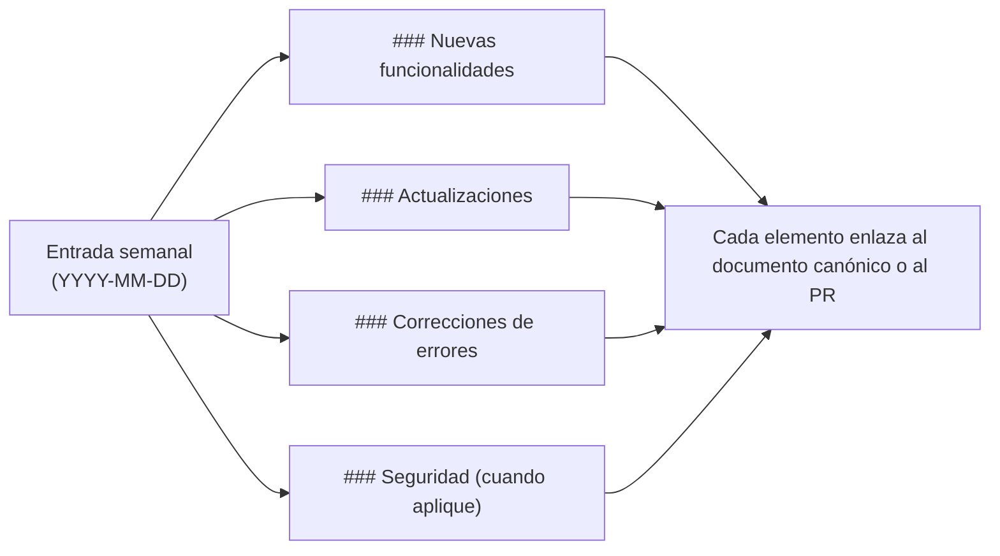

## Semana del 17 de mayo de 2026

### Correcciones de errores

- **Se acabaron las pulsaciones dobles en la TUI de Windows.** `coven tui` y el navegador de sesiones ahora filtran únicamente los eventos de pulsación de tecla en Windows, de modo que escribir `a` ya no inserta `aa`, las flechas avanzan una fila por pulsación y Enter activa la selección una sola vez. No hay cambios de comportamiento en macOS ni en Linux. Consulta [Coven TUI](/start/coven-tui) e [Instalación en Windows](/install/windows).
- **La TUI ya no se cae en terminales pequeñas.** Tanto `coven tui` como `coven chat` ahora protegen sus cálculos de layout frente a tamaños de terminal muy pequeños, de modo que redimensionar a una ventana estrecha o baja ya no provoca el cierre de la sesión. Consulta [Coven TUI](/start/coven-tui).
- **Higiene de gates de release.** El guard de secretos de release pública ahora permite URLs públicas de avisos de GitHub y escanea el historial de release desde `HEAD`, para que ramas remotas obsoletas no bloqueen el gate actual.

### Seguridad

- **Aviso de seguridad de Ratatui resuelto.** Se actualizó la pila de renderizado de Ratatui para incorporar la versión parcheada del crate `lru`, resolviendo el aviso [GHSA-rhfx-m35p-ff5j](https://github.com/advisories/GHSA-rhfx-m35p-ff5j). No se requiere ninguna acción: basta con instalar la última versión.

## Semana del 15 de mayo de 2026

### Actualizaciones

- **Tema TUI alineado con la marca.** Tanto `coven tui` como `coven chat` ahora comparten una paleta unificada y alineada con la marca, con tokens semánticos consistentes para los estilos primary, agent, user, hint, surface y dim. Los colores se adaptan a tu terminal automáticamente: truecolor en terminales de 24 bits, 256 colores en terminales legacy, y sin color cuando la salida está canalizada o `NO_COLOR` está configurado. Consulta [Troubleshooting](/TROUBLESHOOTING).

## Cómo leer este changelog

Las entradas son semanales, primero las más recientes. Los elementos dentro de cada semana se agrupan por categoría. Cualquier cambio que afecte a la API pública (superficie de la CLI, rutas del socket, formas de respuesta) también aparece en [Contrato de la API](/API-CONTRACT) — el changelog es un puntero, no un sustituto.

## Semana del 11 de mayo de 2026

### Nuevas funcionalidades

- **TUI de Coven orientada a prompts.** Ejecutar `coven` (o `coven tui`) ahora abre una interfaz interactiva basada en Ratatui. Escribe tareas en formato libre, ejecuta slash commands (`/help`, `/agent`, `/clear`, `/export`, `/exit`) y navega por los menús de rituales con las teclas de flecha. Funciona sobre SSH y se redimensiona de forma segura. Consulta [Coven TUI](/start/coven-tui).
- **Diagnóstico y alivio con `coven pc`.** Una herramienta de presión del sistema orientada primero a macOS. Los comandos de solo lectura muestran instantáneas de CPU, memoria, disco y procesos principales; las operaciones de escritura (`coven pc kill`, `coven pc cache clear`) requieren una puerta `--confirm` explícita. Consulta la [referencia de la CLI](/reference/cli) y [Troubleshooting](/TROUBLESHOOTING).
- **Contrato de la API local v1.** La API por socket del daemon ahora expone endpoints versionados de salud y capacidades, respuestas de error estructuradas y paginación de eventos basada en cursor. Los clientes pueden negociar funcionalidades en lugar de adivinar. Consulta [Contrato de la API](/API-CONTRACT) y [API local](/API).
- **Salida JSON de sesiones.** `coven sessions --json` emite listados de sesiones legibles por máquina para scripts, dashboards y clientes externos. Consulta [comux JSON sessions](/sessions/comux-json).
- **Ruta de instalación en Windows.** Coven ahora distribuye un paquete npm para Windows, de modo que `npx @opencoven/cli` funciona en Windows nativo junto con macOS y Linux. Consulta [Getting started](/GETTING-STARTED).

### Actualizaciones

- **Posicionamiento y marca de OpenCoven.** Se refrescó la copia de producto en la documentación y la CLI para enmarcar a Coven como un ecosistema de familiares de IA persistentes, con tokens de marca y guía de diseño actualizados. Consulta [Marca](/BRAND).
- **Paleta de marca refinada.** Se actualizó la paleta de OpenCoven a un gris lavanda apagado (`#9A8ECD`) con un nuevo sistema de acentos complementarios y tokens de superficie dedicados para modo claro y oscuro. Se preservan los alias de color legacy existentes, así que no se requiere ninguna acción para adoptar la nueva apariencia. Consulta [Marca](/BRAND).
- **Tema TUI alineado con la marca.** La TUI de Coven ahora utiliza un tema unificado alineado con la paleta de OpenCoven. Los fallbacks elegantes para terminales sin color, de 256 colores y truecolor mantienen su legibilidad localmente, sobre SSH y dentro de CI. Consulta [Coven TUI](/start/coven-tui).
- **Troubleshooting: salud y presión del sistema.** Se añadió una sección que enlaza desde el flujo canónico de troubleshooting a `coven pc` para diagnosticar presión local de CPU, memoria y disco. Consulta [Troubleshooting](/TROUBLESHOOTING).
- **IDs completos de sesión en la salida plain.** `coven sessions --plain` ahora imprime los IDs completos de sesión para que puedan copiarse directamente a comandos posteriores.

### Correcciones de errores

- **Verificación del estado del daemon.** `coven` ahora verifica el daemon a través de su socket de salud antes de reportar `running`, limpia los metadatos obsoletos muertos y reporta `stale` cuando los metadatos están vivos pero no verificados.
- **Recuperación de metadatos corruptos del daemon.** La CLI ahora se recupera de forma elegante cuando los metadatos del estado del daemon en disco están corruptos, en lugar de fallar al arrancar.
- **Paginación de eventos más estricta.** La API rechaza los valores no enteros de `limit` y `afterSeq` con un error estructurado `invalid_request` antes de hacer cualquier búsqueda de sesión.
- **Falsos positivos del guard de secretos de release.** El guard de secretos de release pública ahora permite los enlaces documentados del repositorio de OpenCoven y las rutas locales de worktree como tokens benignos de alta entropía, mientras sigue marcando los patrones de secretos explícitos.
