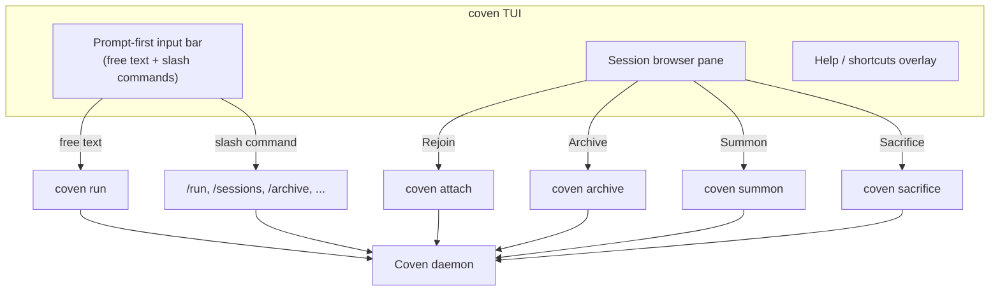

`coven` (o el explícito `coven tui`) abre la **TUI prompt-first**: una interfaz respaldada por Ratatui donde puedes escribir tareas en forma libre, ejecutar comandos slash o navegar menús de rituales con las teclas de flecha. Es el punto de partida recomendado para usuarios nuevos y funciona sobre SSH o en un terminal local.

## Cuándo usarla

| Situación | Mejor superficie |
|---|---|
| Instalación recién hecha, explorando lo que Coven puede hacer | **TUI** (`coven`) |
| Tarea puntual en un proyecto conocido | **TUI** o `coven run <harness> "<task>"` |
| Scripting, pipes, salida legible por máquina | `coven sessions --json`, `--plain` |
| Attach/replay de larga duración | Explorador de sesiones de la TUI o `coven attach <id>` |
| Comprobación rápida de salud | `coven doctor` |

La TUI es una capa fina de presentación. Cada acción que ofrece se mapea a un verbo subyacente de CLI o llamada a la API por socket — el daemon en Rust sigue siendo la autoridad.

## Anatomía



La TUI nunca se salta el daemon. La raíz de proyecto, el cwd y el id de harness se revalidan del lado del servidor en cada lanzamiento.

## Modos de input

La barra de prompt acepta tres formas de input indistintamente:

1. **Texto libre de tarea** — cualquier cosa que **no** empiece con `/`. Pulsar `Enter` lanza el harness por defecto contra el proyecto actual.

   ```text
   fix the failing tests
   review the diff in packages/cli
   ```

2. **Comandos slash** — empiezan con `/` y se enrutan a un verbo específico.

   ```text
   /run codex "audit this repo"
   /run claude "polish the help text" --title "Help polish"
   /sessions
   /archive session-1
   /help
   ```

3. **Navegación por menú con teclas de flecha** — `↑` / `↓` recorren cards de ritual (Rejoin, View Log, Summon, Archive, Sacrifice) para la sesión actualmente seleccionada. `Enter` confirma. `Esc` cancela.

## Referencia de comandos slash

| Comando | Qué hace |
|---|---|
| `/help` | Muestra el overlay de ayuda con todos los atajos y ejemplos. |
| `/run <harness> "<task>"` | Lanza una sesión limitada al proyecto. Igual que `coven run`. |
| `/sessions` | Abre el explorador de sesiones. Igual que `coven sessions`. |
| `/attach <session-id>` | Adjunta a (o reproduce) una sesión. |
| `/archive <session-id>` | Oculta una sesión no en ejecución preservando los eventos. |
| `/summon <session-id>` | Restaura una sesión archivada. |
| `/sacrifice <session-id>` | Borra permanentemente una sesión no en ejecución. Te pide que escribas `sacrifice` para confirmar. |
| `/doctor` | Ejecuta `coven doctor` y renderiza el resultado en línea. |
| `/clear` | Limpia la barra de input y cualquier salida en línea. |
| `/export` | Copia el registro de la sesión seleccionada actual como JSON al portapapeles. |
| `/agent <harness>` | Establece el harness por defecto para el input libre en esta sesión de la TUI. |
| `/exit` | Cierra la TUI limpiamente. Equivalente a `Ctrl+C` o `Esc` en la raíz. |

## Atajos de teclado

| Teclas | Acción |
|---|---|
| `h` (raíz) | Abre el overlay `/help` |
| `↑ / ↓` | Mueve la selección en el explorador de sesiones o el menú |
| `Enter` | Confirma la selección / envía el prompt |
| `Esc` | Sale de un menú, o sale en la raíz |
| `Ctrl+C` | Sale inmediatamente |
| `Tab` | Cicla el foco entre la barra de input y el explorador de sesiones |
| `Ctrl+L` | Re-renderiza (útil sobre SSH inestable) |

La TUI redimensiona de forma segura. Terminales tan pequeños como 80×24 siguen siendo usables; los terminales más anchos expanden la lista de sesiones, la vista previa del log y el overlay de ayuda automáticamente.

## Acciones del explorador de sesiones

Seleccionar una sesión y pulsar `Enter` muestra acciones contextuales. Cada una está restringida por el estado de la sesión — las acciones que no son seguras para el estado actual se ocultan, no se ponen en gris, así que el menú nunca ofrece un verbo destructivo que no puedas ejecutar.

| Acción | Disponible cuando | Efecto |
|---|---|---|
| **Rejoin** | la sesión está `running` | Adjunta al PTY vivo; el input se reenvía al harness. |
| **View Log** | la sesión no está `running` | Reproduce el log de eventos (solo lectura). |
| **Summon** | `archived_at` está establecido | Restaura a la lista activa y reproduce/sigue. |
| **Archive** | la sesión no está `running` y no archivada | Oculta de la lista activa; los eventos se preservan. |
| **Sacrifice** | la sesión no está `running` | Borrado permanente; requiere confirmación tecleada. |

El mapa entre acciones y verbos de CLI está documentado en [Ciclo de vida de la sesión](/SESSION-LIFECYCLE).

## Uso por SSH y remoto

La TUI está basada en Ratatui y sobrevive a los entornos hostiles habituales:

- Terminales sobre SSH (sin dependencias locales de ratón/fuente).
- Redimensionado durante una sesión (re-renderiza en `SIGWINCH`).
- `TERM=xterm-256color` o `screen-256color`.

**No** requiere un terminal gráfico, un backend de portapapeles o `tmux`. Si estás dentro de `tmux` o `screen`, la TUI se comporta como cualquier otra app Ratatui — los splits de panel y detach siguen funcionando.

## Fallback en texto plano

Si prefieres un flujo no interactivo (CI, scripting, logs de auditoría), sáltate la TUI por completo:

```bash
coven run codex "fix the failing tests"
coven sessions --plain
coven attach <session-id>
```

Estos verbos producen salida estable y scriptable, y son los mismos a los que la TUI termina enrutando.


## Relacionado

- [Empieza con Coven](/GETTING-STARTED)
- [Ciclo de vida de la sesión](/SESSION-LIFECYCLE)
- [Referencia de la CLI](/reference/cli)
- [Solución de problemas](/TROUBLESHOOTING)
