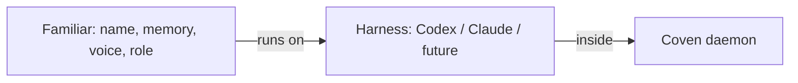
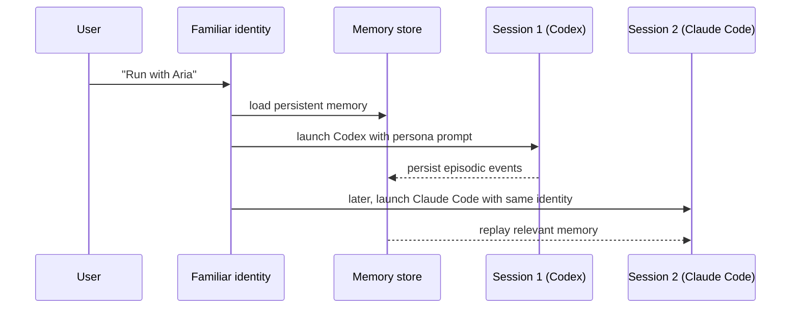

**Familiars** are OpenCoven's product layer above the Coven runtime: persistent named agents with memory, tools, identity, roles, and continuity. A familiar is not a faceless bot. It has a name, a purpose, a memory, a toolset, a voice, a role, and a place in a larger workflow.

> OpenCoven turns AI from a blank chatbox into a living workspace of agents that remember, coordinate, and belong to you.

<Columns>
  <Card title="What is a familiar?" href="/familiars/what-is-a-familiar" icon="sparkles">
    The product concept layered above the technical [harness](/harnesses) concept.
  </Card>
  <Card title="Naming and voice" href="/familiars/naming-and-voice" icon="quote">
    Names, voices, and the brand promise of personal-not-pretending-human agents.
  </Card>
  <Card title="Roles" href="/familiars/roles" icon="users">
    The roles a familiar can take inside a workflow.
  </Card>
</Columns>

## Familiar vs. harness

A familiar can swap harnesses. A harness does not know which familiar it is serving. Coven is the substrate that keeps the boundary honest.

## What every familiar has

- **A name and voice** — see [Naming and voice](/familiars/naming-and-voice).
- **Memory** — working, persistent, episodic, semantic. See [Memory](/memory).
- **Tools** — exec, apply-patch, web-fetch, plus skills and plugins.
- **Identity** — a stable handle across sessions, devices, and harness swaps.
- **A role** — the slot a familiar occupies in a workflow.
- **A place in the circle** — multi-familiar workflows let specialists coordinate.

## How a familiar lives across sessions

The familiar identity outlives any single session. Coven only requires that **each session** pins a project root; the familiar layer is free to span multiple sessions and harnesses.

## Multi-familiar

<Columns>
  <Card title="Handoff" href="/familiars/handoff" icon="git-branch">
    Phase 1 — explicit transfer of task + context between familiars.
  </Card>
  <Card title="Orchestration" href="/familiars/orchestration" icon="route">
    Phase 2 — capability discovery, router, load balancing.
  </Card>
  <Card title="Parallel lanes" href="/familiars/parallel-lanes" icon="columns">
    Specialist lanes that work the same task in parallel.
  </Card>
</Columns>

## Related

- [Memory overview](/memory)
- [Sessions](/sessions)
- [Rituals](/rituals) — archive, summon, sacrifice
- [Brand](/reference/brand) — naming, voice, mark
