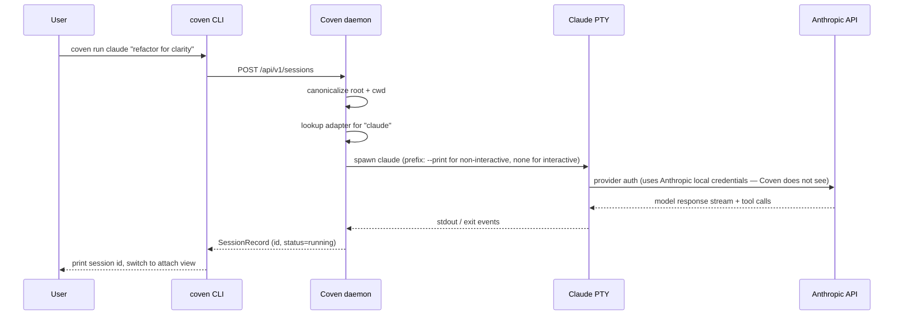

Claude Code is Anthropic's coding-agent CLI. Coven wraps it in a project-rooted PTY so launches, attaches, and rituals work the same as for any other harness.

| Field | Value |
|---|---|
| Harness id | `claude` |
| Install | `npm install -g @anthropic-ai/claude-code` |
| Auth | `claude doctor` (one-time, Anthropic side) |
| Doctor check | `coven doctor` reports the resolved Claude path and version. |

## Setup

<Steps>
  <Step title="Install Claude Code">
    ```bash
    npm install -g @anthropic-ai/claude-code
    ```
  </Step>
  <Step title="Run Claude's own doctor">
    ```bash
    claude doctor
    ```
    Provider credentials stay with Claude Code. Coven never reads them.
  </Step>
  <Step title="Confirm with Coven">
    ```bash
    coven doctor
    ```
    The output should include `claude: ok (/usr/local/bin/claude)`.
  </Step>
  <Step title="Launch">
    ```bash
    coven run claude "polish this UI"
    ```
  </Step>
</Steps>

## Per-session flags

```bash
coven run claude "refactor for clarity" --cwd packages/web --title "Web refactor"
```

- `--cwd` — canonicalized inside the project root.
- `--title` — sets a readable title in the session browser.
- `--json` — print structured launch metadata for clients.

## Provider auth boundary

Claude Code owns its own OAuth flow and token cache. Coven never reads Anthropic keys or session cookies.

## Troubleshooting

| Symptom | Likely cause | Fix |
|---|---|---|
| `coven doctor` reports `claude` missing | Claude Code not on `PATH` | `npm install -g @anthropic-ai/claude-code`, then re-run doctor. |
| Claude prompts for login | Auth not finished | `claude doctor`. |
| Session shows long pre-flight pause | Claude resolving config | First run only; subsequent launches are fast. |

## How Coven supervises Claude Code



Claude Code's tool calls run inside the Claude process — Coven does not arbitrate them. The PTY captures their output as ordinary stdout/stderr.


## Related

- [Installing harness CLIs](/harnesses/installing)
- [Provider auth boundary](/harnesses/provider-auth)
- [Troubleshooting](/TROUBLESHOOTING#harness-missing)
