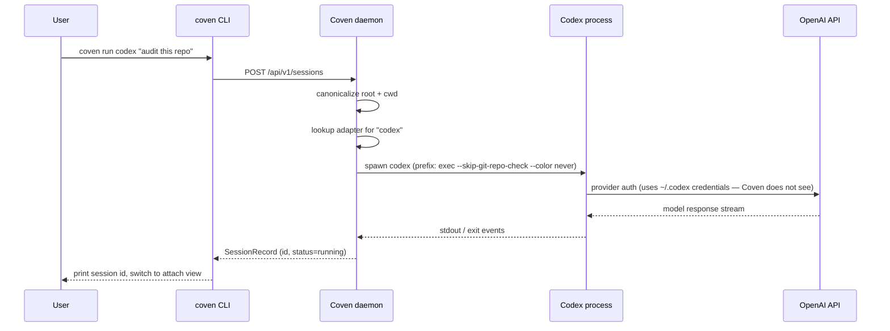

Codex is OpenAI's coding-agent CLI. Coven uses a project-rooted PTY for
interactive sessions, and Codex's JSON mode over ordinary pipes for machine
streaming, so launches, attaches, and rituals work the same as for any other
harness.

| Field | Value |
|---|---|
| Harness id | `codex` |
| Install | `npm install -g @openai/codex` |
| Auth | `codex login` (one-time, OpenAI side) |
| Doctor check | `coven doctor` reports the resolved Codex path and version. |

## Setup

<Steps>
  <Step title="Install Codex">
    ```bash
    npm install -g @openai/codex
    ```
    Other install methods (Homebrew cask, package managers) are listed at the [Codex repo](https://github.com/openai/codex).
  </Step>
  <Step title="Log in to OpenAI">
    ```bash
    codex login
    ```
    Provider credentials stay with Codex. Coven never reads them.
  </Step>
  <Step title="Confirm with Coven">
    ```bash
    coven doctor
    ```
    The output should include a line like `codex: ok (/usr/local/bin/codex)`.
  </Step>
  <Step title="Launch">
    ```bash
    coven run codex "fix the failing tests"
    ```
  </Step>
</Steps>

## Per-session flags

```bash
coven run codex "audit this repo" --cwd packages/cli --title "CLI audit"
```

- `--cwd` — canonicalized inside the project root.
- `--title` — sets a readable title in the session browser.
- `--json` — print structured launch metadata for clients.

## Provider auth boundary

Codex owns its own OAuth flow and token cache. If you see `Invalidated OAuth token`, run `codex login` again. Coven will keep the existing session record so you can re-launch with the same title.

For the local rescue path:

```bash
coven patch openclaw "fix Codex auth profile order after invalidated OAuth token"
```

## Troubleshooting

| Symptom | Likely cause | Fix |
|---|---|---|
| `coven doctor` reports `codex` missing | Codex not on `PATH` | `npm install -g @openai/codex`, then re-run doctor. |
| Codex prompts for login each run | Stale token | `codex login`. |
| Codex returns `invalid_value` for `reasoning.effort` | An obsolete `model_reasoning_effort` value in `%USERPROFILE%\.codex\config.toml` | Use a currently supported value such as `model_reasoning_effort = "xhigh"` rather than legacy `ultra`/`max`, then retry. Coven never reads or writes Codex credentials. |
| CovenCave/direct `--stream-json` request hangs on Windows | Older Coven package launches npm's `codex.cmd` through the ConPTY/OpenConsole path | Update Coven to a release containing the piped Codex JSON bridge, then retry. `coven doctor` should still report Codex as ready. |
| Interactive session waits for input | Codex is waiting on its terminal prompt | Detach with `Ctrl-]`, then re-launch with `coven run` directly. |

## How Coven supervises Codex



The dotted line worth noticing: Coven never connects to the OpenAI API itself. The credential path is **Codex CLI ↔ OpenAI**, with Coven only supervising the local Codex process and its output.

For `coven run codex --stream-json`, Coven instead runs `codex exec --json`
through normal pipes and emits Coven `assistant` / `result` JSONL frames. On
Windows this keeps the npm `.cmd` shim off ConPTY and supplies multiline
prompts through stdin safely. The result carries Codex's native thread id as
`harness_session_id`; Coven keeps that mapping so a later `--continue` can use
the stable Coven session id. During that one-shot bridge, Unix
`SIGINT`/`SIGTERM`/`SIGHUP` cancel the owned Codex process group and produce a
failed terminal result. Windows uses an owned Job Object when assignment is
available; otherwise Coven's timeout/error cleanup uses `taskkill /T /F`.


## Related

- [Installing harness CLIs](/harnesses/installing)
- [Provider auth boundary](/harnesses/provider-auth)
- [Troubleshooting](/TROUBLESHOOTING#harness-missing)
