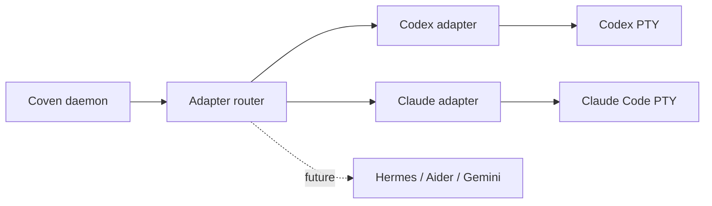

A **harness** is an external coding-agent CLI that Coven can launch and supervise inside an explicit project root. Coven owns the PTY, the session record, and the event log; the harness owns the conversation, the tool calls, and provider authentication.

<Columns>
  <Card title="Codex" href="/harnesses/codex" icon="binary">
    OpenAI Codex CLI. Harness id `codex`.
  </Card>
  <Card title="Claude Code" href="/harnesses/claude-code" icon="brain">
    Anthropic Claude Code. Harness id `claude`.
  </Card>
  <Card title="Future harnesses" href="/FUTURE-HARNESSES" icon="compass">
    Hermes, Aider, Gemini CLI, Cline — adapter direction and roadmap signals.
  </Card>
</Columns>

## What Coven supervises



## What every harness has in common

- A stable **harness id** that clients pass to `coven run` or `POST /api/v1/sessions`.
- A guaranteed launch inside a canonical **project root**.
- A Coven-owned PTY for I/O, replay, and `coven attach`.
- An append-only event stream stored under the session id.
- The same **rituals**: archive, summon, sacrifice.

## What stays with the harness

- **Provider auth.** Coven does not store API keys or OAuth tokens. `codex login` and `claude doctor` keep working as they did before.
- **Conversation state.** The harness owns its own prompt cache, system prompt, and tool registry.
- **Tool execution.** Tools run in-process inside the harness; Coven's job is to give it a clean PTY and a project-rooted cwd.

See [Provider auth boundary](/harnesses/provider-auth) for the credential-isolation rationale.

## Installing a harness CLI

<Steps>
  <Step title="Install one">
    ```bash
    npm install -g @openai/codex
    # or
    npm install -g @anthropic-ai/claude-code
    ```
  </Step>
  <Step title="Finish provider auth">
    ```bash
    codex login
    claude doctor
    ```
  </Step>
  <Step title="Verify Coven sees it">
    ```bash
    coven doctor
    ```
  </Step>
</Steps>

If `coven doctor` reports a harness as missing, see [Installing harness CLIs](/harnesses/installing).

## Related

- [Provider auth boundary](/harnesses/provider-auth)
- [Harness adapter guide](/HARNESS-ADAPTERS)
- [Future harness notes](/FUTURE-HARNESSES)
