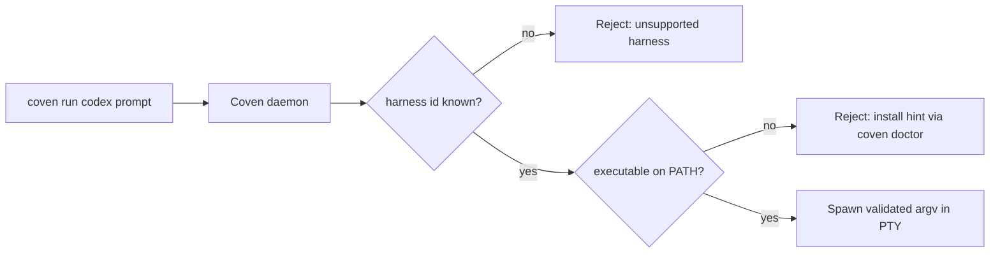

Coven does **not** bundle harness CLIs. Each supported harness is an independent CLI that Coven detects on `PATH` at launch time and supervises through a PTY adapter. This page shows the install commands for every v0 harness and explains how `coven doctor` reports detection results.

## How detection works

`coven doctor`, `coven adapter doctor`, and `POST /api/v1/sessions` all resolve a harness id (`codex`, `claude`, …) to an executable name on `PATH` using the adapter registry in [Harness adapters](/HARNESS-ADAPTERS). If the binary is missing, Coven fails closed with an install hint instead of attempting to launch.



The daemon revalidates the harness id on every launch request. Clients cannot widen the allowlist by sending a different argv or path; only bundled compatibility adapters and explicit manifest adapters are accepted.

## Supported v0 harnesses

| Harness id | Executable | Install command | Provider login | Detail page |
|---|---|---|---|---|
| `codex` | `codex` | `npm install -g @openai/codex` | `codex login` | [Codex harness](/harnesses/codex) |
| `claude` | `claude` | `npm install -g @anthropic-ai/claude-code` | `claude doctor` | [Claude Code harness](/harnesses/claude-code) |
| `copilot` | `copilot` | `npm install -g @github/copilot` | `copilot login` | [Copilot CLI harness](/harnesses/copilot-cli) |

Other CLIs (Hermes, Aider, Gemini CLI, Cline, custom commands) are **not** bundled in v0. Test them through an explicit manifest and `coven adapter doctor`; see [Future harness notes](/FUTURE-HARNESSES) for the adapter direction.

## Step-by-step install

<Steps>
  <Step title="Install at least one harness">
    Pick the harness you want to drive first. You can install more later.

    ```bash
    # OpenAI Codex
    npm install -g @openai/codex

    # Anthropic Claude Code
    npm install -g @anthropic-ai/claude-code

    # GitHub Copilot CLI
    npm install -g @github/copilot
    ```

    Other install paths (Homebrew, package managers, build-from-source) are documented in each project's own README. Coven only requires the binary to be on `PATH` under the expected executable name.
  </Step>

  <Step title="Finish provider auth in the harness CLI">
    Coven never touches provider credentials. Run each CLI's own login flow once.

    ```bash
    codex login
    claude doctor
    copilot login
    ```

    See [Provider auth boundary](/harnesses/provider-auth) for the rationale.
  </Step>

  <Step title="Verify Coven sees the harness">
    ```bash
    coven doctor
    coven adapter list
    ```

    Expected output (abridged):

    ```text
    store:    ok
    project:  ok  (/path/to/project)
    daemon:   running  (pid 12345)
    codex:    ok       (/usr/local/bin/codex 0.x.y)
    claude:   ok       (/usr/local/bin/claude 0.x.y)
    copilot:  ok       (/usr/local/bin/copilot 1.x.y)
    ```

    If a row shows `missing`, doctor also prints the exact install command shown in the table above. `coven adapter list --json` is the machine-readable form for clients such as Coven Cave.
  </Step>

  <Step title="Launch a session">
    ```bash
    coven run codex "describe this repo"
    coven run claude "polish the CLI help text"
    coven run copilot "explain the failing CI job"
    ```
  </Step>
</Steps>

## Updating a harness

Coven does not auto-update harness CLIs. Treat them as ordinary global npm (or other package-manager) installs:

```bash
npm install -g @openai/codex@latest
npm install -g @anthropic-ai/claude-code@latest
npm install -g @github/copilot@latest
```

After updating, re-run `coven doctor` to confirm the resolved path/version still matches what you expect.

## Custom executable locations

If a harness is installed under a non-`PATH` directory (for example, a project-local `node_modules/.bin`), make sure that directory is on `PATH` **before** the daemon starts. Coven respects the daemon process environment, not the calling shell environment, when launching PTYs.

If you change `PATH` system-wide, restart the daemon:

```bash
coven daemon restart
coven doctor
```

## Troubleshooting

| Symptom | Likely cause | Fix |
|---|---|---|
| `coven doctor` reports a harness as `missing` even after install | New shell `PATH` not picked up by the daemon | `coven daemon restart`, then `coven doctor`. |
| Doctor finds the binary but `coven run` fails immediately | Provider auth incomplete | Re-run `codex login` / `claude doctor` / `copilot login`. See [provider auth](/harnesses/provider-auth). |
| Doctor shows a stale version | Older binary earlier on `PATH` | `which -a codex` (or `claude`, `copilot`) and remove the duplicate. |
| Doctor reports `unsupported harness` | Typo in harness id | Use one of the ids in the table above. |


## Related

- [Harnesses](/harnesses)
- [Codex harness](/harnesses/codex)
- [Claude Code harness](/harnesses/claude-code)
- [Copilot CLI harness](/harnesses/copilot-cli)
- [Harness adapters](/HARNESS-ADAPTERS)
- [Future harness notes](/FUTURE-HARNESSES)
